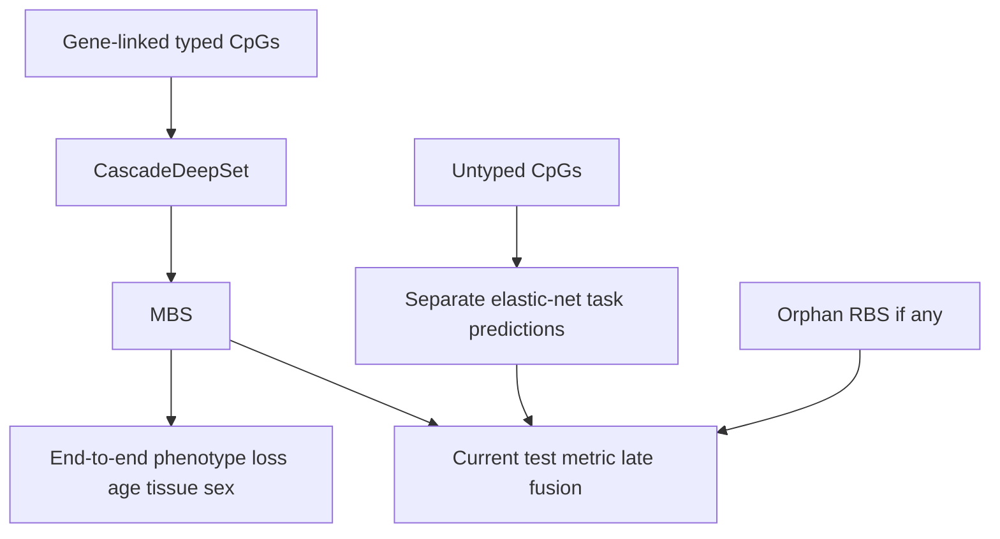
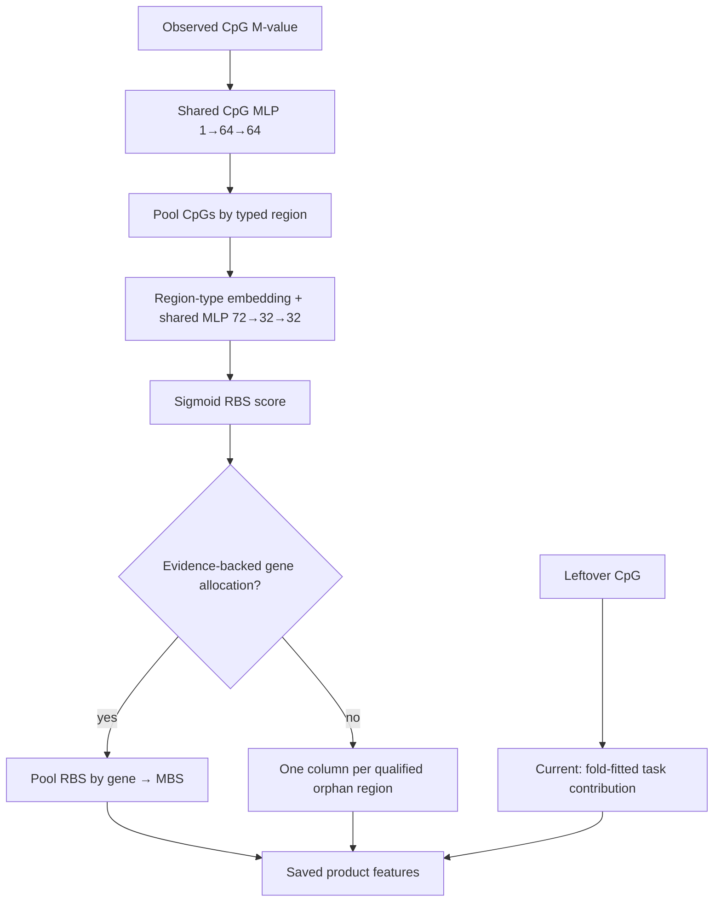
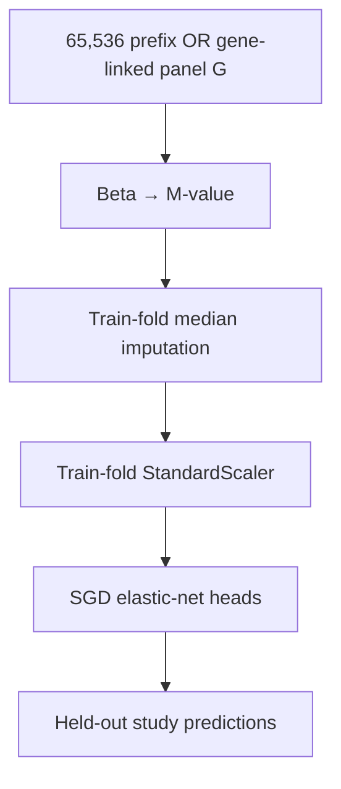

# Stage 0 architecture

Post–Stage 0 modules (epimutation AE, ComBat-met) are outlined in
[`STRATEGIC_PLAN.md`](STRATEGIC_PLAN.md); they are not Stage 0 prerequisites.

## Objective

Learn one scalar methylation burden score for every observed sample–gene pair while sharing the scoring function across genes and training traits.

The model must accept variable sets of CpGs and remain independent of a fixed array manifest.

**Public name:** deepMAT. **Package / CLI:** `methyl-burden-score` / `mbs`
(unchanged; see [ADR 0003](adr/0003-milestone-5b-phenotype-registry.md)).

## Core contracts

For sample `s`, CpG `c`, region `r`, and gene `g`:

```text
sample-specific methylation features x[s,c]
static locus features z[c]
annotation features a[c,r]
        │
        ▼
shared CpG encoder phi_cpg
        │
        ▼
permutation-invariant pooling within region
        │
        ▼
shared region encoder phi_region
        │
        ▼
permutation-invariant pooling within gene
        │
        ▼
shared compression network rho
        │
        ▼
MBS[s,g] in [0,1]
```

The score network is shared across CpGs, regions, genes, samples, and traits. Phenotype-specific parameters exist only in downstream heads.

## Current 7F product model and 7G comparator

The phenotype-trained cascade serves **two uses of the same model**: (1) masked
auxiliary phenotype prediction during training/selection; (2) export of
sample×gene MBS and optional non-gene features for downstream association. These
are not separate topologies.

### Training vs evaluation (current hybrid — to be corrected)



End-to-end training supervises **MBS only**. Current test reporting concatenates
`[orphan_rbs | mbs | direct_contrib]` before linear heads — so **reported P2
~0.38 F1 is not an MBS-only architecture result**. Corrected Phase-2 (**P2-G**,
**P4-G**, **P5-G**) must evaluate on gene-linked CpGs only and report MBS-only
metrics separately from any full-model fusion.

**Architecture-selection phase (7G′ Stage A):** compare CascadeDeepSet vs
`C-mvalue-enet-G` on the **identical gene-linked CpG columns** only. Exclude
orphan regions and direct CpGs from both training input and primary metrics.

**Full model (after Stage A):** concatenate additional **feature columns**
(qualified orphan RBS, direct CpG values/scores) before trait heads — not extra
sample rows. Staged fine-tune from the winning gene encoder.

### deepMAT cascade implementation

The current cascade implementation in `CascadeDeepSet` is:



At the 7G checkpoint, the CpG encoder receives one M-value per observed locus;
the richer beta/M/robust-z/static feature contract below is the intended final
input, not yet the cascade's actual input. The CpG→region and region→gene pools
are configurable as `max` or `mean` for P4. Disease/cancer heads exist in
`MultitaskHeads` but are **not** wired in the current P4/P5 cascade loop.

The product use is DeepRVAT-like:

1. train the identity-free shared aggregation function using masked auxiliary
   phenotypes;
2. cross-fit and export sample×gene MBS plus any qualified orphan-region and
   direct-CpG values/identifiers;
3. discard the training heads for product association work;
4. perform downstream feature selection, association tests, and prediction on
   the reduced representation.

The present 7F writer exports `direct_contrib.zarr` with one fitted **task
prediction per sample**, not one column per retained CpG. That artifact is a
phenotype diagnostic only. Downstream association requires
`direct_cpg.zarr` (sample×locus) or a lossless canonical-matrix view — a **7G′
Stage B** deliverable before final OOF.

The shared CpG encoder does not consume raw probe IDs and can score new arrays
when loci map to the canonical graph. Linear phenotype heads require a **stable
canonical gene index** — the full phenotype model is probe-ID agnostic in the
encoder path, not gene-ID agnostic in the head path. The **direct** branch is
locus-specific and not probe-ID agnostic.

### Best current phenotype comparator: C-mvalue-enet (7G) and C-mvalue-enet-G (7G′ Stage A)



**C-mvalue-enet** (7G bake-off): all 65 536 prefix columns — includes CpGs that
never receive MBS gradients. Tissue macro-F1 **0.334**.

**C-mvalue-enet-G** (corrected architecture selection): **exact same unique
gene-linked CpG columns** as the neural gene-only arms. Tissue/sex must use
logistic elastic-net, not regression on float class indices.

Fair selected-panel comparison is **7G′ Stage B** (`C-mvalue-enetS`).

### Orphan regulatory regions

Orphan RBS must never be pooled into one genome-wide scalar or pooled merely by
region type. Each eligible `region_id` is a separate feature. The current 7F
code satisfies that column-level rule, but its unrestricted nearest-gene fallback
left **zero** orphan regions in the Hub smoke. Before final OOF:

- only versioned, well-defined multi-CpG regions may become orphan RBS;
- a region enters MBS only through an explicit evidence-backed region→gene edge;
- singleton or unstructured non-gene loci stay direct (or are omitted in the
  lightweight arm);
- if no orphan region passes eligibility, export an empty block rather than a
  global fallback score.

The lightweight ablation passes `[M-value, one-hot regulatory type, observed]`
through a shared pre-aggregation adapter and compares **MBS + direct** against
the full region encoder. See **7G′ Stage B** in
[`milestone-7g-prime-matched-probe-lightweight.md`](plans/milestone-7g-prime-matched-probe-lightweight.md).

## Input representation

Initial CpG input:

```text
beta value
M value
robust fold-fitted z                   # 7D: median / 1.4826×MAD on train M
static CpGPT sequence-adapter vector
static-embedding-present flag          # Milestone 7C; do not drop loci
observed / missingness / value_valid
norm_present                           # False for novel loci (z=0, keep)
structured locus annotations
region-edge annotations
```

Excluded from the shared encoder:

```text
sample ID
study or GSE ID
donor ID
technical replicate ID
platform ID
raw probe ID
raw gene ID
phenotype label
```

## Exact flat reference model

The first neural baseline mirrors the DeepRVAT gene-impairment module:

```math
h_{s,c} = \phi(x_{s,c})
```

```math
v_{s,g} = \max_{c \in C_{s,g}} h_{s,c}
```

```math
MBS_{s,g} = \sigma(\rho(v_{s,g}))
```

Elementwise maximum is fixed and permutation invariant. This baseline isolates whether a shared set scorer works before testing the regulatory hierarchy.

## Hierarchical reference model

```math
h_{s,c} = \phi_{cpg}(x_{s,c})
```

```math
v_{s,r} = \max_{c \in C_{s,r}} h_{s,c}
```

```math
u_{s,r} = \phi_{region}([v_{s,r}, e_{type(r)}])
```

```math
q_{s,g} = \max_{r \in R_{s,g}} u_{s,r}
```

```math
MBS_{s,g} = \sigma(\rho(q_{s,g}))
```

The initial gene-region roles are:

1. promoter core;
2. promoter proximal;
3. five-prime region;
4. gene body;
5. three-prime region.

CpG-island relation and regulatory annotations are orthogonal features rather than a combinatorial explosion of region types.

### Residual / unmapped path (Milestone 6 — frozen v0.1)

Every observed probe is retained ([ADR 0004](adr/0004-unmapped-probe-retention.md)).
Loci with typed gene-region edges follow the hierarchy above. Loci (or
Illumina-coordinate-unmapped residual columns) without a clean gene-region
assignment do **not** enter nearest-gene or ``__unassigned__`` gene pooling.
In **deepMAT-hierarchical-v0.1** they use a separate residual DeepSet that
max-pools **all** residual CpGs into **one** sample-level scalar:

```math
h_{s,c}^{\mathrm{res}} = \phi_{cpg}(x_{s,c})
```

```math
r_s = \max_{c \in U_s} h_{s,c}^{\mathrm{res}}
```

```math
\mathrm{residual}_s = \sigma(\rho_{\mathrm{res}}(r_s))
```

The phenotype panel is ``[MBS_{s,g}]_g`` plus one residual score slot.
Batch tensors expose annotation-status masks
``mapped`` / ``unmapped`` / ``ambiguous`` / ``multi_mapped``. Evaluation reports
full, mapped-only, and residual-only slices on the same folds as the flat
baseline.

**Shipped topology (Milestone 7F, [ADR 0009](adr/0009-drop-tbs-scores.md)):** tile
**scores** are dropped; leftover CpGs stay **direct**. Product families are
**MBS** (gene-aggregated RBS), **orphan RBS** (one score per typed region with
no gene allocation — not pooled by type), and **direct** per-locus contributions.

### CascadeDeepSet (7F product encoder)

Typed regions only (no tile path inside the neural module):

```math
h_{s,c} = \phi_{\mathrm{cpg}}(x_{s,c})
```

```math
v_{s,r} = \mathrm{pool}_{c \in r} h_{s,c} \quad (\mathrm{max\ or\ mean})
```

```math
\mathrm{RBS}_{s,r} = \sigma(\rho_{\mathrm{region}}([v_{s,r}, e_{\mathrm{type}(r)}]))
```

```math
\mathrm{MBS}_{s,g} = \mathrm{pool}_{r \rightarrow g} \mathrm{RBS}_{s,r}
```

Orphan regions (`region_to_gene = -1`) keep per-region RBS columns in
`rbs.zarr`; only gene-allocated RBS enter MBS pooling. Leftover CpGs (no typed
region) are scored outside this module via fold-fitted elastic-net on Level-1 z
(`direct_contrib.zarr`). Late fusion concatenates
`[orphan\_rbs | mbs | direct]` for optional phenotype heads.

Implementation: `CascadeDeepSet` in `src/mbs/models.py`; trainer
`src/mbs/training/cascade_loop.py`.

### Intended use (DeepRVAT-style)

Training is **end-to-end phenotype prediction** (age, sex, tissue, disease,
cancer with masks). The same trained encoder is **probe-agnostic** after
training: apply to 450K, EPIC, or WGBS without retraining on probe IDs. Export
fewer features (genes + optional orphan regions + direct CpGs), then run
downstream feature selection and association tests — analogous to DeepRVAT's
gene-level scores after variant aggregation.

A **lightweight** alternative (7G′ plan): per-CpG M-value or beta plus
one-hot regulatory annotation → DeepSet pool by gene → MBS; closer to DeepRVAT's
per-variant + context pattern than the two-hop RBS→gene cascade.

### Legacy target multi-path (7C; TBS scores dropped in 7F)

```math
\hat{y}_{s,k}
=
W^{G}_{k}\mathrm{MBS}_s
+
W^{R}_{k}\mathrm{RBS}_s
+
W^{T}_{k}\mathrm{TBS}_s
+
D_k(s)
+
X_s\alpha_k
```

Direct CpG contribution \(D_k(s)\) is a deepMAT extension (sparse per-locus or
context-generated weights), not an exact DeepRVAT phenotype module. First
transparent baseline:

```math
D_k(s)=\sum_{c \in \mathrm{observed}(s)} w_{k,c} z_{s,c}
```

Elastic-net / group sparsity; minimum cross-study coverage; centered
fold-normalized \(z\). Later \(w_{k,c}\) from static embeddings.

**Score identifiability ([ADR 0008](adr/0008-score-identifiability.md)):** with
centered sigmoid MBS and unconstrained linear heads,
`MBS → 1−MBS` plus flipped head weights yields the same \(\hat y\). Define an
orientation anchor (hyper/hypo channels or magnitude vs |robust z|) **before**
averaging OOF scores. deepMAT is a sample×gene **predictive** representation,
not a LOEUF-like constraint score.

**Implementation gap (fix in Milestone 7C):** mapped CpGs lacking CpGPT
embeddings must stay in the set with `static_present=False`; residual CpGs that
receive zero embeddings need a missingness flag. Do not drop loci for missing
static features.

## Optional gated pooling ablation

MethylSPWNet motivates learned CpG weighting, but Stage 0 does not assign a free parameter to every locus. Instead, a shared gate may generate within-region weights:

```math
\alpha_{s,c,r}
= \operatorname{softmax}_{c \in r}
  q^T \tanh(W_h h_{s,c} + W_t e_{type(r)} + W_a a_{c,r})
```

```math
\bar{h}_{s,r} = \sum_{c \in r} \alpha_{s,c,r} h_{s,c}
```

The gated representation is concatenated with max pooling. The max/max hierarchy remains the reference model.

## Missing-set semantics

A gene with no observed CpGs is not low burden.

```math
MBS_{s,g}=0.5,\qquad present_{s,g}=0
```

Phenotype heads consume centered, masked scores:

```math
\widetilde{MBS}_{s,g}
= present_{s,g}(MBS_{s,g}-0.5)
```

This makes an unobserved gene contribute zero to a linear head.

**Implementation gap (fix in Milestone 7C):** tissue uses
`SeedMaskedLinearHead` (centers at the neutral score); age and sex currently
multiply raw `mbs * present` without centering. The contract above is normative.

## Phenotype heads

Age regression:

```math
\hat{y}^{age}_s
= x_s^T\alpha
+ \sum_{g \in S_{age}} w_g \widetilde{MBS}_{s,g}
```

Tissue classification:

```math
\hat{\mathbf{y}}^{tissue}_s
= A x_s + W(\widetilde{\mathbf{MBS}}_s \odot m_{seed})
```

Heads may include nuisance covariates. Nuisance covariates do not enter the shared MBS encoder.

### Multitask packs (Milestone 5c)

Do not train one model per Hub ZIP. Use one shared encoder and linear heads with
per-sample task masks (age MSE/Huber, tissue CE, optional disease/cancer aux).
See [`plans/milestone-5c-multitask-shared-encoder.md`](plans/milestone-5c-multitask-shared-encoder.md)
and [`../configs/experiment/stage0_flat_multitask.yaml`](../configs/experiment/stage0_flat_multitask.yaml).

## Ragged representation

Do not materialize a tensor shaped as samples × genes × annotations × maximum CpGs.

Use flat segment tensors:

```text
cpg_features          [N_cpg, D]
cpg_locus_row         [N_cpg]
cpg_sample_index      [N_cpg]
cpg_to_region         [N_edges]
annotation_status     [N_cpg]   # mapped / unmapped / ambiguous / multi_mapped
residual_features     [N_residual, D]
residual_sample_index [N_residual]
region_type            [N_regions]
region_to_gene         [N_regions]
gene_to_sample         [N_gene_instances]
gene_panel_index       [N_gene_instances]
```

Static locus features are looked up after collation and are not copied into every sample record.

## Training and scoring

Development protocol (Milestone **7E** architecture selection):

```text
3 study-grouped outer folds
2 random restarts per fold
study-grouped validation
```

Minimum independently trained arms: transparent gene/region mean and
elastic-net; parameter-matched flat gene-only; parameter-matched hierarchical
gene-only; gene + direct; gene + RBS + TBS + direct; each neural arm with and
without Level-1 robust-z; CpGPT inclusion as a separate ablation.

Final Stage 0 protocol (Milestone **7**, after 7A–7E):

```text
5 study-grouped outer folds
up to 6 random restarts per fold
```

Do not launch the final 5×6 protocol until catalog census, nine-pack matrices,
multi-path architecture, Level-1 normalization, and 7E selection are done
([ADR 0007](adr/0007-crossfit-prerequisites.md)).

Every stored training-sample MBS value is out-of-fold. Technical replicates and repeated donor measurements remain in one fold.

## Deferred architecture

Not part of Stage 0 core:

- dynamic CpGPT or MethylGPT token states;
- LoRA or full foundation-model fine-tuning;
- imputed CpGs treated as observations;
- attention-only pooling as the reference operator;
- enhancer-to-gene edges without a versioned evidence policy;
- intergenic burden assignment to the nearest gene;
- episignature and epivariant production models;
- ClickHouse or default TileDB migration;
- PROTRIDER / masked AE as the default normalizer (Level-3 ablation only);
- methylation **constraint** / LOEUF-like scores (post–Stage 0; ADR 0008).

Graph-layer cCRE / tiles for RBS/TBS are Milestone **7C**, not forever-deferred.