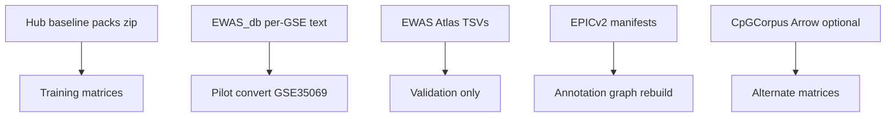

# Data catalog (Stage 0 open sources)

Inventory of methylation datasets, sample counts, on-disk sizes, and trait
harmonization used by Stage 0. Download policy:
[`EWAS_DATA.md`](EWAS_DATA.md). Metadata contracts:
[`EWAS_METADATA.md`](EWAS_METADATA.md). Registry:
[`configs/data/phenotype_registry.yaml`](../configs/data/phenotype_registry.yaml).

**Last refreshed (Hub zip sizes):** 2026-08-11 via
[`reports/inspection/raw_inventory/`](../reports/inspection/raw_inventory/).
**Sample-info Ns:** 2026-08-06 via
[`reports/inspection/ewas_metadata_structure/`](../reports/inspection/ewas_metadata_structure/)
(`mbs inspect ewas-metadata`).

```bash
uv run python scripts/write_raw_inventory_refresh.py
uv run mbs inspect ewas-metadata
uv sync --extra analysis   # matplotlib, once
uv run python scripts/write_pipeline_doc_figures.py
```

Do not recursively dump `$MBS_DATA_ROOT` into chat; use these reports.

## Completeness (this doc + reports)

| Topic | Status |
|-------|--------|
| Source lanes + raw GiB | Present (+ figure) |
| Hub pack advertised vs on-disk | Present (+ figure); disease marked `bad_zip` |
| Unique GSM / studies / primary column | Present (+ sample-count figure) |
| Converted matrices + multitask masks | Present (5d evidence) |
| Trait harmonization rules | Present |
| EWAS_db per-study byte breakdown | Shallow study-dir count only (455) |
| Disease full matrix convert | Blocked until zip OK |
| Live download progress % for disease | Not instrumented in inventory |

## Source lanes



| Lane | Path under `$MBS_DATA_ROOT/raw/` | Role |
|------|----------------------------------|------|
| EWAS Data Hub baseline packs | `ewas_datahub/download/*_methylation_v1.zip` | Primary open training matrices |
| EWAS Data Hub All Data | `ewas_datahub/EWAS_db/{GSE}/` | Per-study GSM β text; pilot convert |
| EWAS Atlas | `ewas_atlas/*.tsv` | Association knowledge / validation only |
| Illumina / EPICv2 manifests | `manifests/epicv2/` | Probe annotation rebuild input |
| CpGCorpus (optional) | `cpgcorpus/{GSE}/{GPL}/` | Alternate Arrow matrices; Stage 0 GSEs only |

ADR: [`adr/0002-ewas-datahub-primary-source.md`](adr/0002-ewas-datahub-primary-source.md).

### Raw tree sizes (2026-08-11)


| Tree | Approx. size |
|------|-------------:|
| `ewas_datahub/` | 428.45 GiB |
| `cpgcorpus/` | 6.72 GiB |
| `manifests/` | 0.43 GiB |
| `ewas_atlas/` | 0.26 GiB |
| **all `raw/`** | **435.93 GiB** |

`EWAS_db` study directories present: **457** (shallow count). Hub profile zips are
a small slice of `ewas_datahub/`; most bytes are per-study `EWAS_db` text.

## Hub phenotype packs

Advertised GB from NGDC / [`EWAS_DATA.md`](EWAS_DATA.md). On-disk from
`raw_inventory` 2026-08-11. Sample-info from `ewas_metadata_structure` 2026-08-06.


| Family | Profile zip | Adv. GB | On-disk | Zip | Unique GSM | Studies | Primary column |
|--------|-------------|--------:|--------:|:--:|-----------:|--------:|----------------|
| age | `age_methylation_v1.zip` | 11.73 | 11.73 GiB | OK | 8,374 | 143 | `age` |
| tissue | `tissue_methylation_v1.zip` | 7.7 | 7.70 GiB | OK | 5,323 | 258 | `tissue` |
| sex | `sex_methylation_v1.zip` | 4.33 | 4.33 GiB | OK | 2,978 | 161 | `sex` |
| blood | `blood_methylation_v1.zip` | 4.86 | 4.86 GiB | OK | 3,402 | 161 | `cell_component` |
| brain | `brain_methylation_v1.zip` | 2.77 | 2.77 GiB | OK | 1,997 | 40 | `tissue` |
| bmi | `bmi_methylation_v1.zip` | 3.06 | 3.06 GiB | OK | 2,070 | 25 | `bmi` |
| ancestry | `ancestry_category_methylation_v1.zip` | 1.96 | 1.96 GiB | OK | 1,380 | 21 | `race` |
| cancer | `cancer_methylation_v1.zip` | 16.07 | 16.07 GiB | OK | 10,101 | 225 | `disease` |
| disease | `disease_methylation_v1.zip` | 20.11 | 4.27 GiB | **bad_zip** | 12,218 | 209 | `disease` |

Disease/cancer sample-info row counts exceed unique GSM (duplicate rows in the
R tables); use **unique `sample_id`** for training N. Disease profile zip is
incomplete / corrupt on disk (re-download in progress per
[`TODO_PIPELINE.md`](TODO_PIPELINE.md)); cancer EOCD is OK as of this refresh.

Sample-info extracts live under
`reports/inspection/ewas_datahub_samples/` (ancestry file is `sample_race.txt`).

## Canonical matrices in use

| Matrix ID | Samples × loci | Notes |
|-----------|----------------:|-------|
| `matrix-hub-age-full-v1` | 8,374 × 482,379 | Full age pack, HM450 |
| `matrix-hub-tissue-full-v1` | 5,323 × 482,379 | Full tissue pack |
| `matrix-hub-sex-full-v1` | 2,978 × 482,379 | Full sex pack |
| `matrix-hub-age-tissue-sex-full-v1` | **13,548 × 482,379** | GSM-union merge; 3,127 deduped GSMs |
| GSE35069 pilot | 60 × … | EWAS_db cell-type smoke |

Multitask phenotype table on the union
(`sample_phenotype_table_age_tissue_sex_full_v1.parquet`):

| Mask | Samples with label |
|------|-------------------:|
| age | 10,002 |
| tissue | 7,866 |
| sex | 12,445 |

Study-grouped split (`hub-age-tissue-sex-full-auto-v1`): train 9,489 /
val 2,074 / external_test 1,985. Evidence:
[`reports/inspection/stage0_5d_max_n/`](../reports/inspection/stage0_5d_max_n/).

Smaller study-holdout matrices (age/tissue/blood/brain) remain registered for
benchmarks; see registry + `stage0_hub_real_benchmark/`.

## Trait harmonization

| Concern | How Stage 0 handles it |
|---------|------------------------|
| Join keys | Hub `sample_id` (GSM) + `project_id` (GSE). Do **not** equate Atlas `study_ID` (ES…) to GSE |
| Family → column | Fixed map in [`EWAS_METADATA.md`](EWAS_METADATA.md) / `FAMILY_VALUE_COLUMN` |
| Tissue labels | Ontology / class ids via `tissue_ontology.yaml` for CE head |
| Blood pack | Primary `cell_component` is mostly null; benchmarks often use `tissue` instead |
| Disease / cancer | Both use `disease` column; empty → control rules planned at convert; disease matrix blocked until zip OK |
| Multitask | One shared encoder; per-sample masks gate loss ([`SCORING_PIPELINE.md`](SCORING_PIPELINE.md)) |
| Atlas traits | 878 study traits / associations — **validation only**, not training labels |

Wave-1 training focus: age, tissue, disease (disease pending). Wave-2 /
secondary: cancer, blood, brain, sex, ancestry, BMI.

## EWAS Atlas (knowledge, not training)

| File | Approx. size | Rows (inventory) |
|------|-------------:|-----------------:|
| associations | 106 MiB | ~804,919 |
| probe_annotations | 174 MiB | ~900,413 |
| studies | 154 KiB | 1,902 |
| cohorts | 398 KiB | ~3,983 |
| trait×trait logP | 986 KiB | 371 traits |

## Known gaps

- **Disease profile zip** incomplete (`bad_zip`, ~4.3 GiB of ~20 GB expected).
- Blood primary phenotype sparsity; do not treat as pack-wide cell-type labels
  without another column strategy.
- Registry `sample_count: null` on most pack entries until convert registers N.
- Sample-info structure report not re-run on 2026-08-11 (extracts unchanged).
- Uncapped hierarchical train on the 13,548 union is Milestone 6 (in progress).

## Proposed improvements

1. After disease EOCD is healthy: refresh inventory + add `matrix-hub-disease-*` row to the matrices table.
2. Populate registry `sample_count` from unique GSM when exporting sample-info Parquet (one write, many docs).
3. Optional Venn / upset of GSM overlap across age∩tissue∩sex (already implied by 13,548 union + 3,127 dedupe note).
4. Do not commit Hub `.RData` sample blobs; keep `.txt` / Parquet only under inspection.

## Related

- Probe assignment rates: [`PROBE_ANNOTATION_COVERAGE.md`](PROBE_ANNOTATION_COVERAGE.md)
- Scoring flow: [`SCORING_PIPELINE.md`](SCORING_PIPELINE.md)
- Plan: [`plans/docs-scoring-annotation-catalog.md`](plans/docs-scoring-annotation-catalog.md)
- Figures: `scripts/write_pipeline_doc_figures.py`
