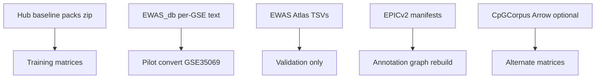
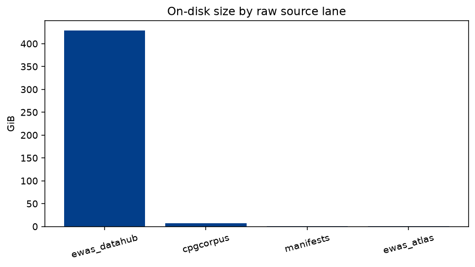
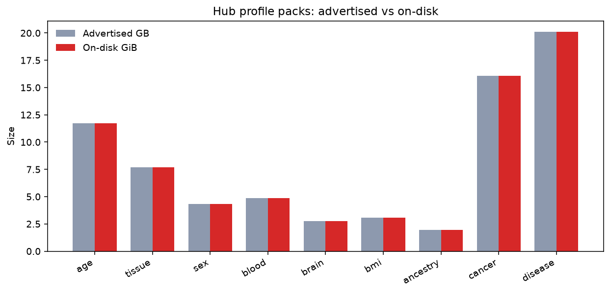
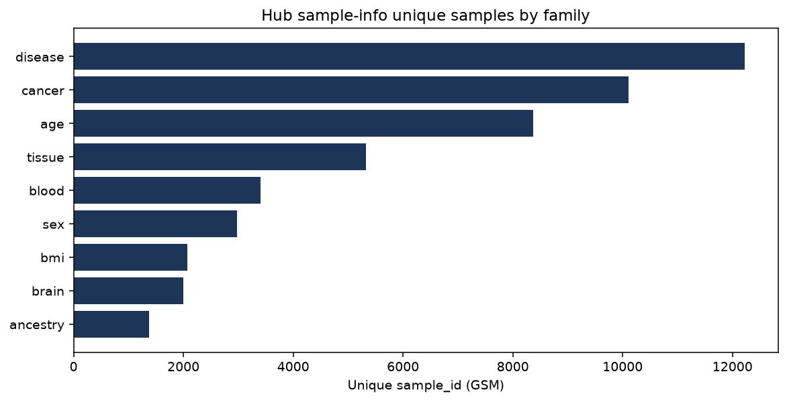

# Data catalog (Stage 0 open sources)

Inventory of methylation datasets, sample counts, on-disk sizes, and trait
harmonization used by Stage 0. Download policy:
[`EWAS_DATA.md`](EWAS_DATA.md). Metadata contracts:
[`EWAS_METADATA.md`](EWAS_METADATA.md). Registry:
[`configs/data/phenotype_registry.yaml`](../configs/data/phenotype_registry.yaml).

**Last refreshed:** 2026-08-24 via
[`reports/inspection/raw_inventory/`](../reports/inspection/raw_inventory/)
(`scripts/write_raw_inventory_refresh.py`). Sample-info Ns from
`canonical/phenotypes/*_sample_info.parquet` (same refresh). Host disk at
refresh: **~2.0 T free** on `/data` (~92% used) — not a download blocker.

```bash
uv run python scripts/write_raw_inventory_refresh.py
uv sync --extra analysis   # matplotlib, once
uv run python scripts/write_pipeline_doc_figures.py
```

Do not recursively dump `$MBS_DATA_ROOT` into chat; use these reports.

## Completeness (this doc + reports)

| Topic | Status |
|-------|--------|
| Source lanes + raw GiB | Present (+ figure); refreshed 2026-08-24 |
| Hub pack advertised vs on-disk | Present (+ figure); **all nine packs `ok`** including disease |
| Unique GSM / studies / primary column | Present (+ sample-count figure) |
| Converted matrices + multitask masks | Present (5d evidence) |
| Trait harmonization rules | Present |
| EWAS_db per-study progress | **In progress** (raw dirs ~1049/1989; catalog ingest **924** studies / **92 971** GSM) |
| Disease / cancer / blood / brain / BMI / ancestry full matrices | **7B done** (`matrix-hub-*-full-v1` + stage0_7b report) |
| Harmonized DuckDB release | **7A done** (`deepmat-data-v1/`); census refresh follow-ons remain |
| Unique GSM vs pack-row sum | Memberships ≠ people; 7A census + refresh follow-ons |

## Source lanes



| Lane | Path under `$MBS_DATA_ROOT/raw/` | Role |
|------|----------------------------------|------|
| EWAS Data Hub baseline packs | `ewas_datahub/download/*_methylation_v1.zip` | Primary open training matrices |
| EWAS Data Hub All Data | `ewas_datahub/EWAS_db/{GSE}/` | Per-study GSM β text; pilot convert |
| EWAS Atlas | `ewas_atlas/*.tsv` | Association knowledge / validation only |
| Illumina / EPICv2 manifests | `manifests/epicv2/` | Probe annotation rebuild input |
| CpGCorpus (optional) | `cpgcorpus/{GSE}/{GPL}/` | Alternate Arrow matrices; Stage 0 GSEs only |

ADR: [`adr/0002-ewas-datahub-primary-source.md`](adr/0002-ewas-datahub-primary-source.md).

### Raw tree sizes (2026-08-24)



| Tree | Approx. size |
|------|-------------:|
| `ewas_datahub/` | 989.82 GiB |
| `cpgcorpus/` | 6.72 GiB |
| `manifests/` | 0.43 GiB |
| `ewas_atlas/` | 0.26 GiB |
| **all `raw/`** | **997.30 GiB** |

`EWAS_db` study directories present: **1049 / 1989** advertised remote (~52.7%).
The 2026-08-25 catalog ingest listed **924** studies / **92 971** GSM files
(dirs without usable GSM files are not rows). Most of `ewas_datahub/` is
per-study `EWAS_db` text (~917 GiB); Hub profile
zips are ~73 GiB total. Download still running:
`bash scripts/download_ewas_datahub.sh EWAS_db` (log
`$MBS_ARTIFACT_ROOT/logs/downloads/ewas_datahub_EWAS_db.log`). Some GSM
`wget` attempts fail transiently (`WARN: failed`); the script continues and
resume re-tries.

## Hub phenotype packs

Advertised GB from NGDC / [`EWAS_DATA.md`](EWAS_DATA.md). On-disk + Zip OK from
`raw_inventory` 2026-08-24. Unique GSM / studies from sample-info Parquet.





| Family | Profile zip | Adv. GB | On-disk | Zip | Unique GSM | Studies | Primary column |
|--------|-------------|--------:|--------:|:--:|-----------:|--------:|----------------|
| age | `age_methylation_v1.zip` | 11.73 | 11.73 GiB | OK | 8,374 | 143 | `age` |
| tissue | `tissue_methylation_v1.zip` | 7.7 | 7.70 GiB | OK | 5,323 | 258 | `tissue` |
| sex | `sex_methylation_v1.zip` | 4.33 | 4.33 GiB | OK | 2,978 | 161 | `sex` |
| blood | `blood_methylation_v1.zip` | 4.86 | 4.86 GiB | OK | 3,402 | 161 | `cell_component` |
| brain | `brain_methylation_v1.zip` | 2.77 | 2.77 GiB | OK | 1,997 | 40 | `tissue` |
| bmi | `bmi_methylation_v1.zip` | 3.06 | 3.06 GiB | OK | 2,070 | 25 | `bmi` |
| ancestry | `ancestry_category_methylation_v1.zip` | 1.96 | 1.96 GiB | OK | 1,380 | 21 | `race` |
| cancer | `cancer_methylation_v1.zip` | 16.07 | 16.07 GiB | OK | 10,101 | 225 | `disease` |
| disease | `disease_methylation_v1.zip` | 20.11 | 20.11 GiB | OK | 12,218 | 209 | `disease` |

Disease/cancer **row** counts in sample-info exceed unique GSM (duplicate rows
in Hub R tables): cancer 10,841 rows / 10,101 GSM; disease 14,501 rows /
12,218 GSM. Use **unique `sample_id`** for training N; represent labels as
**long-form** observations (Milestone 7A/7B)—do not `dict[gsm]=row` overwrite.

Nine unique-GSM counts sum to **pack memberships** (47,843), not independent
people. Age/tissue/sex alone: 16,675 memberships → 13,548 unique GSMs. The
inventory spans about **470 Hub projects**. Milestone **7A** census reports
true unique N, pack overlap, and conflicts; remaining census fields (metadata-
only predictability, within-study age/BMI ranges, donor/replicate) are
refresh follow-ons.

**“Prevalence”** here means availability in these selected public packs—not
epidemiological prevalence. Unlike UK Biobank, these are heterogeneous,
selectively contributed studies with strong tissue, study, platform, and
disease confounding.

**Disease pack history:** earlier incomplete local copies lacked EOCD and were
quarantined; resilient resume finished 2026-08-11
(`scripts/download_disease_pack_resilient.sh`) at exact remote
`Content-Length` 21 589 344 448 bytes. Failures were CNCB connection drops /
bogus `416`, **not** disk space.

Sample-info extracts: `reports/inspection/ewas_datahub_samples/` (ancestry
file is `sample_race.txt`). Parquet exports:
`$MBS_DATA_ROOT/canonical/phenotypes/{family}_sample_info.parquet`.

### Recommended pack roles

Availability in these packs is not epidemiology. Reasons:

| Family | Unique GSM / studies | Role | Reason |
|--------|---------------------:|------|--------|
| Age | 8,374 / 143 | Core regression | Strongest broadly supported continuous task |
| Tissue | 5,323 / 258 | Core after ontology | 72 raw labels too fragmented; coarse + conditional fine |
| BMI | 2,070 / 25 | Secondary core | If age/tissue-adjusted ranges exist in several studies |
| Sex | 2,978 / 161 | Downweighted aux/QC | Easy; may over-use sex chromosomes vs general burden |
| Disease | 12,218 / 209 | Later multi-label | ~36.6% of rows labeled; missing is unknown, not control |
| Cancer | 10,101 / 225 | Within-tissue case/control | Pan-cancer largely learns tissue/study |
| Brain | 1,997 / 40 | Conditional fine-tissue | Only among brain samples |
| Blood | 3,402 / 161 | Do not use `cell_component` pack-wide | ~1.1% populated; often compositions |
| Ancestry | 1,380 / 21 | Fairness / domain eval | Not a default biological burden objective |

## Canonical matrices in use

| Matrix ID | Samples × loci | Notes |
|-----------|----------------:|-------|
| `matrix-hub-age-full-v1` | 8,374 × 482,379 | Full age pack, HM450 |
| `matrix-hub-tissue-full-v1` | 5,323 × 482,379 | Full tissue pack |
| `matrix-hub-sex-full-v1` | 2,978 × 482,379 | Full sex pack |
| `matrix-hub-age-tissue-sex-full-v1` | **13,548 × 482,379** | GSM-union merge; freeze **deepmat-data-age-tissue-sex-v1** |
| GSE35069 pilot | 60 × … | EWAS_db cell-type smoke |

Milestone **7B** adds per-pack full matrices (no dense nine-pack union):

```text
matrix-hub-{disease,cancer,blood,brain,bmi,ancestry}-full-v1
```

Cross-pack membership is the virtual index
`canonical/matrices/hub_pack_matrix_index.parquet` plus GSM beta concordance
checks (do not silently take the first pack). Plan:
[`plans/milestone-7b-complete-hub-matrices.md`](plans/milestone-7b-complete-hub-matrices.md).

Milestone **7E′** adds a **virtual multi-store** cohort (no dense ~61 GB union):

| Artifact | Notes |
|----------|--------|
| `matrix-hub-nine-pack-virtual-v1` | Route + indices; pack priority age→…→ancestry; locus intersection |
| `sample_phenotype_table_hub_nine_pack_v1.parquet` | Masked age/tissue/sex/disease/cancer; unknown ≠ control |
| Split `hub-nine-pack-full-auto-v1` | Study-grouped; does **not** overwrite ATS freeze |
| Blood | `cell_component` is **not** a pack-wide head (~1.1% populated) |

Plan: [`plans/milestone-7e-prime-analysis-hygiene.md`](plans/milestone-7e-prime-analysis-hygiene.md).

Multitask phenotype table on the ATS union
(`sample_phenotype_table_age_tissue_sex_full_v1.parquet`):

| Mask | Samples with label |
|------|-------------------:|
| age | 10,002 |
| tissue | 7,866 |
| sex | 12,445 |

Study-grouped split (`hub-age-tissue-sex-full-auto-v1`): train 9,489 /
val 2,074 / external_test 1,985 (sample-count greedy — trait-aware splits are
**7C**). Evidence:
[`reports/inspection/stage0_5d_max_n/`](../reports/inspection/stage0_5d_max_n/).

Frozen model runs (do not overwrite): **deepMAT-flat-v0.1** /
**deepMAT-hierarchical-v0.1**.

Smaller study-holdout matrices (age/tissue/blood/brain) remain registered for
benchmarks; see registry + `stage0_hub_real_benchmark/`.

## Trait harmonization

| Concern | How Stage 0 handles it |
|---------|------------------------|
| Join keys | Hub `sample_id` (GSM) + `project_id`/`study_id` (GSE). Do **not** equate Atlas `study_ID` (ES…) to GSE |
| Family → column | Fixed map in [`EWAS_METADATA.md`](EWAS_METADATA.md) / `FAMILY_VALUE_COLUMN` |
| Tissue labels | Ontology / class ids via `tissue_ontology.yaml` for CE head |
| Blood pack | Primary `cell_component` is mostly null; benchmarks often use `tissue` instead |
| Disease / cancer | Both use `disease` column; multi-label long-form in 7A/7B; missing → unknown |
| Multitask | One shared encoder; per-sample masks gate loss ([`SCORING_PIPELINE.md`](SCORING_PIPELINE.md)) |
| Atlas traits | 878 study traits / associations — **validation only**, not training labels |

Wave-1 training focus: age, tissue (+ sex in 5d). Disease/cancer heads follow
7B conversion + eligibility census.

## EWAS Atlas (knowledge, not training)

| File | Approx. size | Rows (inventory) |
|------|-------------:|-----------------:|
| associations | 106 MiB | ~804,919 |
| probe_annotations | 174 MiB | ~900,413 |
| studies | 154 KiB | 1,902 |
| cohorts | 398 KiB | ~3,983 |
| trait×trait logP | 986 KiB | 371 traits |

## Known gaps

- **EWAS_db mirror incomplete** (catalog 2026-08-25T11:15Z: **924**/1989 study
  dirs, **92 971** GSM files; still downloading; not a 7E gate).
- Blood primary phenotype sparsity; do not treat as pack-wide cell-type labels
  without another column strategy.
- Registry `sample_count: null` on most pack entries until convert registers N
  (refresh after 7B: prefer unique GSM from full-matrix sample indexes).
- 7A census refresh follow-ons (metadata-only predictability, donor/replicate,
  within-study age/BMI ranges) — see programme brief. Underscore census
  (`reports/inspection/deepmat_data_v1/`) matches the live DuckDB
  (**121 931** GSM / **1 325** studies). Ignore the hyphen CLI-default dir if
  N≈5 (test fixture leak).
- `v_replicate_groups` is empty; `locus`/`gene`/`region` DuckDB tables are empty
  by design (graph stays on disk).
- 7B full-pack `platform_id` is `450K`; frozen 5d ATS is `HM450` — same universe,
  un-normalized string.
- Full-genome `graph-grch38-gencode38-cgi-tile-v2` is **on disk** (RBS ≫ 72
  chrom×context regions; inspection `annotation_graph_cgi_tile_v2/`).
- Hub baseline packs are **450K-only** (`sample_info.platform == "450K"`). EPIC
  is not missing from the converter; it is absent from these zips.
- Final OOF (Milestone 7) is **blocked until 7A–7E′**; **do not retrain v0.1**.

## Proposed improvements

1. Milestone **7E** ATS development CV (current gate; graph-v2 unblocks RBS/TBS).
2. Milestone **7E′** Hub multitask (age/tissue/sex/disease/cancer, masked) +
   hygiene — see [`plans/milestone-7e-prime-analysis-hygiene.md`](plans/milestone-7e-prime-analysis-hygiene.md).
3. Alias Hub `platform=450K` → `HM450` on catalog refresh (EPIC is not in these
   nine zips; EPIC coverage is in the annotation graph / EWAS_db `add_txt_850`).
4. Populate registry `sample_count` from unique GSM when exporting sample-info.
5. Let EWAS_db finish (or pause if disk approaches capacity); re-run
   `mbs catalog refresh-release` — optional, not a 7E gate.

## Related

- Probe assignment rates: [`PROBE_ANNOTATION_COVERAGE.md`](PROBE_ANNOTATION_COVERAGE.md)
- Scoring flow: [`SCORING_PIPELINE.md`](SCORING_PIPELINE.md)
- Plan: [`plans/post-v0-scientific-programme.md`](plans/post-v0-scientific-programme.md)
- Figures: `scripts/write_pipeline_doc_figures.py`
