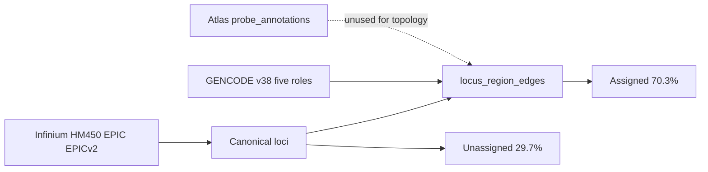
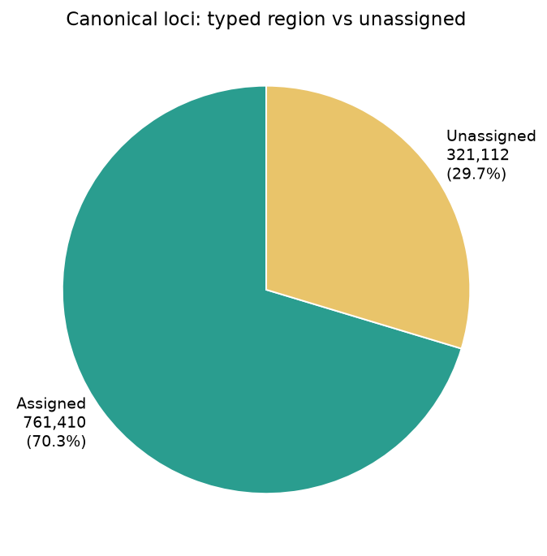
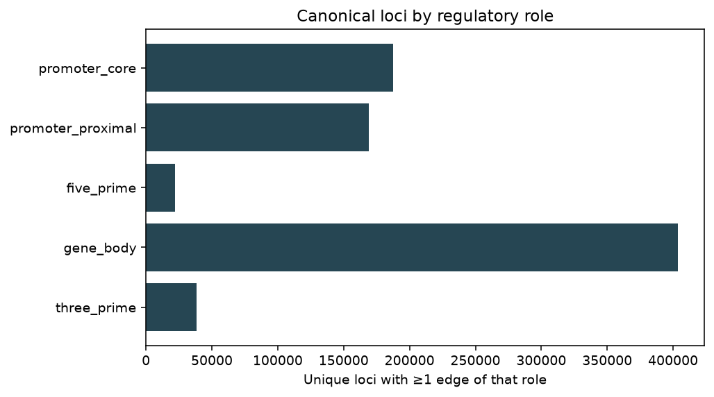
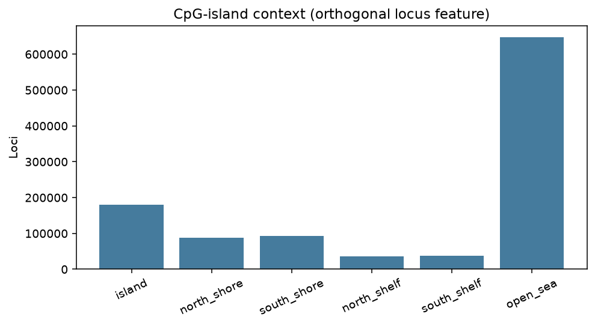
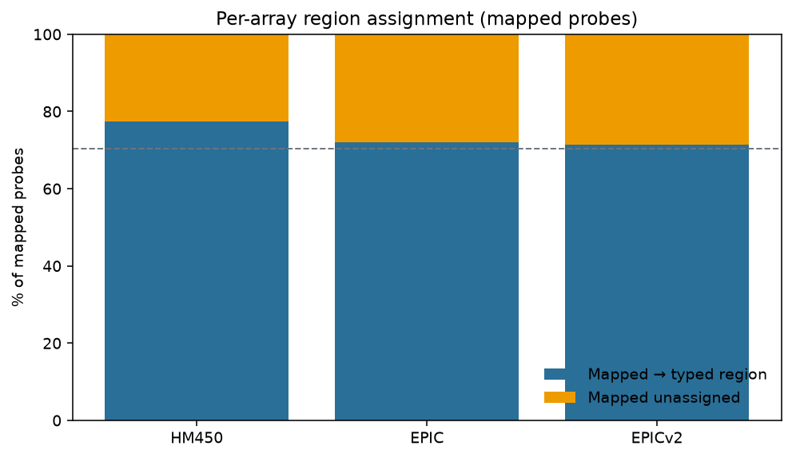

# Probe / CpG annotation coverage

Quantified Stage 0 mapping of Illumina array probes onto the canonical GRCh38
five-role annotation graph. Normative topology:
[`ANNOTATION_GRAPH.md`](ANNOTATION_GRAPH.md). Regenerable evidence:
[`reports/inspection/annotation_coverage_v1/`](../reports/inspection/annotation_coverage_v1/)
(and the frozen graph summary
[`annotation_graph_v1/`](../reports/inspection/annotation_graph_v1/)).

```bash
uv run python scripts/write_annotation_coverage_report.py
uv sync --extra analysis   # matplotlib, once
uv run python scripts/write_pipeline_doc_figures.py
```

Graph ID: `graph-grch38-gencode38-five-role-v1` (GENCODE v38 protein-coding;
InfiniumAnnotation HM450 / EPIC / EPICv2 → GRCh38).

## Completeness (this doc + report)

| Topic | Status |
|-------|--------|
| Global locus assigned / unassigned % | Present |
| Per-platform mapped → region % | Present (+ figures) |
| Unique loci / probes by role | Present |
| Illumina unmapped vs gene-unassigned | Distinguished |
| Atlas probe TSV as separate layer | Noted (not mixed into counts) |
| CGI context distribution | Present (+ figure) |
| Study-matrix unmapped (e.g. GSE35069) | Pointer only → study inspect reports |
| EPICv2 GeneHancer / clock columns from Zenodo manifest | Not summarized here (manifest rebuild input only) |

## Two different “not annotated” notions

| Term | Meaning | Model consequence |
|------|---------|-------------------|
| **Unmapped probe** | No GRCh38 cytosine coordinate in InfiniumAnnotation | Excluded from matrix columns; counted only |
| **Unassigned locus** | Mapped locus overlaps no five-role gene region | Left unassigned in the immutable graph; hierarchical train mints singleton `unassigned` regions under `__unassigned__` (no nearest-gene) |

Do **not** confuse either with EWAS Atlas `EWAS_Atlas_probe_annotations.tsv`
(~900k rows: transcripts, TSS offsets, islands). That table is association /
knowledge metadata and is **not** used to build the MBS graph
([`EWAS_METADATA.md`](EWAS_METADATA.md)).



## Global locus-level coverage

From `annotation_coverage_v1` (matches `annotation_graph_v1` unassigned count):



| Metric | Count | Share of loci |
|--------|------:|-------------:|
| Canonical loci | 1,082,522 | 100% |
| Assigned (≥1 typed region edge) | 761,410 | **70.34%** |
| Unassigned / intergenic | 321,112 | **29.66%** |
| Multi-gene loci | 92,793 | — |
| Locus–region edges | 870,947 | — |
| Genes (protein-coding) | 19,937 | — |
| Regions | 322,331 | — |

### Unique loci by regulatory role

A locus may appear in more than one role when it maps to multiple genes; role
counts are unique-locus sets, not a partition of all loci.



| Role | Unique loci | Edges |
|------|------------:|------:|
| `promoter_core` | 187,602 | 200,605 |
| `promoter_proximal` | 169,085 | 175,070 |
| `five_prime` | 21,967 | 22,071 |
| `gene_body` | 403,607 | 433,506 |
| `three_prime` | 38,526 | 39,695 |

### CpG-island context (orthogonal)



From `annotation_graph_v1`: island 179,826; north/south shores ~182k combined;
shelves ~74k; open sea 647,094.

## Per-array probe coverage

All platforms together: **2,290,670** probes; **2,143** unmapped (**0.09%**).



| Platform | Probes | Mapped | Unmapped | Mapped → typed region | Mapped unassigned |
|----------|-------:|-------:|---------:|----------------------:|------------------:|
| HM450 | 486,427 | 485,569 | 858 (0.18%) | 375,826 (**77.40%**) | 109,743 (**22.60%**) |
| EPIC | 866,553 | 865,904 | 649 (0.07%) | 624,518 (**72.12%**) | 241,386 (**27.88%**) |
| EPICv2 | 937,690 | 937,054 | 636 (0.07%) | 668,862 (**71.38%**) | 268,192 (**28.62%**) |

“Mapped → typed region” = probe’s locus has ≥1 five-role edge. Newer arrays
add more open-sea / intergenic cytosines, so the unassigned share among mapped
probes rises from HM450 → EPIC → EPICv2 while Illumina unmapped stays under 0.2%.

### Unique probes by role (per platform)

| Role | HM450 | EPIC | EPICv2 |
|------|------:|-----:|-------:|
| `promoter_core` | 115,163 | 167,912 | 164,300 |
| `promoter_proximal` | 91,481 | 146,326 | 148,370 |
| `five_prime` | 15,186 | 18,668 | 18,730 |
| `gene_body` | 166,646 | 312,246 | 355,831 |
| `three_prime` | 24,293 | 31,902 | 33,452 |

Probes can hit multiple roles (multi-gene loci); columns are not additive to
“mapped → region”.

## How the graph is built

```text
Illumina manifests (HM450, EPIC, EPICv2)
  → mapped probes collapse to unique GRCh38 loci
  → overlap GENCODE v38 five-role intervals (role precedence)
  → locus_region_edges + region_gene_edges
```

CLI: `uv run mbs graph build`. Sources and precedence:
[`ANNOTATION_GRAPH.md`](ANNOTATION_GRAPH.md). Scoring use of unassigned loci:
[`SCORING_PIPELINE.md`](SCORING_PIPELINE.md).

## Proposed improvements

1. Optional table: **fraction of open-sea loci that are unassigned** (CGI × assignment cross-tab) — explains why EPICv2 unassigned % is higher.
2. Study-level appendix: unmapped probe counts for each converted Hub matrix (already in matrix manifests; not yet rolled up).
3. Keep Atlas probe TSV out of the graph, but add a one-row “overlap with Atlas Probe.id vocabulary” sanity check if validation joins become common.

## Related

- Plan: [`plans/docs-scoring-annotation-catalog.md`](plans/docs-scoring-annotation-catalog.md)
- Milestone 2 plan: [`plans/milestone-2-canonical-annotation-graph.md`](plans/milestone-2-canonical-annotation-graph.md)
- Figures regenerate: `scripts/write_pipeline_doc_figures.py`
