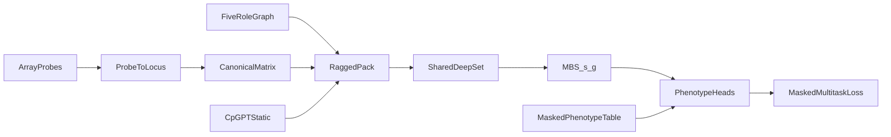
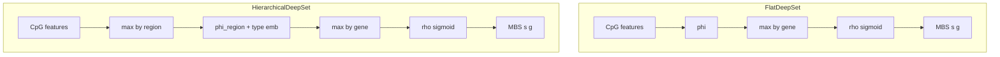
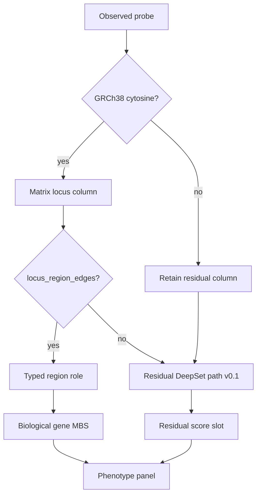
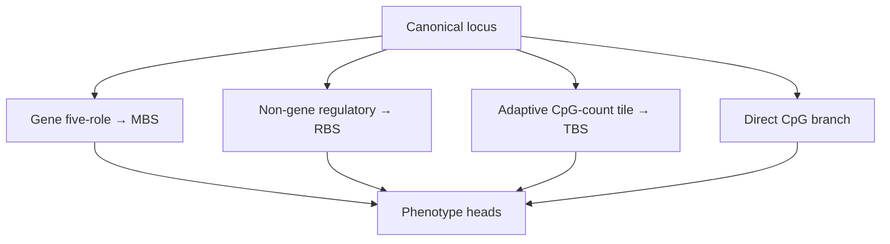
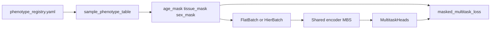

# Scoring pipeline: CpG → aggregation → phenotypes → MBS

Stage 0 schema sketch for **deepMAT** (package/CLI: `mbs`). Normative contracts:
[`ARCHITECTURE.md`](ARCHITECTURE.md), [`ANNOTATION_GRAPH.md`](ANNOTATION_GRAPH.md).
Implementation brief: [`plans/post-v0-scientific-programme.md`](plans/post-v0-scientific-programme.md)
(historical docs trio: [`plans/docs-scoring-annotation-catalog.md`](plans/docs-scoring-annotation-catalog.md)).

Phenotype heads train the shared encoder; they are **not** part of the exported
MBS scoring function.

## Completeness (this doc)

| Topic | Status |
|-------|--------|
| End-to-end mermaid + stage table | Present |
| Flat vs hierarchical aggregation | Present (+ unassigned semantics) |
| Phenotype masking / shared encoder | Present |
| Today vs Milestone 7 OOF MBS | Present; 7 blocked until 7A–7E |
| Target multi-path (RBS/TBS/direct) | Documented; implement in 7C |
| Numeric train metrics / loss curves | Out of scope here → `stage0_5d_max_n/`, TB |
| Cross-fitting fold diagram | Deferred with §7 |

## End-to-end flow



| Stage | What happens | Code / artifacts |
|-------|----------------|------------------|
| Probe → locus | Illumina IDs map to GRCh38 cytosine loci; unmapped probes dropped from matrix columns | `src/mbs/matrix/locus_map.py`, `annotation/` |
| Canonical matrix | Observed betas → Zarr + indices + manifest | `mbs matrix convert` / `convert-pack` |
| Graph | Typed five-role regions + genes | `mbs graph build`, `canonical/graphs/…` |
| Static features | Offline CpGPT locus vectors (lookup, not IDs) | `mbs features export-cpgpt` |
| Pack | Ragged sample features + segment indices | `training/dataset.py`, `hier_dataset.py` |
| Encoder | `FlatDeepSet` or `HierarchicalDeepSet` → `[B,G]` MBS + `present` | `src/mbs/models.py` |
| Heads + loss | Linear age/tissue/(sex) modules; masks gate loss | `training/multitask.py` |
| Train | Study-grouped split, checkpoints, metrics | `mbs train flat` / `hierarchical` |

## Aggregation: flat vs hierarchical

Both paths consume **ragged** CpG sets (permutation-invariant pooling). Empty
genes score `MBS=0.5` with `present=False` (missing ≠ low burden).



### Flat baseline (`FlatDeepSet`)

```text
CpG features → φ → elementwise max by gene → ρ → sigmoid MBS[s,g]
```

Regions are collapsed when building the locus→gene index (`training/locus_gene.py`).
This is the DeepRVAT-style reference retained for every comparison.

### Hierarchical (`HierarchicalDeepSet`) — frozen v0.1

```text
CpG → max within typed region → φ_region(+ region-type emb) → max within gene → ρ → MBS
unmapped / residual CpGs → shared φ_cpg → max per sample → ρ_res → residual slot
```

Roles: `promoter_core`, `promoter_proximal`, `five_prime`, `gene_body`,
`three_prime`. Loci with no graph edge (and Illumina-coordinate-unmapped probes
retained as residual matrix columns) stay on the **residual path** — they are
not nearest-gene assigned and not pooled under `__unassigned__`. Eval reports
`full` / `mapped_only` / `residual_only` on the same folds as flat.

**Important:** residual_only near-chance results test the **one-scalar
bottleneck**, not noncoding biology ([ADR 0006](adr/0006-multipath-noncoding-scores.md)).

See [`plans/milestone-6-hierarchical-region-model.md`](plans/milestone-6-hierarchical-region-model.md).



### Target multi-path (Milestone 7C)



Train branches independently for ablations; do not rely on eval-time masking
alone. v0.1 residual-only used ~108k loci → one scalar and the **first 512
ordered** holdout samples — that is not a noncoding biology test. Direct CpG
v1: \(D_k(s)=\sum w_{k,c} z_{s,c}\) (elastic-net). Score orientation:
[ADR 0008](adr/0008-score-identifiability.md).
## Changing phenotypes (architecture stays fixed)



1. **Registry** catalogs Hub packs / studies
   ([`configs/data/phenotype_registry.yaml`](../configs/data/phenotype_registry.yaml)).
2. **Unified table** (`mbs phenotypes build-multitask-table`) carries labels and
   masks (`age_years`/`age_mask`, `tissue_*`/`tissue_mask`, optional sex).
3. **Batches** copy masks onto `FlatBatch` / `HierBatch`.
4. **`MultitaskHeads`** always expose the same linear modules; missing traits do
   not swap architectures.
5. **`masked_multitask_loss`** sums only observed sample×trait terms (Huber/MSE
   age, CE tissue/sex).

Study IDs, GSM IDs, and platform IDs never enter the shared encoder.

Contracts: [`EWAS_METADATA.md`](EWAS_METADATA.md),
[`plans/milestone-5c-multitask-shared-encoder.md`](plans/milestone-5c-multitask-shared-encoder.md).

## What “producing MBS” means today vs deferred

**Today**

- Forward pass yields per-batch `MBS[s,g] ∈ [0,1]` used for multitask training/eval.
- Checkpoints and `split.json` under `$MBS_ARTIFACT_ROOT/runs/<run_id>/`.
- Study-grouped train / validation / external_test splits exist
  (`evaluation/splits.py`); hierarchical runs can reuse a flat `split.json`.

**Deferred (Milestone 7 — blocked until 7A–7E)**

- Full **out-of-fold** score matrix: every training sample scored only by models
  that never saw its study group; persisted OOF MBS (+ optional RBS/TBS/direct,
  phenotype preds).
- Protocol: [`EXPERIMENT_PROTOCOL.md`](EXPERIMENT_PROTOCOL.md) § out-of-fold;
  gates: [`TODO_PIPELINE.md`](TODO_PIPELINE.md) §7A–7E then §7;
  [ADR 0007](adr/0007-crossfit-prerequisites.md).

## Proposed improvements (not blocking)

1. Link TensorBoard / epoch curves from `stage0_5d_max_n` when documenting
   performance (keep this doc topology-focused).
2. When §7 lands, add a cross-fitting fold mermaid and concrete export schema
   including RBS/TBS if selected in 7E.

## Related commands

```bash
uv run mbs matrix convert-pack --phenotype-family age --all-studies ...
uv run mbs phenotypes build-multitask-table
uv run mbs train flat --config configs/experiment/stage0_flat_deeprvat_full.yaml
uv run mbs train hierarchical --config configs/experiment/stage0_hier_deeprvat_full.yaml
uv run mbs monitor --run-id <run_id>
```

Probe assignment rates: [`PROBE_ANNOTATION_COVERAGE.md`](PROBE_ANNOTATION_COVERAGE.md).
Data volumes and traits: [`DATA_CATALOG.md`](DATA_CATALOG.md).
