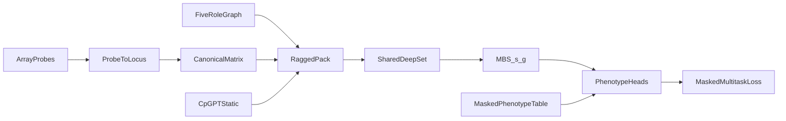
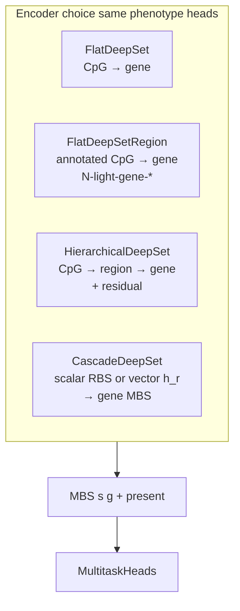
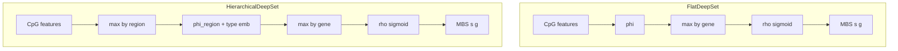
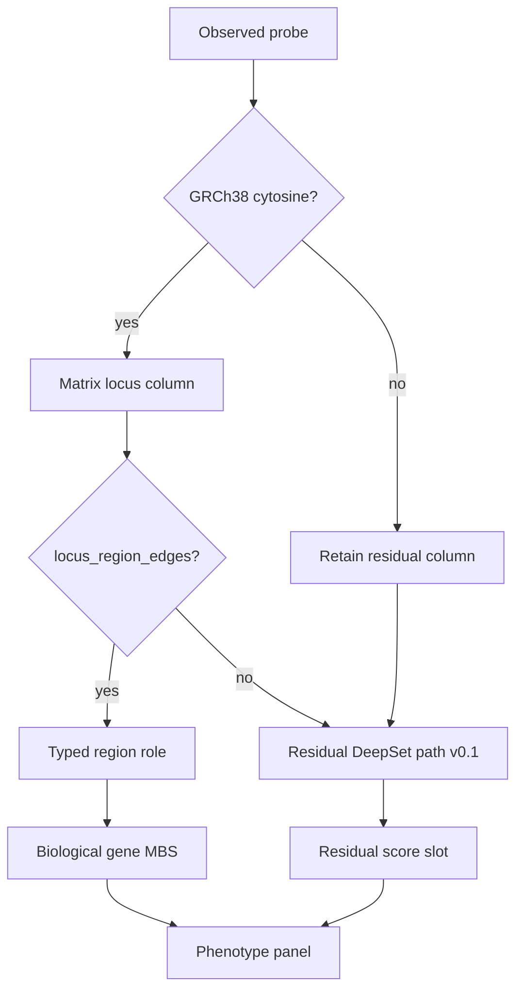
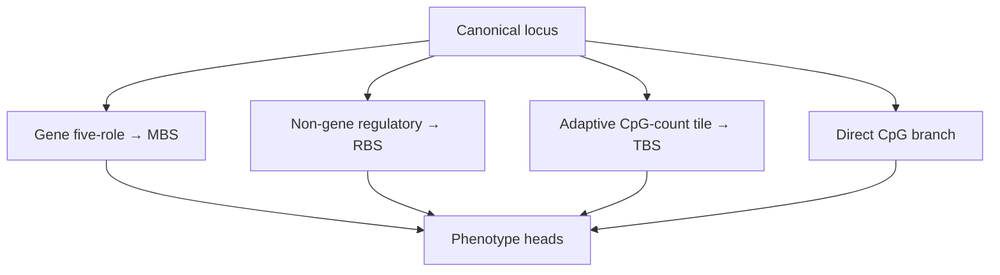
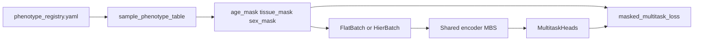

# Scoring pipeline: CpG → aggregation → phenotypes → MBS

Stage 0 schema sketch for **deepMAT** (package/CLI: `mbs`). Normative contracts:
[`ARCHITECTURE.md`](ARCHITECTURE.md) (encoder family, gene-only vs full),
[`ANNOTATION_GRAPH.md`](ANNOTATION_GRAPH.md).
Implementation brief: [`plans/post-v0-scientific-programme.md`](plans/post-v0-scientific-programme.md).

Phenotype heads train the shared encoder; they are **not** part of the exported
MBS scoring function.

## Completeness (this doc)

| Topic | Status |
|-------|--------|
| End-to-end mermaid + stage table | Present |
| Four neural encoders (flat / flat+region / hier / cascade) | Present |
| Gene-only vs full CpG scope (7G′) | Present |
| GPU policy for real training | Present |
| Flat vs hierarchical aggregation | Present (+ unassigned semantics) |
| Phenotype masking / shared encoder | Present |
| Today vs Milestone 7 OOF MBS | Present; 7 blocked until 7G′ |
| Current 7F cascade (MBS/orphan RBS/direct; no TBS) | Implemented; `direct_cpg.zarr` is a 7G′ Stage B gap |
| Numeric train metrics / loss curves | Out of scope here → `stage0_5d_max_n/`, TB |
| Cross-fitting fold diagram | Deferred with §7 |

## End-to-end flow



| Stage | What happens | Code / artifacts |
|-------|----------------|------------------|
| Probe → locus | Illumina IDs map to GRCh38 cytosine loci; unmapped probes dropped from matrix columns | `src/mbs/matrix/locus_map.py`, `annotation/` |
| Canonical matrix | Observed betas → Zarr + indices + manifest | `mbs matrix convert` / `convert-pack` |
| Graph | Typed five-role regions + genes | `mbs graph build`, `canonical/graphs/…` |
| Static features | Offline CpGPT locus vectors (lookup, not IDs) | `mbs features export-cpgpt` |
| Pack | Ragged sample features + segment indices | `training/dataset.py`, `hier_dataset.py`, cascade assignment |
| Encoder | One of four DeepSet encoders → `[B,G]` MBS + `present` | `src/mbs/models.py` |
| Heads + loss | Linear age/tissue/(sex) modules; masks gate loss | `training/multitask.py` |
| Train | Study-grouped split, checkpoints, metrics (**GPU** on real data) | `mbs train flat` / `hierarchical` / `cascade` |

## Neural encoders (four architectures)

All encoders share: permutation-invariant pooling, neutral `MBS=0.5` when
`present=False`, and masked linear phenotype heads. See
[`ARCHITECTURE.md` § Neural encoder family](ARCHITECTURE.md#neural-encoder-family).



| Encoder | Train command | Pooling stages | Region annotations |
|---------|---------------|----------------|-------------------|
| **FlatDeepSet** | `mbs train flat` | CpG → **gene** | Collapsed in locus→gene index only |
| **FlatDeepSetRegion** | Stage A **`N-light-gene-*`** / Stage B **`N-light-type`** | `mbs train flat` (`topology: flat_region`) | CpG(+role/context/regulatory) → **gene** | Per-edge gene-role + CGI + reserved cCRE multi-hot |
| **HierarchicalDeepSet** | `mbs train hierarchical` | CpG → **region** → **gene**; unmapped → **residual** scalar | Region-type embedding at region pool |
| **CascadeDeepSet** | `mbs train cascade` | CpG → **region** → **RBS** → **gene** MBS; orphan RBS separate | Region-type embedding; orphan never pooled by type |

### Gene-only vs full input (7G′)

| Mode | When | CpGs in encoder | Comparator |
|------|------|-----------------|------------|
| **Gene-only** | 7G′ Stage A architecture selection | `gene_cols` only (typed edges allocated to a gene) | `C-mvalue-ridge-G`, `-enet-G`, `-hgb-G`, `-sva-G` on same columns |
| **Full** | 7G′ Stage B + Milestone 7 OOF | Fold-selected panel + qualified orphan regions + direct loci | `C-mvalue-enetS`, `N-cascade-S`, fusion ablations |

Cascade config keys: `training.gene_linked_only`, `training.primary_evaluation`
(`mbs_e2e` vs `late_fusion`), `training.extra_fusion_modes` (orphan ablation:
`fusion_full` vs `fusion_mbs_direct`). Runner:
`scripts/run_7g_gene_only_probe.py`.

### Compute policy

**Always use GPU** for real Hub training (multi-fold, ≥8k loci). CPU is for
fixtures, unit tests, and smoke only.

```bash
uv run mbs train flat         --config … --device cuda
uv run mbs train hierarchical --config … --device cuda
uv run mbs train cascade      --config … --device cuda
uv run python scripts/run_7g_gene_only_probe.py --device cuda
```

Set `device.torch_device: cuda` in experiment YAML when using config-driven
training without an explicit CLI flag.

## Aggregation detail: flat vs hierarchical vs cascade

Both paths consume **ragged** CpG sets (permutation-invariant pooling). Empty
genes score `MBS=0.5` with `present=False` (missing ≠ low burden).



### Flat baseline (`FlatDeepSet`)

```text
CpG features → φ → elementwise max by gene → ρ → sigmoid MBS[s,g]
```

Regions are collapsed when building the locus→gene index (`training/locus_gene.py`).
This is the DeepRVAT-style reference retained for every comparison. Trains on
the full locus prefix or a **gene-only** column subset via the packed index.

### Flat with region annotations (`FlatDeepSetRegion` — 7G′ Stage A / B)

```text
[M-value, gene-role one-hot, CGI context, regulatory multi-hot, presence flags]
  → shared φ → pool by gene → ρ → MBS → tissue/age/sex heads
```

Stage A arms **`N-light-gene-max`** / **`N-light-gene-mean`** use
`gene_allocation: explicit_only` on the same gene-linked panel as cascade `-G`.
Regulatory SCREEN/cCRE slots are reserved (zeros until a later graph release).
Train via batched `mbs train flat` (`topology: flat_region`), not the per-sample
Stage B helper. Legacy Stage B name: **`N-light-type`**.

### Vector-region cascade (`CascadeDeepSet` + `gene_aggregation: region_hidden`)

```text
h_c = φ_CpG(x_c)
u_r = pool_{c∈r} h_c
h_r = φ_R[u_r, e(region_type)]
h_g = pool_{r∈g} h_r
MBS_g = σ(ρ_G(h_g))
```

Scalar RBS from `ρ_R(h_r)` is still exported for diagnostics (`all_gene_rbs.zarr`)
but is **not** used for gene pooling. Arms: `N-cascade-vector-mean-max`,
`N-cascade-vector-max-max`. Residual / orphan / direct paths stay off in Stage A.

### Hierarchical (`HierarchicalDeepSet`) — Milestone 6 / 7E

```text
CpG → max within typed region → φ_region(+ region-type emb) → max within gene → ρ → MBS
unmapped / residual CpGs → shared φ_cpg → max per sample → ρ_res → residual slot
```

Roles: `promoter_core`, `promoter_proximal`, `five_prime`, `gene_body`,
`three_prime`. Loci with no graph edge (and Illumina-coordinate-unmapped probes
retained as residual matrix columns) stay on the **residual path** — they are
not nearest-gene assigned and not pooled under `__unassigned__`. Eval reports
`full` / `mapped_only` / `residual_only` on the same folds as flat.

**Important:** residual_only near-chance results test the **one-scalar
bottleneck**, not noncoding biology ([ADR 0006](adr/0006-multipath-noncoding-scores.md)).

See [`plans/milestone-6-hierarchical-region-model.md`](plans/milestone-6-hierarchical-region-model.md).

### Cascade product encoder (`CascadeDeepSet`) — Milestone 7F / 7G / 7G′

```text
CpG M-value → pool within typed region → RBS (region-type context)
  → pool by gene → MBS
orphan regions → one RBS column per region_id (not pooled by type)
leftover CpGs → fold-fitted direct branch (outside the neural module)
```

Trainer: `training/cascade_loop.py`. Evaluation modes: `mbs_e2e` (Stage A
primary), `mbs_linear_probe`, `fusion_full`, `fusion_mbs_direct` (orphan
ablation). Late-fusion diagnostic: `direct_contrib.zarr` (one task pred/sample);
association product needs **`direct_cpg.zarr`** (Stage B).



### Historical 7C multi-path and current 7F product



The diagram records the 7C experiment. ADR 0009 subsequently removed TBS from
the product. The current cascade exports MBS, separate orphan-region scores and
a direct phenotype contribution. Before final OOF, 7G′ Stage B must add
`direct_cpg.zarr` (sample×locus); `direct_contrib.zarr` is diagnostic only.
Replace unrestricted nearest-gene RBS allocation with evidence-backed edges.

Train branches independently for ablations; do not rely on eval-time masking
alone. v0.1 residual-only used ~108k loci → one scalar and the **first 512
ordered** holdout samples — that is not a noncoding biology test. Direct CpG
v1: \(D_k(s)=\sum w_{k,c} z_{s,c}\) (elastic-net). Score orientation:
[ADR 0008](adr/0008-score-identifiability.md).
## Changing phenotypes (architecture stays fixed)



1. **Registry** catalogs Hub packs / studies
   ([`configs/data/phenotype_registry.yaml`](../configs/data/phenotype_registry.yaml)).
2. **Unified table** (`mbs phenotypes build-multitask-table`) carries labels and
   masks (`age_years`/`age_mask`, `tissue_*`/`tissue_mask`, optional sex).
3. **Batches** copy masks onto `FlatBatch` / `HierBatch`.
4. **`MultitaskHeads`** always expose the same linear modules; missing traits do
   not swap architectures.
5. **`masked_multitask_loss`** sums only observed sample×trait terms (Huber/MSE
   age, CE tissue/sex).

Study IDs, GSM IDs, and platform IDs never enter the shared encoder.

Contracts: [`EWAS_METADATA.md`](EWAS_METADATA.md),
[`plans/milestone-5c-multitask-shared-encoder.md`](plans/milestone-5c-multitask-shared-encoder.md).

## What “producing MBS” means today vs deferred

**Today**

- Forward pass yields per-batch `MBS[s,g] ∈ [0,1]` used for multitask training/eval.
- Checkpoints and `split.json` under `$MBS_ARTIFACT_ROOT/runs/<run_id>/`.
- Study-grouped train / validation / external_test splits exist
  (`evaluation/splits.py`); hierarchical runs can reuse a flat `split.json`.

**Deferred (Milestone 7 — blocked until 7G′ Stage A and B)**

- Full **out-of-fold** score matrix: every training sample scored only by models
  that never saw its study group; persisted OOF MBS, qualified per-region orphan
  RBS, indexed direct CpGs, and optional phenotype predictions. No TBS.
- Protocol: [`EXPERIMENT_PROTOCOL.md`](EXPERIMENT_PROTOCOL.md) § out-of-fold;
  gates: [`TODO_PIPELINE.md`](TODO_PIPELINE.md) §7A–7E then §7;
  [ADR 0007](adr/0007-crossfit-prerequisites.md).

## Proposed improvements (not blocking)

1. Link TensorBoard / epoch curves from `stage0_5d_max_n` when documenting
   performance (keep this doc topology-focused).
2. When §7 lands, add a cross-fitting fold mermaid and concrete export schema
   including RBS/TBS if selected in 7E.

## Related commands

```bash
# Real Hub runs — always prefer GPU
uv run mbs matrix convert-pack --phenotype-family age --all-studies ...
uv run mbs phenotypes build-multitask-table
uv run mbs train flat         --config configs/experiment/stage0_flat_deeprvat_full.yaml --device cuda
uv run mbs train hierarchical --config configs/experiment/stage0_hier_deeprvat_full.yaml --device cuda
uv run mbs train cascade      --config configs/experiment/stage0_7g_gene_only_probe_p2.yaml --device cuda
uv run python scripts/run_7g_gene_only_probe.py --device cuda
uv run mbs monitor --run-id <run_id>
```

Probe assignment rates: [`PROBE_ANNOTATION_COVERAGE.md`](PROBE_ANNOTATION_COVERAGE.md).
Data volumes and traits: [`DATA_CATALOG.md`](DATA_CATALOG.md).
