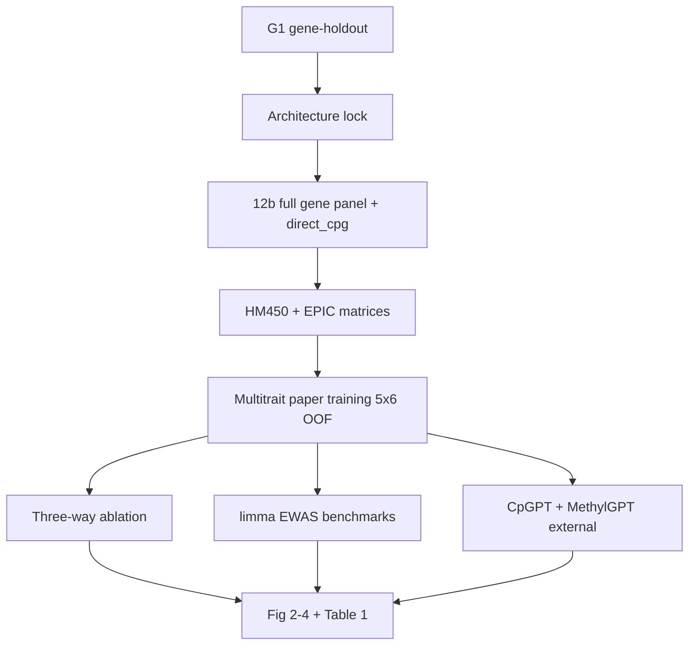

# deepMAT paper TODO

**Role:** Manuscript checklist for a deepRVAT-shaped technical report on
interpretable methylation burden scoring. This is **not** a coding milestone;
execute pipeline work via [`TODO_PIPELINE.md`](TODO_PIPELINE.md). Update this
file when paper-scale analyses complete.

**Reference paper:** Clarke & Holtkamp et al., *Nature Genetics* 2024
([s41588-024-01919-z.pdf](s41588-024-01919-z.pdf); code
[PMBio/deeprvat](https://github.com/PMBio/deeprvat)).

**Last updated:** 2026-09-28

---

## 0. Central claim (not rare variants)

deepRVAT learns a **trait-agnostic gene impairment score** from rare variants
and annotations, then uses it for gene discovery and phenotype prediction.
deepMAT is the methylation analogue: **not** a rare-variant method.

| deepRVAT concept | deepMAT analogue |
|------------------|------------------|
| Rare variants + functional annotations | Observed CpGs + region type + optional static locus features (CpGPT sequence adapter) |
| Gene impairment score | **MBS** (gene methylation burden) and **RBS** (region burden) |
| Unmodeled / non-gene signal | **Direct / unassigned CpGs** — loci with no typed-region assignment ([ADR 0009](adr/0009-drop-tbs-scores.md)) |
| SKAT / burden / STAAR baselines | **limma EWAS** (+ `C-mvalue-enet` as strong classical predictor) |
| Common-variant PRS | Epigenetic **clocks** + **CpGPT / MethylGPT** as **external** phenotype models |
| Seed genes from burden tests | Optional fold-internal EWAS gene lists for ablation only; product trains on full gene panel after G1 gene-holdout passes |
| UKB unrelated European WES | EWAS Data Hub **all studies**, **HM450 + EPIC** jointly |
| REGENIE + relatedness | **Study-grouped OOF** (already in pipeline); no metadata-only competitor panel |

**Primary scientific question:** Does permutation-invariant aggregation to
**gene- and region-level scores** improve **interpretability** (which genes and
regions drive a call) **and** **prediction** versus classical EWAS and
foundation-model baselines, when the final model uses **MBS together with
unassigned CpGs**?

**Three-way prediction ablation (mandatory on every trait):**

| Setting | Features | Role |
|---------|----------|------|
| **A — MBS only** | Gene-aggregated RBS → MBS matrix | Gene-level explanation path |
| **B — unassigned only** | `direct_cpg` / direct branch only | Non-gene-assigned biology |
| **C — both** | MBS + unassigned (product) | Primary product claim |

Secondary (not co-primary): RBS-only; RBS+MBS without direct.

**Non-claims:**

- deepMAT is not a LOEUF / constraint score ([ADR 0008](adr/0008-score-identifiability.md)).
- Pack-level “any disease” or pan-cancer AUROC is not a headline result.
- Metadata-only (study / platform / tissue) is **not** a benchmark competitor.
- HM450-only nine-pack OOF numbers are development only, not paper cohort.
- TBS / tile scores are not exported ([ADR 0009](adr/0009-drop-tbs-scores.md)).

---

## 1. Implementation status (what exists vs what the paper needs)

### 1.1 Already implemented (methods + dev numbers — do not cite as paper results)

| Component | Status | Evidence / notes |
|-----------|--------|------------------|
| **Cascade P2-G** (CpG → region → RBS → gene MBS, max/max) | Locked topology | [`ARCHITECTURE_BENCHMARKS.md`](ARCHITECTURE_BENCHMARKS.md); nine-pack e2e **0.355 / 13.43 / 0.853** |
| **N-light@64** (`FlatDeepSetRegion`, mean pool) | Locked light encoder | Nested 3-fold **0.368 / 9.88 / 0.803**; **5×6 OOF done** on 65k-prefix |
| Score families: RBS, MBS, orphan RBS, direct | Implemented (7F) | [`SCORING_PIPELINE.md`](SCORING_PIPELINE.md); fusion modes `fusion_full`, `fusion_mbs_direct` |
| **`direct_cpg.zarr` export** | Spec + unit tests; **full-panel paper export pending** | Milestone 11 gap in SCORING_PIPELINE |
| Study-grouped CV / OOF | Implemented | ADR 0007; N-light 5×6 **30/30** → nested **0.316 / 9.59 / 0.822** |
| CpGPT **inside encoder** (`cpgpt2m_adapter_128_v1`) | G2 **YES** for N-light | Age MAE 9.57 → **8.10 ± 0.19**; cascade CpGPT plumbing smoke done |
| Phenotype registry + Hub matrices | Done (7A–7B) | [`phenotype_registry.yaml`](../configs/data/phenotype_registry.yaml); disease 12 218 GSM; cancer 10 101 |
| Classical baselines | `C-mvalue-enet`, gene means | Milestone 8 winner on ATS |
| **limma EWAS pipeline** | **Not implemented** | Paper blocker |
| **MethylGPT phenotype benchmark** | Weights + token-prior export only | [`.venv-methylgpt`](WORKSPACE.md); no external predictor run |
| **CpGPT external phenotype benchmark** | **Not run** | Separate from static embeddings in encoder |
| Per-disease / per-cancer **trained** heads | **Not run** | Only frozen pack probes (cancer ~0.95, broad disease ~0.59, Alzheimer’s ~0.84) |
| **HM450 + EPIC joint training** | **Not run** | Catalog ~110k HM450 / ~57k EPIC; nine-pack is HM450-only |
| Cascade 5×6 OOF | Blocked on G1 | Native P2-G recipe |

### 1.2 In progress now (GPU queue — prerequisite, not paper)

From [`TODO_PIPELINE.md`](TODO_PIPELINE.md) (2026-09-28):

1. **G1 gene-holdout** — train φ/ρ on one gene set, score disjoint genes, nested enet on held-out MBS. Plumbing landed; smokes pending.
2. After G1 pass: max samples, CpGPT on, trait heads in loop, then cascade 5×6.
3. **G3 platform (EPIC)** — not started; paper requires EPIC in **training**, not only as transfer ED.

### 1.3 Still required for the paper (checklist)

- [ ] G1 gene-holdout pass (cascade + N-light).
- [ ] Full gene-linked panel (~19.6k genes) + `direct_cpg.zarr` at scale (milestone 12b).
- [ ] **Final multitrait model:** age + **each eligible disease** + **each eligible cancer type** vs healthy controls, all studies, **HM450 + EPIC**.
- [ ] **limma EWAS** runner (fold-internal train, held-out test genes/CpGs).
- [ ] **Three-way ablation** runner (MBS / unassigned / both) on OOF scores.
- [ ] **CpGPT** and **MethylGPT external** age (+ disease where supported) benchmarks on identical samples.
- [ ] Per-trait results table + Fig. 2–4 + Table 1 + supplementary trait dictionary.
- [ ] Figure regeneration scripts under `reports/inspection/paper/` (or dedicated `scripts/paper/`).

---

## 2. Manuscript outline

### Title (working)

*Interpretation of DNA methylation through deep set aggregation to gene and
region burden scores enables multi-trait prediction across array platforms.*

### Abstract bullets (fill after results)

1. Problem: CpG-level EWAS is hard to interpret at gene scale; ad hoc gene
   aggregation loses regulatory structure.
2. Method: deepMAT — deep set network from annotated CpGs → **RBS** → **MBS**,
   plus parallel **unassigned CpG** path; multitrait training across EWAS Data Hub.
3. Main result: **C (MBS + unassigned)** beats **A**, **B**, and **limma** on
   *N* traits; per-disease and per-cancer gains listed.
4. Interpretability: top genes/regions for case traits overlap limma gene
   summaries but add coordinated multi-CpG structure.
5. External benchmarks: vs CpGPT / MethylGPT / clocks on age; vs limma on diseases.
6. Data/code: Hub release id, OOF manifest, Zenodo target.

### Introduction (~4 paragraphs)

- [ ] **P1** — Methylation associates with age, disease, cancer; EWAS Catalog
  scale; need **gene-interpretable** scores, not only CpG lists.
- [ ] **P2** — Limitations of mean/median gene aggregation and black-box
  predictors; region types (promoter, enhancer, CGI, …) underused in a single
  learned score.
- [ ] **P3** — deepRVAT precedent: trait-agnostic impairment score + linear
  heads; we adapt the **architecture pattern**, not RVAT statistics.
- [ ] **P4** — Contributions: (1) RBS/MBS + unassigned product, (2) multitrait
  Hub training HM450+EPIC, (3) limma + foundation-model benchmarks, (4)
  per-disease/cancer evaluation, (5) open pipeline.

### Results (section order mirrors deepRVAT)

| § | deepRVAT analogue | deepMAT content | Status |
|---|-----------------|-----------------|--------|
| **R1** | Fig. 1 + semi-synthetic calibration | Model overview; fixture / small Hub smoke calibration | Partial (figures exist: [`figures/`](figures/)) |
| **R2** | Fig. 2 gene discovery | **Prediction vs limma + CpGPT/MethylGPT** by trait group; optional gene-rank concordance with limma | **TODO** |
| **R3** | Fig. 3 PRS + extremes | **Three-way ablation** (MBS / unassigned / both); age MAE; per-trait AUROC; optional extreme-tail panel | **TODO** |
| **R4** | Fig. 4 binary + REGENIE | **Per-disease and per-cancer** vs healthy controls; calibration; gains over limma | **TODO** |
| **R5** | Table 1 novel hits | **Interpretation table:** top MBS/RBS genes/regions vs limma for selected traits | **TODO** |

### Discussion (~5 paragraphs)

- [ ] Interpretability vs prediction trade-off (when unassigned CpGs help).
- [ ] Comparison to EWAS Catalog expectations; study heterogeneity.
- [ ] CpGPT embeddings **inside** vs **external** model — do not conflate.
- [ ] Limits: array coverage, label noise, unknown ≠ control, no causal claim.
- [ ] Future: WGBS, expression auxiliary (milestone 13), constraint scores (post–Stage 0).

### Methods (minimum subsections)

- [ ] Data: EWAS Data Hub release (`deepmat-data-v1` + paper release tag), HM450
  and EPIC matrices, phenotype harmonization, unknown labels.
- [ ] Annotation graph: typed regions → RBS; gene allocation → MBS; direct path.
- [ ] Encoder: locked P2-G (and report N-light as ablation if needed); CpGPT
  static block; within-gene sampling; study-grouped 5×6 OOF.
- [ ] Training traits: list every disease and cancer type head (Supplementary Table S1).
- [ ] Readouts: nested elastic-net on OOF MBS / direct / fused features.
- [ ] **limma:** model formula, covariates, multiple testing, gene aggregation rule.
- [ ] **CpGPT / MethylGPT external:** versions, checkpoints, inference command, same folds.
- [ ] Statistics: metrics (MAE, AUROC, AUPRC, macro-F1 tissue), FWER where applicable.
- [ ] Code/data availability statement.

---

## 3. Cohort and training protocol (paper freeze)

### 3.1 Samples and platforms

| Layer | Rule |
|-------|------|
| **Training cohort** | All eligible Hub GSM with methylation matrix + ≥1 trait label; **HM450 and EPIC together** |
| **Studies** | All studies in registry; **study-grouped** outer folds (no train/test study leakage) |
| **Platforms** | Train jointly; record `platform_id` in manifest; do **not** hold EPIC out of training |
| **Paper release tag** | New content-addressed release e.g. `deepmat-paper-v1/` — do not overwrite `deepmat-data-v1` |

Catalog reference (2026-09): ~173k samples total; ~110k HM450 / ~57k EPIC
([`post-v0-scientific-programme.md`](plans/post-v0-scientific-programme.md)).
Nine-pack virtual union (34 234 GSM) remains **development only**.

### 3.2 Trait dictionary

**Training heads (multitask encoder + linear heads, end-to-end):**

| Family | Head definition | Notes |
|--------|-----------------|-------|
| **Age** | Continuous (years) | Core quantitative trait |
| **Tissue** | Coarse (+ optional fine brain) | Multiclass; masked where unknown |
| **Sex** | Binary / multiclass | Aux; downweight in paper if sex-chromosome leakage suspected |
| **Disease *i*** | Case vs **healthy control** | **One head per disease label** in registry — not “any disease” |
| **Cancer type *j*** | Case vs **healthy control** | **One head per cancer subtype**; within-tissue controls where pack defines them |
| **BMI** | Continuous | Secondary quantitative; can be held-out from encoder training for Fig. 2f-style generalization |

**Eligibility for main-text Fig. 4** (starting criteria from programme brief; re-run census before freeze):

| Trait type | Minimum for main figure | Below threshold |
|------------|-------------------------|-----------------|
| Binary disease | ≥200 cases, ≥200 documented controls, ≥3 studies | Supplement only or exclude |
| Cancer subtype | Same + **within-tissue** case/control where possible | Pan-cancer sensitivity → supplement |
| Age | ≥5 000 labeled samples across ≥10 studies | — |

**Commands to refresh eligibility:**

```bash
mbs catalog phenotype-census
mbs catalog trait-eligibility
```

Export frozen trait list to `reports/inspection/paper/trait_dictionary.json` before any paper-scale run.

### 3.3 Final model recipe (differs from current pipeline default)

| Parameter | Paper value | Current pipeline (2026-09-28) |
|-----------|-------------|----------------------------------|
| Gene panel | Full gene-linked (~19.6k) | 65k-prefix (~2.6k genes) |
| Platforms | HM450 + EPIC train | HM450 nine-pack only |
| Traits in training | All eligible diseases + cancers + age (+ tissue/sex aux) | ATS + masked disease/cancer aux (7E′) |
| Static features | CpGPT `cpgpt2m_adapter_128_v1` on | G2 YES for N-light |
| Readout | Nested enet on OOF; three-way ablation | Product nested enet |
| Metadata benchmark | **None** | Leakage alarm only |

### 3.4 Evaluation splits

- **Primary:** 5 outer folds × 6 restarts, study-grouped OOF ([ADR 0007](adr/0007-crossfit-prerequisites.md)).
- **Orientation:** Apply score-orientation anchor before ensembling ([ADR 0008](adr/0008-score-identifiability.md)).
- **Secondary:** Held-out **studies** (20% of studies per fold) for replication-style gene lists.
- **Optional:** Train encoder on subset of traits, evaluate on held-out traits (deepRVAT Fig. 2f) — e.g. hold BMI out of training.

---

## 4. Benchmarks (detailed)

### 4.1 Internal deepMAT readouts

| ID | Method | Input | When to run |
|----|--------|-------|-------------|
| **DM-full** | deepMAT product | MBS + unassigned + optional orphan RBS fusion | Primary |
| **DM-mbs** | MBS only | `mbs.zarr` OOF | Ablation A |
| **DM-direct** | Unassigned only | `direct_cpg.zarr` OOF | Ablation B |
| **DM-rbs** | RBS only (region columns) | `rbs.zarr` | Secondary interpretability |
| **DM-no-cpgpt** | Matched encoder without static block | Same as DM-full | ED ablation |

Readout: **nested elastic-net** on fold-internal train, evaluate on fold-held-out samples (same as product). Report mean ± SD across folds.

### 4.2 Classical EWAS (replaces SKAT / burden / STAAR)

| ID | Method | Protocol | Output |
|----|--------|----------|--------|
| **EW-limma** | limma on M-values | Per fold: fit on train samples; empirical Bayes; FDR across CpGs | CpG *P* values, volcano |
| **EW-limma-gene** | Gene summary | Aggregate significant CpGs to genes (max \|t\|, or ACAT) | Gene list for Table 1 |
| **EW-limma-pred** | Predictor | Top-*k* CpGs or elastic net on limma-selected features | AUROC / MAE comparable to DM-* |
| **EW-enet** | `C-mvalue-enet` / `-G` | Existing implementation | Strong classical line |

**Implementation TODO:**

- [ ] Add `scripts/run_paper_limma_ewas.py` (or R wrapper with frozen `r-env.yaml`).
- [ ] Document model matrix: `~ phenotype + age + sex + tissue_factor` (no study/platform in **competitor** — study as random effect optional sensitivity).
- [ ] Fold-internal feature selection only.

### 4.3 External foundation models (not encoder features)

| ID | Model | Age | Disease / cancer | Env |
|----|-------|-----|------------------|-----|
| **FM-cpgpt** | CpGPT released inference | **Required** | Per trait if API supports | `uv sync --extra cpgpt` |
| **FM-methylgpt** | MethylGPT pretrained | **Required** | Attempt per trait; document failures | `.venv-methylgpt` |
| **FM-clocks** | Horvath / Hannum / PhenoAge | Supplementary age baselines | N/A | CpG subset on HM450/EPIC |

Same OOF sample IDs as deepMAT. Report whether model was trained on overlapping Hub studies (data leakage check).

### 4.4 Negative controls

- [ ] Permute phenotype labels **within study** → null AUROC / MAE distribution.
- [ ] Shuffle CpG→gene assignment (preserve marginals) → collapse interpretability.
- [ ] Static-only ablation (CpGPT vectors, zero methylation) → leakage alarm only, **not** a results panel.

---

## 5. Figures and tables (spec + Done when)

Artifact root: `reports/inspection/paper/` (create on first run). Each figure:
`summary.json`, `summary.md`, vector PDF, and regeneration script.

### Fig. 1 — Model overview (deepRVAT Fig. 1)

**Panels:**

- **a** End-to-end: CpGs (+ annotations, optional CpGPT static) → φ → pool → RBS → pool → **MBS**; parallel **unassigned CpGs → direct**.
- **b** Set network detail (φ, permutation-invariant pool, ρ) at region and gene hops.
- **c** **Discovery / interpretation use:** gene- and region-level scores rank loci for a trait.
- **d** **Prediction use:** linear heads on **MBS + unassigned** → age, disease *i*, cancer *j*.

**Assets:** [`figures/deepmat-poster.png`](figures/deepmat-poster.png),
[`figures/p2g-cascade-architecture.png`](figures/p2g-cascade-architecture.png).

**Done when:** Panel d explicitly labels three readouts (MBS / unassigned / both); published PDF matches ADR 0009 topology (no TBS).

---

### Fig. 2 — Benchmark vs limma and foundation models (deepRVAT Fig. 2)

**Panels:**

- **a** Bar or cumulative: traits where **DM-full** beats **EW-limma-pred** and **EW-enet** (grouped: age, diseases, cancers). Include traits **used in training**.
- **b** QQ or calibration of association *P* values for **EW-limma-gene** vs **MBS-based gene test** (optional secondary).
- **c** Replication-style curve: rank genes by MBS association, overlap with EWAS Catalog genes for that trait.
- **d** Example scatter: sample MBS for gene *G* vs age (or case probability) — LDLR analogue.
- **e** Runtime: score export + enet fit vs limma per trait (log scale).
- **f** Same as **a** for traits **held out of encoder training** (e.g. BMI only).

**Metrics:**

| Trait group | Primary metric |
|-------------|----------------|
| Age | MAE (years), vs FM-cpgpt, FM-methylgpt, FM-clocks |
| Disease *i* | AUROC, AUPRC |
| Cancer *j* | AUROC (within-tissue subset flagged) |
| Tissue (if reported) | macro-F1 |

**Done when:** ≥1 disease and ≥1 cancer beat limma predictor at FDR<0.05 on metric gain table; external FM age benchmark included; no metadata-only series on chart.

---

### Fig. 3 — Three-way ablation (deepRVAT Fig. 3)

**Panels:**

- **a** Paired bars across traits: Δmetric for **DM-mbs**, **DM-direct**, **DM-full** vs covariate-only baseline.
- **b** Age MAE distribution (boxplot across folds).
- **c** Example disease: AUROC for A vs B vs C.
- **d** Optional: extreme-tail enrichment (top/bottom 1% age) if effect size meaningful.

**Done when:** For ≥80% of eligible traits, **C ≥ max(A, B)** on primary metric; document exceptions in supplement.

---

### Fig. 4 — Per-disease and per-cancer results (deepRVAT Fig. 4)

**Panels:**

- **a** Heatmap or matrix: rows = individual **diseases** and **cancer types**; columns = DM-full, EW-limma-pred, FM-* (where available); cell = AUROC or ΔAUROC.
- **b** Calibration plots (predicted case probability vs observed rate) for binary traits — aggregate and 3 example traits.
- **c** Count of traits with significant gain over limma (FWER or FDR protocol pre-registered in Methods).
- **d** Breakdown by disease category (autoimmune, CNS, …) — optional if labels support.

**Done when:** Main text includes **one row per eligible disease and cancer type** (or top *N* main + full list in supplement); HM450+EPIC training manifest cited; no “any disease” aggregate bar.

---

### Table 1 — Interpretable loci (deepRVAT Table 1)

For **3–5** showcase traits (1 age-adjacent quantitative if any, 2 diseases, 2 cancers):

| Column | Content |
|--------|---------|
| Trait | Registry label |
| Gene | HGNC symbol |
| MBS effect direction | ↑ hypomethylation burden in cases, etc. |
| Top RBS region | region_id + type |
| limma overlap | Y/N; best CpG *P* |
| Novel vs Catalog | EWAS Catalog gene hit? |

**Done when:** Table validates against `EW-limma-gene` and OOF MBS association on same folds.

---

### Extended Data

| ED | Content | deepRVAT analogue |
|----|---------|-----------------|
| **ED1** | 5×6 study-grouped OOF diagram | ED Fig. 1 |
| **ED2** | Bad seed genes + label permutation null | ED Fig. 2 |
| **ED3** | Downsample traits/genes; linear vs nonlinear φ; CpGPT on/off | ED Fig. 3 |
| **ED4** | Condition on age/sex/tissue in gene test | ED Fig. 4 |
| **ED5** | Binary trait QQ; prevalence vs discoveries | ED Fig. 5 |
| **ED6** | Case study locus plot (one disease gene) | ED Fig. 6 |

---

### Supplementary tables

| Table | Content |
|-------|---------|
| **S1** | Full trait dictionary (n cases, n controls, n studies, HM450/EPIC counts) |
| **S2** | All per-trait metrics (DM-*, EW-*, FM-*) |
| **S3** | limma top CpGs per trait |
| **S4** | Software versions + Zenodo DOIs |
| **S5** | G1 gene-holdout results (train-gene vs held-out-gene MBS) |

---

## 6. Statistical protocol

### 6.1 Gene-level association from MBS (interpretation layer)

On **OOF MBS** only (never train-on-test):

- Quantitative: linear regression `trait ~ MBS_g + covariates`.
- Binary: logistic regression with Firth if separation; or mixed model with study random intercept (sensitivity).
- Multiple testing: Bonferroni across genes **per trait** (FWER 5%) for discovery counts.
- Report β, SE, nominal *P*, adjusted *P*.

### 6.2 Prediction metrics

- Age: MAE, *R*², Pearson *r*.
- Binary: AUROC, AUPRC, Brier score (calibration).
- Multiclass tissue: macro-F1 (if included).
- Compare models with paired bootstrap over samples (*P* < 0.05, one-sided Wilcoxon across folds where deepRVAT used paired tests).

### 6.3 limma gene aggregation

Document one primary rule (pre-register):

- **Option A (recommended):** For each gene, ACAT or max-|t| across CpGs mapping to gene body + promoter window.
- **Option B:** Count CpGs with FDR < 0.05 within gene.

Use same window as annotation graph gene allocation.

### 6.4 Replication

- **Internal:** held-out studies overlap on top-*k* genes.
- **External:** EWAS Catalog gene-trait pairs (version + download date in supplement).

---

## 7. Dependency order (pipeline before paper scale)

Do **not** start paper-scale multitrait HM450+EPIC training until:

1. **G1 gene-holdout** pass ([`milestone-12b-gene-holdout.md`](plans/milestone-12b-gene-holdout.md)).
2. Architecture lock (P2-G cascade vs N-light — report both if close; product picks one).
3. **`direct_cpg.zarr`** at full panel ([`SCORING_PIPELINE.md`](SCORING_PIPELINE.md)).
4. EPIC matrices in catalog + joint train recipe tested (extends G3).
5. **limma** + **FM external** runners merged.

Suggested execution graph:



---

## 8. Numbers you must NOT cite as paper results

| Source | Why excluded |
|--------|--------------|
| N-light 5×6 nested **0.316 / 9.59 / 0.822** | 65k-prefix, HM450-only, ATS heads — dev OOF |
| Pack frozen probes cancer **0.954**, disease **0.586** | Not per-trait training; encoder never saw cancer head |
| Nine-pack P2-G e2e **0.355 / 13.43 / 0.853** | Architecture screen, not paper cohort |
| Metadata-only predictability | Leakage diagnostic only |
| Pre-fix leaked e2e ~0.67 tissue F1 | Invalid split |

Recompute everything under §3 protocol with a new `paper_run_manifest.json`.

---

## 9. Code and data availability (target)

- [ ] Tag release `paper-v1` on GitHub with frozen configs under `configs/experiment/paper/`.
- [ ] Zenodo: OOF score matrices (MBS, RBS, direct), trait dictionary, figure source data.
- [ ] Analysis repo or `scripts/paper/` with one command to regenerate figures.
- [ ] CITATION.cff updated when manuscript submitted.

---

## 10. Task index (actionable checklist)

Use `[ ]` → `[x]` as analyses complete.

### Infrastructure

- [ ] Create `reports/inspection/paper/` layout + `paper_run_manifest.json` schema
- [ ] Implement limma runner + gene aggregation
- [ ] Implement three-way ablation script on existing OOF exports
- [ ] Implement CpGPT external age benchmark script
- [ ] Implement MethylGPT external age benchmark script
- [ ] Export `trait_dictionary.json` from census

### Training (paper cohort)

- [ ] Complete G1 gene-holdout
- [ ] Run paper multitrait 5×6 OOF (HM450+EPIC, full panel, all eligible traits)
- [ ] Export oriented OOF `mbs.zarr`, `rbs.zarr`, `direct_cpg.zarr`

### Analyses

- [ ] Fig. 1 finalize
- [ ] Fig. 2 limma + FM benchmarks
- [ ] Fig. 3 three-way ablation
- [ ] Fig. 4 per-disease / per-cancer matrix
- [ ] Table 1 interpretation examples
- [ ] ED1–ED6
- [ ] Supplementary tables S1–S5

### Writing

- [ ] Draft Methods (can parallelize after protocol freeze)
- [ ] Draft Results after Fig. 2–4 numbers locked
- [ ] Draft Discussion
- [ ] Reporting Summary (Nature Portfolio template)

---

## 11. Cross-links

| Doc | Role |
|-----|------|
| [`TODO_PIPELINE.md`](TODO_PIPELINE.md) | Coding milestones; GPU queue |
| [`ARCHITECTURE_BENCHMARKS.md`](ARCHITECTURE_BENCHMARKS.md) | Encoder lock evidence |
| [`SCORING_PIPELINE.md`](SCORING_PIPELINE.md) | Score export contract |
| [`STATIC_FEATURES.md`](STATIC_FEATURES.md) | CpGPT / MethylGPT |
| [`post-v0-scientific-programme.md`](plans/post-v0-scientific-programme.md) | Trait eligibility |
| [`s41588-024-01919-z.pdf`](s41588-024-01919-z.pdf) | Structural template |

**Maintainer rule:** When a §10 item completes, link the inspection report path inline and date-stamp. Do not mark manuscript sections “done” without figure/table artifacts.
