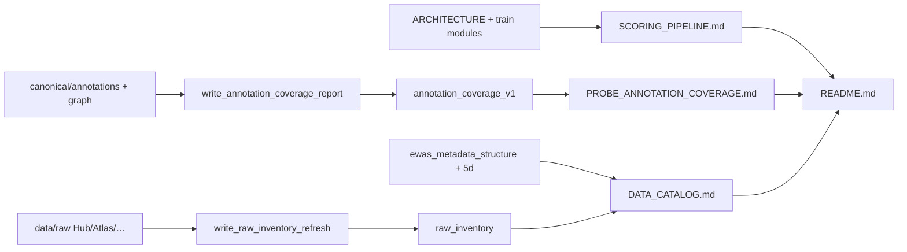

# Plan: README-linked scoring, annotation coverage, and data catalog docs

Status: implementation brief for the docs trio (not a Stage 0 scientific milestone).
Normative contracts remain [`ARCHITECTURE.md`](../ARCHITECTURE.md) and
[`ANNOTATION_GRAPH.md`](../ANNOTATION_GRAPH.md).

## Scope and acceptance

Ship three durable docs cited from [`README.md`](../../README.md):

| Doc | Path |
|-----|------|
| Scoring / train schema | [`docs/SCORING_PIPELINE.md`](../SCORING_PIPELINE.md) |
| Probe annotation coverage | [`docs/PROBE_ANNOTATION_COVERAGE.md`](../PROBE_ANNOTATION_COVERAGE.md) |
| Data & traits catalog | [`docs/DATA_CATALOG.md`](../DATA_CATALOG.md) |

Supporting evidence:

- `reports/inspection/annotation_coverage_v1/` (per-platform probe→region join + `figures/`)
- refreshed `reports/inspection/raw_inventory/` (measured Hub zip bytes / status + `figures/`)
- existing `annotation_graph_v1/`, `ewas_metadata_structure/`, `stage0_5d_max_n/`
- `scripts/write_pipeline_doc_figures.py` (matplotlib; `uv sync --extra analysis`)

**Done when:** README links all three; coverage report includes per-platform %
assigned vs unassigned and unmapped; catalog marks disease/cancer honestly;
unit checks pass for coverage totals vs `annotation_graph_v1`.

## Locked decisions

| Choice | Decision | Why |
|--------|----------|-----|
| Schema doc | New `SCORING_PIPELINE.md` (not replace ARCHITECTURE) | Visual/narrative; ARCHITECTURE stays contract |
| Coverage numbers | Regenerate from canonical Parquets | No invented Ns |
| Per-platform region % | Join `probe_locus_edges` × `locus_region_edges` | Missing from graph_v1 |
| Atlas probe TSV | Cite as unused separate layer | Not MBS topology |
| Inventory refresh | Stat Hub packs + Atlas + manifests + Stage-0 CpGCorpus | Avoid recursive raw dumps |
| OOF MBS export | Document as Milestone 7 deferred | Honest Stage 0 status |

## Schemas / artifacts

```text
docs/SCORING_PIPELINE.md
docs/PROBE_ANNOTATION_COVERAGE.md
docs/DATA_CATALOG.md
scripts/write_annotation_coverage_report.py
scripts/write_raw_inventory_refresh.py
reports/inspection/annotation_coverage_v1/{summary.md,summary.json}
reports/inspection/raw_inventory/{summary.md,summary.json}  # refreshed
tests/unit/test_annotation_coverage_report.py
```

## Data / artifact flow



## Non-goals

- Rebuild GENCODE graph or change topology
- Finish Milestone 6 uncapped train / mark §6 done
- Commit `.RData` or methylation matrices
- Implement Milestone 7 OOF score export

## Open questions

None blocking; disease zip may still be incomplete — catalog reports measured status.
