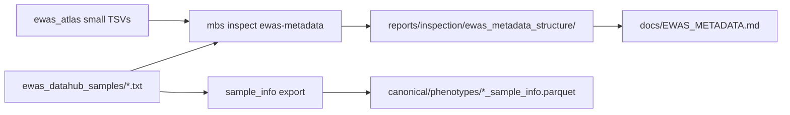

# Plan: EWAS metadata structure documentation

## Status

Implemented.

## Scope and acceptance

Profile Cursor-visible EWAS Atlas small tables and unpacked DataHub
`sample_*.txt` packs; document parse/join contracts; unblock sample-info export
after zip deletion.

**Done when:**

- `mbs inspect ewas-metadata` writes `reports/inspection/ewas_metadata_structure/`
- `docs/EWAS_METADATA.md` documents recipes + family→column map
- `sample_info` export works from unpacked `.txt` when zip is absent
- Unit tests cover fixtures; plan saved here

## Locked decisions

| Choice | Decision | Why |
|--------|----------|-----|
| Scope | Atlas studies/cohorts/trait×trait + 6 sample packs | Matches Cursor-visible enrichment files |
| Report location | `reports/inspection/ewas_metadata_structure/` | Existing inspection pattern |
| Sample-info source | Prefer unpacked txt, fallback zip | Zips deleted after extract |
| Atlas↔Hub join | No raw `study_ID`=`project_id` | Different ID namespaces |

## Schemas / contracts

- Parse + family map: [`docs/EWAS_METADATA.md`](../EWAS_METADATA.md)
- Code: `src/mbs/inspect_ewas_metadata.py`, `src/mbs/registry/sample_info.py`
- CLI: `mbs inspect ewas-metadata`

## Data / artifact flow

## Non-goals

- Profiling associations / probe annotations / matrix zips / EWAS_db
- Re-running Milestone 5b training benchmarks

## Open questions

None.
