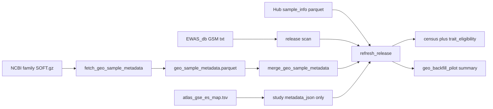

# GEO metadata backfill for EWAS_db-only studies

**Status:** pilot **done**; pre-scale fixes 1–4 **done** + batch-50 expansion
**in progress** — see [`geo-metadata-backfill-pre-scale.md`](geo-metadata-backfill-pre-scale.md)
and [`geo-enriched-training-release.md`](geo-enriched-training-release.md)  
**Parent:** [`data-infrastructure-improvements.md`](data-infrastructure-improvements.md) §2  
**Related:** [`EWAS_METADATA.md`](../EWAS_METADATA.md), [`DATA_CONTRACT.md`](../DATA_CONTRACT.md),
study-level Atlas enrichment (`seed_atlas_gse_es_map.py` — **done**, automatic on
`make catalog-refresh-release`).

This is the operator + audit brief for the **pilot**. Atlas GSE↔ES enrichment is a
**different** lane (study-level only). Do not copy Atlas cohort tissue/disease onto
GSM. Pre-scale fixes 1–4 are green; the next crawl is the audited **batch-50** list
(`configs/data/geo_backfill_batch50_gse.txt`), not a full EWAS_db crawl.

## Scope and acceptance

**Problem:** Most catalog samples come from EWAS_db beta text only. They have
GSM + GSE + assay paths but no Hub `sample_*.txt` phenotype rows. Census and
`trait_eligibility` under-count usable labels for external evaluation and
optional auxiliary heads.

**Goal:** Fetch public GEO sample/Series metadata for EWAS_db-only GSM, harmonize
to existing catalog contracts, and merge on refresh — without inventing labels or
treating missing disease/cancer as controls.

**Not a 7G′ training gate.** Training still reads Hub pack Parquet via
`mbs.training.phenotype_table`, not catalog `sample_phenotype`. GEO rows do not
enter the MBS encoder.

**Done when (pilot):**

1. **10–20 high-N GSE** processed (GEO family SOFT → harmonized Parquet).
2. `make catalog-refresh-release` ingests the Parquet; census shows EWAS_db-only
   GSM gaining ≥1 observed phenotype row where GEO supplies it.
3. Inspection report
   `reports/inspection/deepmat_data_v1/geo_backfill_pilot/{summary.json,summary.md}`
   with merge counts, eligibility, per-GSE rows, and a **compact** census snapshot
   taken **before** the refresh overwrites `census.json`.
4. Unit tests for column mapping + eligibility + Hub-wins + GPL map (no network).

## Commands

```bash
source scripts/activate_data_environment.sh

# Pilot (15 GSE)
make fetch-geo-sample-metadata

# Audited expansion (50 GSE = pilot + 35)
make fetch-geo-sample-metadata-batch
# cache-only rebuild (no FTP):
uv run python scripts/fetch_geo_sample_metadata.py \
  --studies-file configs/data/geo_backfill_batch50_gse.txt --from-cache-only

# Merge into catalog (skip Atlas NCBI seed if the map is current)
MBS_SKIP_ATLAS_SEED=1 make catalog-refresh-release
# skip GEO merge even if parquet exists:
MBS_SKIP_GEO_BACKFILL=1 make catalog-refresh-release
```

Refresh does **not** download SOFT. Fetch is a separate Makefile target.

## Artifacts

| Path | Role |
|------|------|
| `configs/data/geo_backfill_pilot_gse.txt` | 15-GSE pilot list |
| `configs/data/geo_backfill_batch50_gse.txt` | Pilot + 35 high-N studies (audited expansion) |
| `configs/data/geo_tissue_aliases.yaml` | GEO tissue → Hub ontology aliases |
| `$MBS_CACHE_ROOT/geo/{GSE}/{GSE}_family.soft.gz` | Cached NCBI family SOFT |
| `$MBS_DATA_ROOT/canonical/phenotypes/geo_sample_metadata.parquet` | One row per GSM |
| `$MBS_DATA_ROOT/canonical/phenotypes/geo_sample_metadata.manifest.json` | Parquet checksum + study list |
| `sample_phenotype` rows with `source_family=geo_metadata_backfill` | Catalog phenotype SoT for GEO |
| `sample.metadata_json.geo` | Raw characteristics, GPL, SOFT hash (not training features) |
| `study.metadata_json.geo.pubmed_ids` | Series PubMed IDs (not Atlas ES*) |
| `reports/inspection/deepmat_data_v1/geo_backfill_pilot/summary.{json,md}` | Pilot audit |
| `reports/inspection/deepmat_data_v1/geo_backfill_batch/fetch_status.json` | Batch per-GSE status |

## Distinction from Atlas enrichment (done)

| Lane | Grain | Join | Writes | Training labels? |
|------|-------|------|--------|------------------|
| Atlas (`seed_atlas_gse_es_map.py`) | **study** | PMID + curated GSE↔ES map; **never** raw GSE=ES* | `study_atlas_enrichment` + `study.metadata_json.atlas_enrichment` | No |
| GEO backfill (this plan) | **sample** | GSM ↔ `sample_id`, GSE ↔ `study_id` | `sample_phenotype` + `sample.metadata_json.geo` | Catalog only; Hub still wins; not encoder features |

## Join keys

| Layer | Key | Notes |
|-------|-----|-------|
| EWAS_db file | `GSM*.txt` basename → `sample_id` | Already in `assay_file` |
| GEO sample | `!Sample_geo_accession` | 1:1 with catalog `sample_id` |
| GEO series | `!Series_geo_accession` | Catalog `study_id` |
| Hub overlap | GSM in Hub sample-info / `sample_source_membership` | **Omit entire GSM** from GEO merge |
| Atlas | PMID from GEO series → ES* via map | Study-level only; not copied into `sample_phenotype` |

Hub-wins implementation: `sample.metadata_json` is null (or not `source=ewas_db`) → treat as Hub GSM → skip. No `label_status=superseded` (not in SQL / `DATA_CONTRACT.md`).

## Column map (GEO SOFT → catalog)

| GEO / SOFT field | Catalog target | `sample_phenotype`? |
|------------------|----------------|---------------------|
| `geo_accession` | `sample_id` | join key |
| series accession | `study_id` | join key |
| `characteristics_ch1` tokens | age / sex / tissue / disease / cancer | only if eligibility passes |
| `source_name_ch1` | `sample.metadata_json.geo.source_name` | no |
| `platform_id` (GPL) | `sample.metadata_json.geo.platform_id`; `study.platform_id` only if **one** known methylation GPL and Hub left it null | no |
| Age | unit-aware years (months/weeks/days); `age_raw` retained | yes |
| Sex / gender | `sex` + `sample.sex` | yes |
| tissue / cell type / organism part | `tissue` + ontology map when possible; raw in `tissue_raw` / geo JSON | yes |
| disease / diagnosis / condition / disease status / group / case-control | `disease` or `cancer` **only** if explicit case/control token | yes only then |
| sample type (tumor/normal) | `cancer` case/control only for explicit tumor/normal language | yes only then |
| treatment / batch / plate / chip | `characteristics_raw` only | **no** |
| series PubMed ID | `study.metadata_json.geo.pubmed_ids` | no |

### GPL → catalog `platform_id` (normative)

| GPL | Array | catalog |
|-----|-------|---------|
| GPL13534 | HumanMethylation450 | `HM450` |
| GPL16304 | 450K (UBC annotation) | `HM450` |
| GPL21145 | MethylationEPIC | `EPIC` |
| GPL23976 | HumanMethylation850 / EPIC 850k | `EPICv2` |
| anything else | unknown / mixed / expression | JSON only; study.platform_id unchanged |

Unknown GPL must not be written to `study.platform_id` (FK to `platform`). Mixed GPL series (450K+EPIC in one GSE) leave `study.platform_id` null unless Hub already set it.

## Eligibility (ingest)

1. **Age:** unit-aware parse to years (0–120); sentinels 999 / 9999 / 10002 omitted;
   original string in `age_raw`.
2. **Sex:** `M`/`Male`/`F`/`Female` → catalog Male/Female; else unknown and **not** written as observed.
3. **Tissue:** map via Hub ontology + `configs/data/geo_tissue_aliases.yaml`; unmapped
   raw kept for audit; `tissue_ontology_id` set when mapped.
4. **Disease / cancer:** write a row only when the value has an explicit control token
   (`control`, `healthy`, `normal`, …) or case token (`case`, `patient`, `tumor`, …),
   including `group` / `case/control` keys and `sample type` tumor/normal → cancer.
   A diagnosis name alone (e.g. `Crohn's disease`) stays in `metadata_json` — **never**
   default to control.
5. **Hub-wins:** skip Hub GSM entirely.
6. **Encoder:** batch / study-id / GPL are not `sample_phenotype` and must not enter MBS encoder features.

## Data flow



## Pilot GSE list

From `configs/data/geo_backfill_pilot_gse.txt` (local EWAS_db GSM at list time):

| study_id | n_gsm (list) | Notes |
|----------|--------------:|-------|
| GSE197678 | 2922 | |
| GSE55763 | 2711 | Hub overlap; Atlas map hit |
| GSE145361 | 1889 | |
| GSE105018 | 1658 | Hub age pack overlap; Atlas preeclampsia |
| GSE140686 | 1504 | mixed GPL13534+GPL21145 |
| GSE130051 | 1501 | mixed GPL |
| GSE185920 | 1471 | GPL29753 unknown → study.platform_id stays null |
| GSE210255 | 1394 | |
| GSE157131 | 1218 | mixed GPL; Atlas map hit |
| GSE56046 | 1202 | Hub overlap; Atlas map hit |
| GSE147740 | 1128 | all `disease state: normal` → controls only |
| GSE224124 | 1107 | |
| GSE109379 | 1104 | |
| GSE68379 | 1028 | COSMIC cell lines; no mapped phenotypes |
| GSE270375 | 994 | `sample type` not mapped as tissue |

## Audit (live catalog after GPL-map fix)

Re-run after `fetch --from-cache-only` + `catalog-refresh-release`. Authoritative numbers:
`reports/inspection/deepmat_data_v1/geo_backfill_pilot/summary.md`.

**Invariants that must stay true:**

- 0 GEO `sample_phenotype` rows on GSM that have Hub `sample_source_membership`
- 0 `sample.metadata_json.atlas_enrichment` (Atlas stays on `study`)
- `sample_source_membership` families stay Hub packs only (no `geo_metadata_backfill`)
- GEO disease/cancer `label_status` is only `case` or `control` (never invented from blank)
- `v_sample_label_conflicts` has no GEO-vs-Hub clashes (Hub GSM omitted)

**Conservative misses (correct, not bugs):**

- GSE68379: characteristics are `cell line` / `cosmic_id` / `primary site` — not mapped.
- GSE270375 catalog GSM: `sample type: Tumor methylation` is not a tissue key.
- GSE105018 leftover GSM: `gender` mapped to sex; no age/tissue in SOFT.
- GSE56046 leftover GSM: age mapped; `source_name=CD14+ cell` is metadata only.
- GEO disease in this 15-GSE slice is **controls only** (GSE147740 `normal`, GSE145361 `Control`). No cases → `trait_eligibility` for GEO disease is not core. Do not treat that as “GEO found a disease head.”

## Code

| File | Role |
|------|------|
| [`src/mbs/geo_metadata.py`](../../src/mbs/geo_metadata.py) | SOFT parse, eligibility, merge, report |
| [`scripts/fetch_geo_sample_metadata.py`](../../scripts/fetch_geo_sample_metadata.py) | FTP + cache → parquet |
| [`src/mbs/release.py`](../../src/mbs/release.py) | Merge hook before `compute_trait_eligibility` |
| [`tests/unit/test_geo_metadata.py`](../../tests/unit/test_geo_metadata.py) | No-network unit tests |
| [`tests/fixtures/geo/GSE_FIXTURE_family.soft`](../../tests/fixtures/geo/GSE_FIXTURE_family.soft) | Fixture SOFT |

## Non-goals

- Full EWAS_db GEO crawl
- BioSample / GEOparse
- Sample-level Atlas traits
- Wiring GEO `source_family` into 7G′ training heads
- ComBat / batch as encoder features
- Tissue ontology pass (deferred; raw `tissue` only)

## Implementation checklist

- [x] Pilot GSE list
- [x] Fetch script + `$MBS_CACHE_ROOT/geo/` cache
- [x] `geo_metadata.py` parse + eligibility + merge
- [x] `refresh_release` hook; `MBS_SKIP_GEO_BACKFILL`
- [x] Compact census snapshot **before** overwrite
- [x] GPL13534 → HM450 (not EPIC); mixed-GPL studies leave `study.platform_id` null
- [x] Unit tests (no network)
- [x] Pilot report after fetch + refresh
