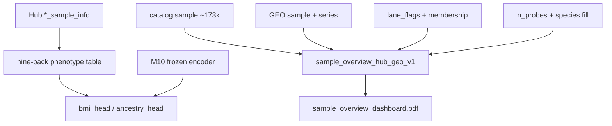

# Label-prep (BMI/ancestry) + full-catalog sample overview

**Status:** implementation track (CPU / data-infra; GPU arms gated)  
**Milestone:** extends **10c** (freeze-and-reuse trait expansion)  
**Does not:** mutate ATS freeze; auto-queue BMI/ancestry GPU; add brain/blood heads

## Scope and acceptance

1. Join real Hub BMI / ancestry labels (and honest brain region labels) into the
   nine-pack phenotype table with real masks.
2. Wire `bmi_head` (regression) and `ancestry_head` (CE) on shared MBS with
   DeepRVAT-style **freeze encoder → train new heads only**.
3. Build a full-catalog (~173k) sample overview (parquet + CSV + report + canvas)
   with Hub pack / GEO flags.

**Done when:**

- Nine-pack table has non-empty `bmi_mask` / `ancestry_mask` matching Hub
  sample_info joins; `brain_mask` reflects brain-pack region labels (no
  `brain_head`).
- `MultitaskHeads` constructs BMI/ancestry heads; unit tests cover masked loss
  + freeze-encoder path.
- Overview parquet row count equals catalog `sample` count; CSV + inspection
  report + canvas exist; CpGPT sample embeddings marked unavailable.

## Locked decisions

| Choice | Decision | Why |
|--------|----------|-----|
| BMI | Join numeric + `bmi_head` (Huber/MSE) | Real continuous targets in `bmi_sample_info` |
| Ancestry | Join `race` → class ids + `ancestry_head` (CE); collapse map versioned | Real categorical labels; rare → `other` |
| Brain | Join `brain_label` + `brain_mask`; **no head** | Region catalogue (100% control), not case/control |
| Blood | Still deferred | Sparse `cell_component`; not pack-wide head |
| Training | Freeze shared encoder from M10 ckpt; train new heads | DeepRVAT freeze-and-reuse |
| Overview | Full catalog Hub ∪ EWAS_db | Widest honesty view |
| IDs | GSM=sample, GSE=study, GPL=platform | Catalog convention |
| ATS | Do not mutate | Campaign hard stop |
| GPU | Wire only; do not auto-queue | Keep GPU 0 on M10 |

## Schemas / contracts

- [`schemas/sample_phenotype_table.schema.json`](../../schemas/sample_phenotype_table.schema.json) — add `bmi`, `bmi_mask`, `ancestry_*`, honest `brain_*`
- Ancestry ontology YAML under `canonical/phenotypes/ancestry_ontology_hub_nine_pack_v1.yaml`
- Overview: `canonical/phenotypes/sample_overview_hub_geo_v1.{parquet,csv.gz,manifest.json}`
- Dashboard PDF (GitHub-friendly):
  [`reports/inspection/deepmat_data_v1/sample_overview/sample_overview_dashboard.pdf`](../../reports/inspection/deepmat_data_v1/sample_overview/sample_overview_dashboard.pdf)

## Gap fills (platform / species)

| Field | Rule |
|-------|------|
| `platform_id` | explicit Hub/GEO/study → DataHub `metadata_json` → GPL map → `_935k` hint → EWAS_db `n_probes` bands (HM450 400–550k, EPIC 800–900k, EPICv2 910–980k). Provenance in `platform_source`; ~47 truncated/custom files stay unresolved. |
| `species_status` | GEO SOFT → single-species series taxon → Hub baseline human → TCGA/CPTAC/ENCODE/… namespaces → remaining EWAS assumed human. Provenance in `species_source`. Every row filled. |

Module: [`src/mbs/sample_overview_enrich.py`](../../src/mbs/sample_overview_enrich.py).

## Data / artifact flow

## Non-goals

- Blood / brain MultitaskHeads
- CpGPT sample CLS export
- Disease/cancer GPU launch (separate 10c probe track)
- ATS overwrite; Milestone 12 OOF

## Open questions

None blocking — ≥1k-per-arm bar remains a GPU launch gate (ancestry classes are
currently all &lt;1k even after modest collapse).
