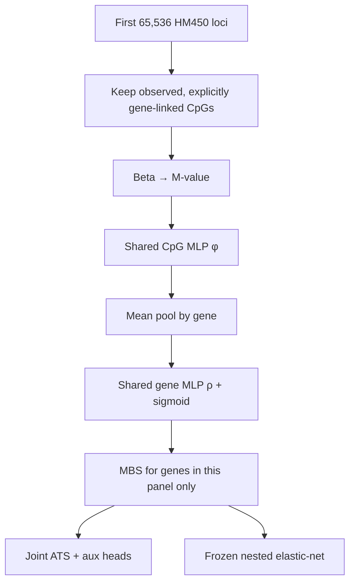
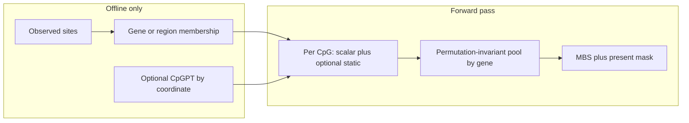
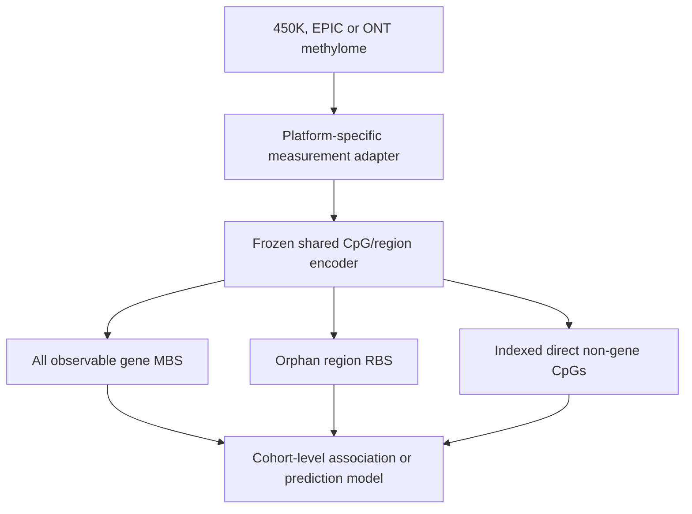

# 12b. Full-graph gene panel (DeepRVAT-style) — GATE G1

> **Status:** `pending` for the **product recipe** (sampler / minibatch gather).
> **GATE G1** — blocks product cascade. Probes started on GPU 0 — do **not**
> mark this milestone done for dense smokes or CpGPT plumbing alone. Do **not**
> change the in-flight N-light 5×6.
> Parent: [`milestone-12-final-oof.md`](milestone-12-final-oof.md).
> Index: [`MILESTONE_INDEX.md`](MILESTONE_INDEX.md).

## Question / Approaches / Results / Verdict

- **Question:** Can we train/score ~19.6k (or Milestone **11** fold-selected)
  gene MBS with shared `φ`/`ρ`, within-gene CpG sampling, and minibatch
  row×column gather — without dense-loading `[n_samples, n_universe]` — and
  does that beat 65k-prefix nested enet?
- **Approaches tested / in flight:** dense full-width N-light smoke
  (`max_loci: null`, anti-pattern); CpGPT 65k N-light ablation (**GATE G2**
  probe); product sampler/gather **not started**; all-genes vs M11 gene-set
  smoke **not started**.
- **Results:** `pending` (dense smoke val_loss climb noted in session logs).
- **Verdict:** open — dense/CpGPT probes ≠ G1 acceptance.

**Key conclusion:** the encoder is **weight-shared across genes**, but the
current experiment is **not** a whole-genome or cross-platform model. It is an
**HM450, first-65,536-locus, gene-linked benchmark** on 34 234 samples. The
architecture *can* be applied to unseen genes; that generalization has **not**
been demonstrated.

The running N-light 5×6 is an **HM450 representation-validation run**, not the
final ~20k-gene deepMAT product. Cascade 5×6, if launched after GATE G1–G4,
should **not** copy the 65k prefix — it should follow this plan (G1 panel +
within-gene CpG sampling).

## Implemented vs not (inventory, 2026-09-09)

| Item | Status |
|------|--------|
| Runtime gene-invariant encoder (`φ`/`ρ`, no gene ID / coordinate / probe ID) | **Done** — N-light + cascade |
| 65k-prefix OOF scope lock | **Done** — configs + docs |
| OOF completeness gate (`scripts/check_12_oof_completeness.py`) | **Done** (read-only; not wired into runners) |
| N-light `static_dim` / `static_block` (CpGPT trailing cols survive `m_only`) | **Done** — unit-tested |
| Cascade static-feature / CpGPT path | **Not started** (`cpg_encoder` still `input_dim=1`) |
| Within-gene CpG sampler (`max_cpgs_per_gene`) | **Not started** |
| Minibatch row×column gather (no dense preload) | **Not started** — both trainers still `betas[:, :n_cols]` |
| Canonical ~20k-gene present-mask training index | **Not started** |
| Role-gated embeddings / platform dropout / ONT adapter / gene-holdout | **Not started** — platform dropout is **12c / G3**; rest post-GATE |
| N-light dense full-width smoke (`max_loci: null`) | **Probe running** — not the recipe |
| Cascade full-width smoke YAML | **Unlaunchable** — `cascade_loop` does `int(max_loci)`; `null` → `TypeError` |
| CpGPT 65k N-light ablation | **Queued** after dense smoke (takeover waiter) |

Configs / scripts: `stage0_12b_gene_expansion_nlight_smoke.yaml`,
`stage0_12b_gene_expansion_cascade_smoke.yaml`,
`stage0_12b_cpgpt_nlight_smoke.yaml`,
`scripts/run_12b_gene_expansion_*.sh`,
`scripts/run_12b_cpgpt_after_gene_expansion_gpu0.sh`.

**Dense-smoke caveat:** with `max_loci: null`, `n_study_loci = len(locus_index)`
(**482 379**, not 374k gene-linked). Gene-linked filtering happens later at
packing. Session logs show sustained val_loss climb vs falling train_loss —
flag when reporting; do not retarget the run. Stronger regularization may be
needed at full gene-panel width under the dense loader.

## Census (this matrix + graph)

`matrix-hub-nine-pack-virtual-v1` × `graph-grch38-gencode38-cgi-tile-v2`,
`gene_allocation: explicit_only`.

| Slice | Loci in slice | Gene-linked CpG columns | Edges | Genes with ≥1 edge | Graph genes |
|------:|--------------:|------------------------:|------:|-------------------:|------------:|
| **Current OOF** `max_loci: 65536` | 65 536 | **51 375** | 57 430 | **2 646** | 19 937 |
| **Full matrix** `max_loci: null` | 482 379 | **374 309** | 440 903 | **19 554** | 19 937 |

CpGs/gene (linked edges): prefix median 17 / max 639; full median 17 / max 1 299.

The 65k cap is an **ordered matrix-column prefix**, not a biologically selected
or genome-balanced sample. Genes and CpGs outside that prefix never receive
gradients. ~17k graph genes are absent from the current MBS matrix.

Code: `build_locus_gene_index(..., max_loci=)` in
[`locus_gene.py`](../../src/mbs/training/locus_gene.py) does `study.iloc[:max_loci]`;
[`loop.py`](../../src/mbs/training/loop.py) then keeps `gene_linked_only` columns
inside that prefix.

## 1. What is being trained now (N-light 5×6)

Config: [`stage0_12_nlight_oof.yaml`](../../configs/experiment/stage0_12_nlight_oof.yaml).

| Component | Current setting |
|-----------|-----------------|
| Samples | 34 234 nine-pack |
| Platform | **HM450 only** |
| CV | 5 study-grouped folds × 6 restarts |
| Loci | **First 65 536 matrix columns** |
| CpG filter | `gene_linked_only: true`, `explicit_only` |
| CpG input | M-value (`m_only`) |
| Role annotations | **not used** |
| Pooling | Mean CpG embedding per gene |
| Encoder | Shared `φ` / `ρ`, width 64 |
| Training heads | Linear age/tissue/sex + n>200 disease/cancer aux |
| Product readout | Nested elastic-net on frozen MBS |

A batch is a batch of **samples**, not of genes. For every sample, all observed
gene-linked edges **inside the 65k prefix** are packed. Ragged edges are
concatenated; gene indices are offset by `sample_index × n_genes` so one
segment-pool yields `[batch, n_genes]`
([`dataset.py`](../../src/mbs/training/dataset.py)).

Therefore today:

- gene count is limited by the prefix (~2.6k, not ~20k);
- genes are not randomly minibatched (good — keep this);
- CpGs outside the prefix never contribute;
- orphan RBS and direct non-gene CpGs do not contribute on this arm;
- `m_only` cannot learn promoter vs body.



## 2. Gene-invariant encoder vs gene-specific readout (DeepRVAT)

Local aggregation is gene-invariant (no gene ID in `φ`/`ρ`):

\[
h_{s,c}=\phi(M_{s,c}),\quad
u_{s,g}=\mathrm{mean}_{c\in g}\,h_{s,c},\quad
\mathrm{MBS}_{s,g}=\sigma(\rho(u_{s,g}))
\]

A frozen encoder **can** be called on a gene never seen in training. That is
the DeepRVAT property we want.

Two qualifications:

1. **The phenotype readout is not gene-invariant.** Linear heads and nested
   elastic-net have one coefficient per MBS column. Extra genes require a
   **new** penalized fit (or association model) on that cohort. Encoder may
   transfer; \(w_g\) must be refit.
2. **Architectural invariance ≠ empirical invariance.** The encoder may have
   memorized CpG-count / methylation-range statistics of the 65k prefix. It has
   not been tested on held-out genes, EPIC-only CpGs, very different coverage,
   or ONT frequencies.

## 2b. Cross-platform: within-gene invariance (runtime vs offline)

**Load-bearing property:** within-gene **permutation- and cardinality-invariance**.
The forward pass does not care which CpGs of a gene are present, how many, or
in what order — `segment_pool` / cascade `gene_rho` pools whatever set shows up.
That is why HM450 training works with **zero positional input**, and why
EPIC/ONT do **not** need an HM450 probe-ID crosswalk.

**Runtime vs offline (do not conflate):**

| Layer | What it sees | Coordinate / probe ID? |
|-------|--------------|------------------------|
| **Forward pass** | Per observed CpG: scalar (beta/M-value) + optional static block + discrete gene/region index | **Never** |
| **Offline annotation** | Builds the membership table (graph, Illumina gene columns, or any other source) | May use coordinates upstream; interchangeable |
| **Optional CpGPT / DNA-LM** | Lookup keyed by genomic location; appended as `static_dim` trailing cols on N-light | Coordinate-keyed **feature**, not required for the encoder to run |

Confirmed today: cascade `cpg_encoder` is `input_dim=1`; N-light `m_only`
zeros annotation channels and still trains. N-light now accepts an optional
per-CpG `static_block` after the fixed 24-wide annotation layout so CpGPT
survives `m_only` — cascade has no equivalent plumbing yet.

**EPIC / ONT = same forward pass** on that platform’s own observed sites plus
*some* gene/region membership table for those sites. Role/promoter-body is
optional extra (cascade already has region types; N-light `m_only` does not).
No HM450↔EPIC identity map.



An optional, explicitly future-only extension: per-gene learned embeddings or
gene-specific priors — not needed for platform invariance, not scoped now.

## 2c. Gene-set fork (do not pick yet)

Two valid training-set options; both stay gene-invariant:

| Option | Gene set | Why consider it |
|--------|----------|-----------------|
| **A. All represented genes** | ~19 554 with ≥1 HM450 link; unobserved stay `mbs_present=0` | More aggregation instances for shared `φ`/`ρ` (hypothesis: aggregator trains harder → better MBS). Competing risk: ~20k MBS columns overfit linear/enet heads (already visible on the dense smoke). |
| **B. Fold-selected genes** | Milestone **11** / ADR 0012 panel (discovery CpGs → seed genes → all linked CpGs of those genes) | DeepRVAT gene-panel analog; nested enet sees fewer columns; still gene-invariant. Deferred; not a gate on the 65k 5×6. |

See [`milestone-11-fold-selected-panel.md`](milestone-11-fold-selected-panel.md).

## 3. How to expand without a dense `[n_samples, n_universe]` tensor

Do **not** set `max_loci: null` and load `[:, :]` into RAM as the product path.
Nine-pack × 482k × float32 is ~66 GB before packing. The in-flight N-light
full-width smoke does exactly that anti-pattern as a **go/no-go on gene
count**; it is not 12b acceptance.

**Preferred training recipe (DeepRVAT-adapted, two-axis batching):**

DeepRVAT (`deeprvat/data/rare.py`) is sparse per sample: `PaddedAnnotations.embed()`
returns only that sample’s variants; `collate_fn` pads to **minibatch** max
variants, never a global max. Methylation is **dense**, so the analog is:

1. **Canonical gene index** = `genes.parquet` order (~19 937), or a Milestone 11
   fold-selected subset (§2c). Genes with no observed CpGs stay **missing**
   (`mbs_present=0`), never imputed as average/low burden.
2. **Column universe** = gene-linked columns on the **full** assignment
   (`max_loci=None`) → 374 309 HM450 gene-linked columns when using option A.
3. **Keep every selected gene** that has ≥1 observed linked CpG in the sample
   (do not randomly drop genes — the readout is additive in gene MBS).
4. **Sample CpGs inside the gene** (`max_cpgs_per_gene` ≈ 16–32; median gene
   already has 17). Persist sampling probabilities and per-gene exposure
   counts. Cap huge genes without starving small genes.
5. **Role-stratify** (promoter / body / UTR) once role channels are back on;
   until then, uniform-within-gene is fine for a first recipe smoke.
6. **Gather only what the minibatch needs:** for each minibatch of sample
   rows, fancy-index those rows × the sampled columns from the backing store
   (`RoutedBetas`/zarr). Pad ragged per-sample gene–CpG lists to that
   minibatch’s own max. Never preload `[n_samples, n_universe]`.
   Today’s anti-pattern (must be replaced):

   ```text
   betas_ram = betas_handle[:, :n_cols]   # loop.py / cascade_loop.py
   ```

7. **Monitor** `n_cpgs` and `n_genes` per batch. `batch_token_budget` already
   exists as a VRAM cap — it is **not** the gather loader.
8. **Chromosome / gene-block shards** are a real **IO/scheduling** strategy at
   EPIC (~938k) and especially ONT (~40M). They are **not** the invariance
   mechanism and not a substitute for (6). Use them when locality matters;
   the scale property is still “never densely materialize the full universe.”

**Scoring / product export** (after train):

- score **all** observed gene-linked CpGs per gene (chunk samples or genes if
  VRAM requires);
- emit `mbs[sample, gene]`, `mbs_present`, observed vs available CpG counts,
  platform + norm contract;
- cascade: also orphan `rbs[sample, region]` and direct locus IDs.

**Nested enet on ~20k MBS columns** will overfit if under-regularized (P2-G
nested RBS age already blew up at ~13k region features). Inner-CV `alpha` /
`l1_ratio` is mandatory; do not treat 20k-gene nested enet as a free lunch.

## 4. Proposed cascade OOF (native P2-G, full gene-linked graph)

10e staged S1–S4 was **negative**; cascade topology stays **native P2-G scalar
max/max**. Do **not** 5×6 that topology on the 65k prefix if the scientific
goal is a portable gene MBS.

When cascade 5×6 is explicitly scheduled:

| Keep from 12 N-light | Change |
|----------------------|--------|
| Split `hub-nine-pack-5fold-v1` | Full gene-linked column universe + within-gene sampler |
| Nested enet primary readout | Within-gene CpG cap in **train**; full CpGs at **score** |
| n>200 disease/cancer aux | Canonical gene index + present mask (or M11 panel) |
| HM450 nine-pack only | Same; no mixed EPIC/ONT in this OOF |
| `explicit_only` | Role-aware region hop is in-graph (cascade already has types) |

A **65k-matched** cascade 5×6 (architecture comparison to N-light) is still a
prefix run. The **product** cascade OOF is this 12b panel. Note: the existing
cascade smoke YAML with `max_loci: null` cannot launch until
`cascade_loop` accepts a nullable max (today: `int(cv_budget["max_loci"])`).

N-light full-panel can share the same sampler/loader. Do not launch either
full-panel 5×6 until:

- a **1-fold smoke** on the recipe (sampled columns + `max_cpgs_per_gene`)
  fits GPU 2;
- gene-coverage report (every selected gene: train exposure, CpG cap hits);
- nested-enet inner-CV shown stable on the chosen gene-set width (1 fold).

## 5. Required follow-ons (not this 5×6 / not this week)

**A. Scoring contract** — platform’s own observed sites + membership →
full-graph MBS/RBS/direct with missingness and coverage. All ~20k genes may
appear as columns; unobserved genes are missing.

**B. Role-aware one-hop** (N-light product candidate after `m_only` validation):

\[
h_c=\phi_M(z_c)+\alpha_R E_R(\mathrm{role}_c)+\alpha_C E_C(\mathrm{context}_c)
\]

gates \(\alpha\) near 0 at init, then role-stratified pooling. Cascade already
represents region type (likely why RBS probes are strong).

**C. Platform dropout** — random CpG drop, 450K-like vs EPIC-like masks, vary
counts per gene. Mean pool does not remove platform bias: EPIC is not a random
subset of 450K.

**D. ONT adapter** — frequency/depth/uncertainty → shared biological encoder.
Do not treat ONT as Illumina M-values.

**E. Held-out-gene test** — train `φ/ρ` on a gene subset; freeze; score unseen
genes; fit a readout on unseen-gene MBS; evaluate leave-study-out. That is the
empirical invariance claim.

**F. OOF runner hygiene** — completeness gate exists
(`scripts/check_12_oof_completeness.py`); runners still treat any
`metrics.json` as done and nested enet uses `check=False`. Wire the gate
before declaring 5×6 complete. `primary_evaluation: mbs_enet_nested` does
**not** select the neural epoch (checkpoint is still validation tissue F1
then age MAE).

## 6. Readout hygiene (keep separate)

| Name | What it is |
|------|------------|
| `mbs_e2e` | Joint linear heads; loss \(0.3 L_\mathrm{age}+3.0 L_\mathrm{tissue}+1.0 L_\mathrm{sex}\) (+ aux). Tissue-primary checkpoint. |
| `mbs_enet_nested` | Frozen MBS → train-only scale → inner study-grouped CV of `alpha`/`l1_ratio` → one outer-test eval ([`transparent_baselines.py`](../../src/mbs/training/transparent_baselines.py)). |
| Tissue macro-F1 | Equal weight per **train-represented** class; report \(K\), zero-shot exclusions, per-class F1. |
| Age MAE | Years after inverting train-fold standardization (e2e) or year-scale enet. |
| Sex AUROC | State what class `1` is. |
| Cancer/disease | Aux heads in **this** 30-ep N-light are encoder supervision. Pack AUROC 0.954 etc. remain **freeze-reuse** on P2-G, not this OOF’s joint heads. Confounded by tissue/study until within-tissue + leave-study-out. |

## Recommended sequence

1. Let N-light 65k 5×6 **finish**; do not reinterpret partial results as the product.
2. Label it **HM450 65k-prefix gene-linked validation**.
3. Harden OOF completeness / nested-enet failure handling (wire the gate).
4. Finish / report GPU0 probes (dense gene-count smoke; CpGPT 65k ablation) —
   **do not** treat them as recipe acceptance.
5. Implement within-gene CpG sampler + minibatch column gather (§3).
6. 1-fold recipe smoke (N-light, then native P2-G); choose gene-set fork (§2c).
7. Gene-holdout + EPIC→450K dropout tests.
8. Role-aware one-hop (N-light) and/or cascade 5×6 on the **12b** graph.
9. ONT measurement adapter.
10. Only then freeze a portable deepMAT encoder.



Today’s model implements only the **gene-linked** slice of that workflow, on
**HM450** and a **65k prefix** (plus dense full-width / CpGPT **probes** that
are not the product path). The remaining work is coverage, two-axis batching,
and measurement invariance — not a new encoder family.
