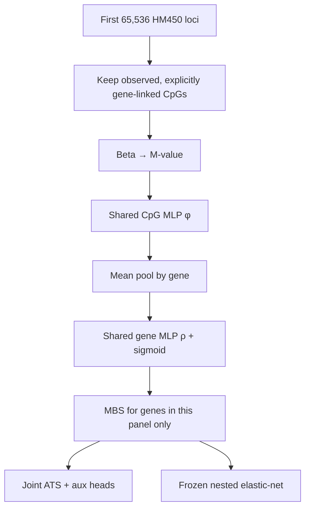

# 12b. Full-graph gene panel (DeepRVAT-style) — after 65k OOF

> **Status:** `pending` (do **not** change the in-flight N-light 5×6).
> Parent: [`milestone-12-final-oof.md`](milestone-12-final-oof.md).
> Index: [`MILESTONE_INDEX.md`](MILESTONE_INDEX.md).

**Key conclusion:** the encoder is **weight-shared across genes**, but the
current experiment is **not** a whole-genome or cross-platform model. It is an
**HM450, first-65,536-locus, gene-linked benchmark** on 34 234 samples. The
architecture *can* be applied to unseen genes; that generalization has **not**
been demonstrated.

The running N-light 5×6 is an **HM450 representation-validation run**, not the
final ~20k-gene deepMAT product. Cascade 5×6, if launched, should **not** copy
the 65k prefix by default — it should follow this plan (full gene-linked graph
+ within-gene CpG sampling).

## Census (this matrix + graph)

`matrix-hub-nine-pack-virtual-v1` × `graph-grch38-gencode38-cgi-tile-v2`,
`gene_allocation: explicit_only`.

| Slice | Loci in slice | Gene-linked CpG columns | Edges | Genes with ≥1 edge | Graph genes |
|------:|--------------:|------------------------:|------:|-------------------:|------------:|
| **Current OOF** `max_loci: 65536` | 65 536 | **51 375** | 57 430 | **2 646** | 19 937 |
| **Full matrix** `max_loci: null` | 482 379 | **374 309** | 440 903 | **19 554** | 19 937 |

CpGs/gene (linked edges): prefix median 17 / max 639; full median 17 / max 1 299.

The 65k cap is an **ordered matrix-column prefix**, not a biologically selected
or genome-balanced sample. Genes and CpGs outside that prefix never receive
gradients. ~17k graph genes are absent from the current MBS matrix.

Code: `build_locus_gene_index(..., max_loci=)` in
[`locus_gene.py`](../../src/mbs/training/locus_gene.py) does `study.iloc[:max_loci]`;
[`loop.py`](../../src/mbs/training/loop.py) then keeps `gene_linked_only` columns
inside that prefix.

## 1. What is being trained now (N-light 5×6)

Config: [`stage0_12_nlight_oof.yaml`](../../configs/experiment/stage0_12_nlight_oof.yaml).

| Component | Current setting |
|-----------|-----------------|
| Samples | 34 234 nine-pack |
| Platform | **HM450 only** |
| CV | 5 study-grouped folds × 6 restarts |
| Loci | **First 65 536 matrix columns** |
| CpG filter | `gene_linked_only: true`, `explicit_only` |
| CpG input | M-value (`m_only`) |
| Role annotations | **not used** |
| Pooling | Mean CpG embedding per gene |
| Encoder | Shared `φ` / `ρ`, width 64 |
| Training heads | Linear age/tissue/sex + n>200 disease/cancer aux |
| Product readout | Nested elastic-net on frozen MBS |

A batch is a batch of **samples**, not of genes. For every sample, all observed
gene-linked edges **inside the 65k prefix** are packed. Ragged edges are
concatenated; gene indices are offset by `sample_index × n_genes` so one
segment-pool yields `[batch, n_genes]`
([`dataset.py`](../../src/mbs/training/dataset.py)).

Therefore today:

- gene count is limited by the prefix (~2.6k, not ~20k);
- genes are not randomly minibatched (good — keep this);
- CpGs outside the prefix never contribute;
- orphan RBS and direct non-gene CpGs do not contribute on this arm;
- `m_only` cannot learn promoter vs body.

## 2. Gene-invariant encoder vs gene-specific readout (DeepRVAT)

Local aggregation is gene-invariant (no gene ID in `φ`/`ρ`):

\[
h_{s,c}=\phi(M_{s,c}),\quad
u_{s,g}=\mathrm{mean}_{c\in g}\,h_{s,c},\quad
\mathrm{MBS}_{s,g}=\sigma(\rho(u_{s,g}))
\]

A frozen encoder **can** be called on a gene never seen in training. That is
the DeepRVAT property we want.

Two qualifications:

1. **The phenotype readout is not gene-invariant.** Linear heads and nested
   elastic-net have one coefficient per MBS column. Extra genes require a
   **new** penalized fit (or association model) on that cohort. Encoder may
   transfer; \(w_g\) must be refit.
2. **Architectural invariance ≠ empirical invariance.** The encoder may have
   memorized CpG-count / methylation-range statistics of the 65k prefix. It has
   not been tested on held-out genes, EPIC-only CpGs, very different coverage,
   or ONT frequencies.

## 3. How to expand the gene panel without a 482k dense tensor

Do **not** set `max_loci: null` and load `[:, :]` into RAM. Nine-pack × 482k ×
float32 is ~66 GB before packing. `RoutedBetas` already special-cases contiguous
prefixes ([`virtual_hub_store.py`](../../src/mbs/matrix/virtual_hub_store.py));
a full-width dense gather is the wrong product path.

**Preferred training recipe (DeepRVAT analog: all genes, sampled variants):**

1. **Canonical gene index** = `genes.parquet` order (~19 937). Genes with no
   observed CpGs stay **missing** (`mbs_present=0`), never imputed as 0.5
   burden.
2. **Column universe** = `gene_linked_col_index` on the **full** assignment
   (`max_loci=None`) → 374 309 HM450 gene-linked columns, 19 554 genes.
3. **Keep every represented gene in every sample** that has ≥1 observed linked
   CpG. Do **not** drop random genes (the readout is additive in gene MBS).
4. **Sample CpGs inside the gene** (`max_cpgs_per_gene`, default 16–32; median
   gene already has 17). Persist sampling probabilities and per-gene exposure
   counts. Cap huge genes (max 1 299) without starving small genes.
5. **Role-stratify the sample** (promoter-core / body / UTR) once role channels
   are back on; until then, uniform-within-gene is acceptable for a first
   full-panel smoke.
6. **Materialize only the sampled columns** per batch (fancy index / pack
   gather), not the 65k contiguous prefix and not the full 482k row.

**Scoring / product export** (after train):

- score **all** observed gene-linked CpGs per gene (chunk samples or genes if
  VRAM requires);
- emit `mbs[sample, gene]`, `mbs_present`, observed vs available CpG counts,
  platform + norm contract;
- cascade: also orphan `rbs[sample, region]` and direct locus IDs.

**Nested enet on ~20k MBS columns** will overfit if under-regularized (P2-G
nested RBS age already blew up at ~13k region features). Inner-CV `alpha` /
`l1_ratio` is mandatory; do not treat 20k-gene nested enet as a free lunch.

## 4. Proposed cascade OOF (native P2-G, full gene-linked graph)

10e staged S1–S4 was **negative**; cascade topology stays **native P2-G scalar
max/max**. Do **not** 5×6 that topology on the 65k prefix if the scientific
goal is a portable gene MBS.

When cascade 5×6 is explicitly scheduled:

| Keep from 12 N-light | Change |
|----------------------|--------|
| Split `hub-nine-pack-5fold-v1` | `max_loci: null` + gene-linked column universe |
| Nested enet primary readout | Within-gene CpG cap in **train**; full CpGs at **score** |
| n>200 disease/cancer aux | Canonical ~20k gene index + present mask |
| HM450 nine-pack only | Same; no mixed EPIC/ONT in this OOF |
| `explicit_only` | Role-aware region hop is in-graph (cascade already has types) |

A **65k-matched** cascade 5×6 (already queued after N-light) is a fair
**architecture comparison** to the current N-light OOF. It is still a
prefix run. The **product** cascade OOF is this 12b panel.

N-light full-panel can share the same sampler/loader. Do not launch either
full-panel 5×6 until:

- a **1-fold smoke** on full gene-linked columns + `max_cpgs_per_gene` fits
  GPU 2;
- gene-coverage report (every graph gene: train exposure, CpG cap hits);
- nested-enet inner-CV shown stable on 20k columns (1 fold).

## 5. Required follow-ons (not this 5×6)

**A. Scoring contract** — arbitrary coordinate-indexed observations → full-graph
MBS/RBS/direct with missingness and coverage. All ~20k genes may appear as
columns; unobserved genes are missing.

**B. Role-aware one-hop** (N-light product candidate after `m_only` validation):

\[
h_c=\phi_M(z_c)+\alpha_R E_R(\mathrm{role}_c)+\alpha_C E_C(\mathrm{context}_c)
\]

gates \(\alpha\) near 0 at init, then role-stratified pooling. Cascade already
represents region type (likely why RBS probes are strong).

**C. Platform dropout** — random CpG drop, 450K-like vs EPIC-like masks, vary
counts per gene. Mean pool does not remove platform bias: EPIC is not a random
subset of 450K.

**D. ONT adapter** — frequency/depth/uncertainty → shared biological encoder.
Do not treat ONT as Illumina M-values.

**E. Held-out-gene test** — train `φ/ρ` on a gene subset; freeze; score unseen
genes; fit a readout on unseen-gene MBS; evaluate leave-study-out. That is the
empirical invariance claim.

**F. OOF runner hygiene** — `metrics.json` must not imply nested enet success;
`check=False` nested jobs must fail the campaign; require 30/30 neural + 30/30
nested, hashes, pooled OOF, fold mean/SD, ensemble rule declared a priori.
`primary_evaluation: mbs_enet_nested` does **not** select the neural epoch
(checkpoint is still validation tissue F1 then age MAE).

## 6. Readout hygiene (keep separate)

| Name | What it is |
|------|------------|
| `mbs_e2e` | Joint linear heads; loss \(0.3 L_\mathrm{age}+3.0 L_\mathrm{tissue}+1.0 L_\mathrm{sex}\) (+ aux). Tissue-primary checkpoint. |
| `mbs_enet_nested` | Frozen MBS → train-only scale → inner study-grouped CV of `alpha`/`l1_ratio` → one outer-test eval ([`transparent_baselines.py`](../../src/mbs/training/transparent_baselines.py)). |
| Tissue macro-F1 | Equal weight per **train-represented** class; report \(K\), zero-shot exclusions, per-class F1. |
| Age MAE | Years after inverting train-fold standardization (e2e) or year-scale enet. |
| Sex AUROC | State what class `1` is. |
| Cancer/disease | Aux heads in **this** 30-ep N-light are encoder supervision. Pack AUROC 0.954 etc. remain **freeze-reuse** on P2-G, not this OOF’s joint heads. Confounded by tissue/study until within-tissue + leave-study-out. |

## Recommended sequence

1. Let N-light 65k 5×6 **finish**; do not reinterpret partial results as the product.
2. Label it **HM450 65k-prefix gene-linked validation**.
3. Harden OOF completeness / nested-enet failure handling.
4. Implement full-graph gene-linked column universe + within-gene CpG sampler.
5. 1-fold smoke (N-light, then native P2-G) on ~20k genes.
6. Gene-holdout + EPIC→450K dropout tests.
7. Role-aware one-hop (N-light) and/or cascade 5×6 on the **full** gene-linked graph.
8. ONT measurement adapter.
9. Only then freeze a portable deepMAT encoder.

```mermaid
flowchart TB
    A["450K, EPIC or ONT methylome"] --> B["Platform-specific measurement adapter"]
    B --> C["Frozen shared CpG/region encoder"]
    C --> D["All observable gene MBS"]
    C --> E["Orphan region RBS"]
    C --> F["Indexed direct non-gene CpGs"]
    D --> G["Cohort-level association or prediction model"]
    E --> G
    F --> G
```

Today’s model implements only the **gene-linked** slice of that workflow, on
**HM450** and a **65k prefix**. The remaining work is coverage and measurement
invariance, not a new encoder family.
