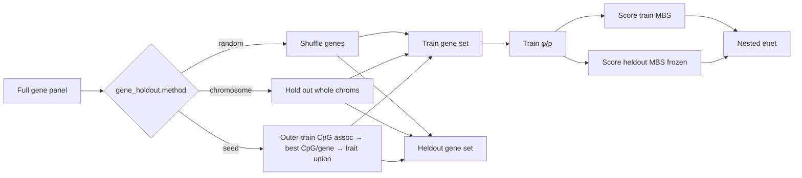

# GATE G1 gene-holdout — implementation brief

> Status (2026-09-28): **plumbing done** for N-light + cascade:
> `random` / `chromosome` leakage probes + **`seed`** DeepRVAT-aligned
> product path (CpG-first best association → gene union; score complement).
> Smokes / nested readouts **not yet run** (GPU queue).
> Product recipe: [`milestone-12b-deeprvat-seed-recipe.md`](milestone-12b-deeprvat-seed-recipe.md).
> Parent: [`milestone-12b-full-gene-panel.md`](milestone-12b-full-gene-panel.md).
> Index: [`MILESTONE_INDEX.md`](MILESTONE_INDEX.md).

## Scope and acceptance

**Question:** Is the shared encoder gene-agnostic? Train `φ`/`ρ` on one gene
set, score a **disjoint** heldout set, fit the post-hoc nested elastic-net on
heldout MBS columns the encoder never saw.

**Done when (G1):**

1. Nested enet on heldout-gene MBS is competitive with train-gene nested (same
   recipe, reported as a pair).
2. Random split smokes land (cascade first, then N-light) + nested.
3. If random passes, chromosome-held-out arm bounds locality leakage.
4. **Product path:** `method: seed` multi-trait seed bank smoke after arch lock
   (not a substitute for the leakage probes).
5. Reports under `reports/inspection/` + TODO Verdict.

Scaffolding alone does **not** close G1. Do **not** revive 9c head masks.

## Locked decisions

| Choice | Decision | Why |
|--------|----------|-----|
| Leakage probes | `random` first; `chromosome` follow-up | Cheap locality bound |
| Product train set | `seed` — multi-trait seed-gene **union**; score complement / genome-wide | DeepRVAT recipe; user lock 2026-09-28 |
| Discovery | CpG-first: best (strongest) linked CpG association → gene; optional gene meta-p later | Fastest / simplest |
| Head masks | **Never** | 9c failed (G0 ≫ G1–G3) |
| Hybrid prior | Optional `extra_seed_gene_ids` / Atlas `external_clean` inside train fold | ADR 0011; only if remap stays honest |
| Ensemble | Deferred until campaign closes | Avoid multiply-before-lock |
| Topology order | Cascade random → N-light random → nested → chrom if pass; seed after arch lock | Product path is cascade |
| Samples (product) | Maximum eligible samples (no train caps) | Nine-pack / full phenotype table |
| Static features | CpGPT sequence embeddings on (`cpgpt2m_adapter_128_v1`) | G2 YES |
| Traits (product) | Joint trait heads once arch locked; seed bank unions those traits | DeepRVAT shared scorer |
| Readout | Existing nested enet (`mbs_enet_nested`) | Already post-hoc; no new head |
| Orphans/direct (cascade) | Train keeps them; heldout score is gene-MBS only | Nested compares gene columns |

## Schemas / config

```yaml
training:
  gene_holdout:
    enabled: true
    method: random          # random | chromosome | seed
    heldout_fraction: 0.2   # random/chromosome only
    seed: 42
    # chromosome only:
    # heldout_chromosomes: [chr7, chr13]
    # exclude_chromosomes: [chrX, chrY]
    # seed (DeepRVAT-aligned) only:
    # seed_discovery: best_cpg_p
    # n_genes_per_trait: 256
    # traits: [age, tissue, sex]
    # extra_seed_gene_ids: [...]   # optional hybrid prior
```

Artifacts (under `scores/`):

| File | Content |
|------|---------|
| `mbs_heldout.npy` | Heldout-gene MBS `[n_samples, n_heldout]` |
| `gene_holdout.json` | Partition + caveat + discovery meta + shapes |
| `gene_ids_{train,heldout}.json` | Gene id lists |
| `gene_holdout_pheno.npz` | Cascade only — train/test idx + phenotypes for nested |
| `gene_holdout_eval.json` | Written by `scripts/eval_gene_holdout_nested.py` |

## Data / artifact flow



Modules:

- `src/mbs/training/gene_holdout.py` — partition + discovery + subset helpers
- `loop.py` / `cascade_loop.py` — train on train genes; score heldout after fit
  (`seed` discovery deferred until outer-train betas/labels exist; per-fold on cascade)
- `scripts/eval_gene_holdout_nested.py` — post-hoc nested comparison

Smoke configs:

- `stage0_12b_gene_holdout_{cascade,nlight}_smoke.yaml` — random
- `stage0_12b_gene_holdout_{cascade,nlight}_chrom_smoke.yaml` — chromosome
- `stage0_12b_gene_holdout_{cascade,nlight}_seed_smoke.yaml` — DeepRVAT seed

## Non-goals

- Reviving phenotype-head seed masks (9c).
- Gene-level SKAT / meta-p as the default discovery (optional later).
- Ensemble of scorers before the experiment campaign finishes.
- Building the full trait-universe runners before arch lock.

## Open questions

- Top-K vs FDR for best-CpG gene selection (start with top-K).
- Product OOF: score all genes vs non-seed complement for nested readout.
