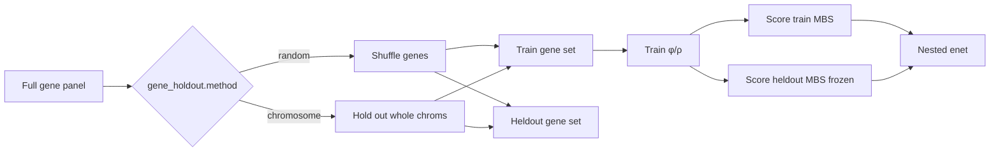

# GATE G1 gene-holdout — implementation brief

> Status (2026-09-28): **plumbing done** for N-light + cascade, random +
> chromosome partitions. Smokes / nested readouts **not yet run** (GPU queue).
> Parent: [`milestone-12b-full-gene-panel.md`](milestone-12b-full-gene-panel.md).
> Index: [`MILESTONE_INDEX.md`](MILESTONE_INDEX.md).

## Scope and acceptance

**Question:** Is the shared encoder gene-agnostic? Train `φ`/`ρ` on one gene
set, score a **disjoint** heldout set, fit the post-hoc nested elastic-net on
heldout MBS columns the encoder never saw.

**Done when (G1):**

1. Nested enet on heldout-gene MBS is competitive with train-gene nested (same
   recipe, reported as a pair).
2. Random split smokes land (cascade first, then N-light) + nested.
3. If random passes, chromosome-held-out arm bounds locality leakage.
4. Reports under `reports/inspection/` + TODO Verdict.

Scaffolding alone does **not** close G1.

## Locked decisions

| Choice | Decision | Why |
|--------|----------|-----|
| Partition | `random` first; `chromosome` follow-up | Random is cheap; chrom bounds neighbour leakage |
| Topology order | Cascade random → N-light random → nested → chromosome if pass | Product path is cascade; N-light is the cheaper comparator |
| Samples (product) | Maximum eligible samples (no train caps) | Nine-pack / full phenotype table for the split |
| Static features | CpGPT sequence embeddings on (`cpgpt2m_adapter_128_v1`) | G2 YES; default once arch locked |
| Traits (product) | Joint trait heads in training once arch locked | Age/tissue/sex + eligible disease/cancer aux |
| Readout | Existing nested enet (`mbs_enet_nested`) | Already post-hoc; no new head |
| Orphans/direct (cascade) | Train keeps them; heldout score is gene-MBS only | Nested compares gene columns |

## Schemas / config

```yaml
training:
  gene_holdout:
    enabled: true
    method: random          # or chromosome
    heldout_fraction: 0.2
    seed: 42
    # chromosome only:
    # heldout_chromosomes: [chr7, chr13]   # optional explicit list
    # exclude_chromosomes: [chrX, chrY]    # optional
```

Artifacts (under `scores/`):

| File | Content |
|------|---------|
| `mbs_heldout.npy` | Heldout-gene MBS `[n_samples, n_heldout]` |
| `gene_holdout.json` | Partition + caveat + shapes |
| `gene_ids_{train,heldout}.json` | Gene id lists |
| `gene_holdout_pheno.npz` | Cascade only — train/test idx + phenotypes for nested |
| `gene_holdout_eval.json` | Written by `scripts/eval_gene_holdout_nested.py` |

## Data / artifact flow



Modules:

- `src/mbs/training/gene_holdout.py` — partition + subset helpers
- `src/mbs/training/loop.py` — N-light hook
- `src/mbs/training/cascade_loop.py` — cascade hook
- `scripts/eval_gene_holdout_nested.py` — post-hoc nested compare

Smoke configs:

| Config | Topology | Method |
|--------|----------|--------|
| `stage0_12b_gene_holdout_nlight_smoke.yaml` | N-light | random |
| `stage0_12b_gene_holdout_nlight_chrom_smoke.yaml` | N-light | chromosome |
| `stage0_12b_gene_holdout_cascade_smoke.yaml` | cascade P2-G | random |
| `stage0_12b_gene_holdout_cascade_chrom_smoke.yaml` | cascade P2-G | chromosome |

## Non-goals / deferred

- Trait-universe A→B→C pipeline (still design-only).
- Product within-gene sampler / minibatch gather (12b recipe).
- Platform dropout (G3 / 12c).
- Quoting G1 from 6-epoch plumbing smokes.

## Open questions

- None blocking plumbing. Run order when GPU frees: **cascade random → N-light
  random → nested → chromosome arms if random passes**. Product campaigns after
  arch lock: max samples + CpGPT sequence embeddings + trait heads in training.
