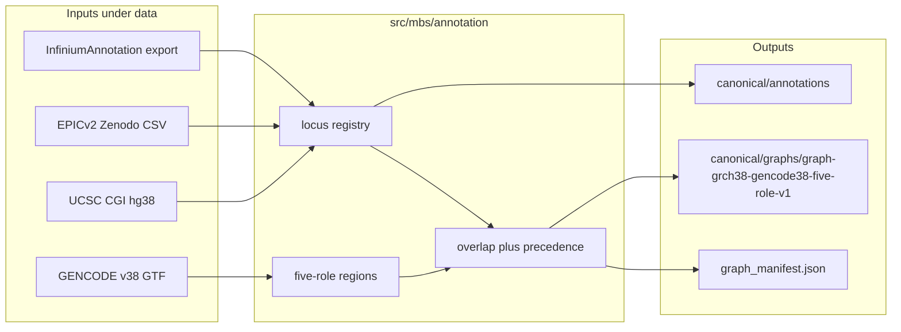

# Milestone 2 build plan: Canonical annotation graph

Historical implementation plan for Stage 0 Milestone 2 (completed). Normative
topology and contracts remain in [`ANNOTATION_GRAPH.md`](ANNOTATION_GRAPH.md)
and [`DATA_CONTRACT.md`](DATA_CONTRACT.md). Milestone status:
[`TODO_PIPELINE.md`](TODO_PIPELINE.md) §2.

## Scope (acceptance)

Ship a **small, auditable** Stage 0 graph—not MethylCapsNet CapsNet topology, not
cCRE/ChromHMM product surfaces.

**Done when:**

- Stable locus registry + `probe → locus → region → gene` edges
- Five roles: `promoter_core`, `promoter_proximal`, `five_prime`, `three_prime`,
  `gene_body` with documented precedence
- A few orthogonal flags (probe QC + CpG-island context)
- Artifacts under `$MBS_DATA_ROOT/canonical/…` with a schema-valid
  [`schemas/graph_manifest.schema.json`](../schemas/graph_manifest.schema.json)
- Unit tests on tiny fixtures (no vendor import at test time)
- [`TODO_PIPELINE.md`](TODO_PIPELINE.md) milestone 2 → `done` with evidence paths

## Locked design choices

| Choice | Decision | Why |
|--------|----------|-----|
| Genome / genes | **GRCh38 + GENCODE release 38** protein-coding | Matches graph id `graph-grch38-gencode38-five-role-v1` in [`configs/experiment/stage0_hier_max.yaml`](../configs/experiment/stage0_hier_max.yaml) and [`ANNOTATION_GRAPH.md`](ANNOTATION_GRAPH.md) |
| Region geometry | Recompute intervals from GENCODE GTF (gene-level union) | Not Illumina `UCSC_RefGene_Group` strings; not Zenodo GENCODEv49 feature columns as geometry source |
| Probe coords | Export from **vendor/infinium_annotation** HM450 + EPIC + EPICv2 (`ordering` ∥ `hg38.coord`) | Checked out submodule; row-aligned; hg38 |
| EPICv2 Zenodo CSV | ID crosswalk + optional island/QC columns only | Under `$MBS_DATA_ROOT/raw/manifests/epicv2/`; do **not** runtime-import `vendor/epicv2_manifest` R |
| MethylCapsNet | Taxonomy reference only (TSS200≈core scale, TSS1500≈proximal, UTR/Body, island shores) | Confirms Stage 0 roles; skip CapsNet routing / GSEA / Mb bins / hg19 pickles |
| Coordinate convention | Infinium `CpG_beg` is **0-based**; store **1-based cytosine** in `position` / `canonical_key` `GRCh38:chr{N}:{pos}`; record convention in manifest | [`DATA_CONTRACT.md`](DATA_CONTRACT.md) |
| Intergenic | Leave unassigned (no nearest-gene) | ANNOTATION_GRAPH policy |
| Overlap engine | DuckDB interval joins (already a dep) | Avoid pybedtools / vendor imports |

Role windows (recorded in `region_policy`):

```text
promoter_core:      TSS −200 .. TSS +200
promoter_proximal:  TSS −1500 .. TSS −200
five_prime:         first exon ∪ 5′ UTR, minus higher roles
three_prime:        3′ UTR, minus higher roles
gene_body:          transcribed gene span, minus higher roles
precedence:         promoter_core > promoter_proximal > five_prime > three_prime > gene_body
```

(Note: Illumina/MethylCapsNet `TSS200` is upstream-only; Stage 0 keeps the
documented ±200 core.)



## Artifact layout

**Locus registry** → `$MBS_DATA_ROOT/canonical/annotations/`:

- `loci.parquet` — `locus_id`, `genome_build`, `chromosome`, `position`,
  `canonical_key`, `mapping_status`, island-context flag columns
- `probes.parquet` — `probe_id`, `platform_id`, `probe_design`, quality flag
  columns (`M_mapping`, `M_nonuniq`, `M_general`, …)
- `probe_locus_edges.parquet` — `probe_id`, `platform_id`, `locus_id`,
  `mapping_source`, `is_primary`
- `annotations_manifest.json` — source file sha256s, InfiniumAnnotation pin,
  coordinate convention

**Graph release** →
`$MBS_DATA_ROOT/canonical/graphs/graph-grch38-gencode38-five-role-v1/`:

- `genes.parquet`, `regions.parquet`, `locus_region_edges.parquet`,
  `region_gene_edges.parquet`
- `regions.bed` (chrom start end region_id score strand gene_id region_type)
- `graph_manifest.json` (validate against schema; absolute `/data/…` paths)
- `validation_report.json` (+
  `reports/inspection/annotation_graph_v1/summary.md`)

Config path: `paths.graph_release` =
`canonical/graphs/graph-grch38-gencode38-five-role-v1`.

## Implementation (code)

Package under `src/mbs/annotation/` (production logic in `src/`; no notebooks):

| Module | Responsibility |
|--------|----------------|
| `probe_ids.py` | Normalize EPICv2 IlmnID suffixes (`cg…_TC21` / `_BC11` → core name); keep full ID as `probe_id` |
| `export_infinium.py` | Read vendor **paths as files** (gzip TSV), never `import` vendor Python; join ordering+coord; unpack YAME mask tags |
| `locus_registry.py` | Collapse probes → locus by `(chrom, 1-based cytosine)`; stable sequential `locus_id`; multi-platform edges |
| `gencode_regions.py` | Parse GTF → protein-coding genes + five-role intervals; emit `region_id = {gene_id}:{region_type}` |
| `cgi_context.py` | Annotate loci with island/shore/shelf/open_sea (2 kb / 4 kb) |
| `map_loci.py` | DuckDB interval join; precedence per `(locus_id, gene_id)`; multi-gene OK; intergenic = no edges |
| `build.py` | Orchestrate + write parquet/BED/manifests/report |
| `manifest.py` | Build + validate graph + annotations manifests |

CLI:

```bash
mbs graph build \
  --graph-id graph-grch38-gencode38-five-role-v1 \
  [--platforms HM450,EPIC,EPICv2] \
  [--infinium-root vendor/infinium_annotation] \
  [--gencode PATH] [--cgi PATH]
```

## Downloads / Makefile

- `scripts/download_gencode.sh` →
  `$MBS_DATA_ROOT/raw/gencode/gencode.v38.annotation.gtf.gz`
- `scripts/download_cpg_islands.sh` →
  `$MBS_DATA_ROOT/raw/annotations/cpgIslandExt.hg38.txt.gz`
- Makefile: `download-gencode`, `download-cpg-islands`; keep `download-manifests`

Infinium tables come from `make references` / the submodule, not HTTP. Slim
joined probe tables may be written under
`$MBS_DATA_ROOT/staging/infinium_export/`.

## Tests

- Unit: `tests/unit/test_annotation_graph.py` — synthetic GTF + probes covering
  all five roles, multi-gene overlap, intergenic locus, EPICv2 suffix normalize,
  precedence, BED columns, manifest validation
- No `from methylcapsnet…` / Infinium Python imports

## Validation report contents

Input hashes/row counts; n loci/genes/regions/edges; counts by `region_type`;
multi-gene loci; probes collapsed per locus; unmapped probes; unassigned loci;
platform coverage; interval policy parameters.

## Explicit non-goals (this milestone)

- Capsule/cCRE/pathway layers, MethylCapsNet runtime, GeneHancer
- Catalog DuckDB population of graph tables (Parquet artifacts suffice)
- Static CpGPT features (milestone 3)
- Pilot matrix (milestone 4)
- Changing ADR order

## Rebuild checklist

```bash
make download-gencode download-cpg-islands download-manifests
uv run mbs graph build
uv run ruff check .
uv run ruff format --check .
uv run pyright
uv run pytest tests/unit
uv run pytest tests/integration -m "not slow"
```
