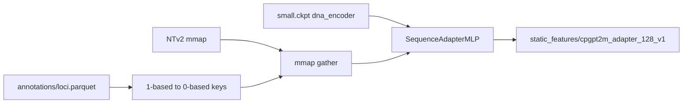

# Milestone 3 build plan: Static locus features (CpGPT default)

Historical implementation plan for Stage 0 Milestone 3 (completed). Normative
contracts remain in [`STATIC_FEATURES.md`](../STATIC_FEATURES.md) and
[`schemas/static_feature_manifest.schema.json`](../../schemas/static_feature_manifest.schema.json).
Milestone status: [`TODO_PIPELINE.md`](../TODO_PIPELINE.md) §3.

## Scope (acceptance)

Ship the **default** offline CpGPT2M sequence-adapter feature set for the
canonical GRCh38 locus registry. MethylGPT token priors stay ablation-only
(config flags / docs; no export CLI required for Done).

**Done when:**

- Artifact under `$MBS_DATA_ROOT/canonical/static_features/cpgpt2m_adapter_128_v1/`
  with `embeddings.zarr`, `loci.parquet`, schema-valid `artifact.json`
- Manifest records commit, checkpoint hash, locus-table hash, dims, dtype,
  genome build, export command
- Unit tests cover coordinate mapping, manifest validation, and store I/O
  without requiring CpGPT at CI time
- [`TODO_PIPELINE.md`](../TODO_PIPELINE.md) milestone 3 → `done` with evidence

## Locked design choices

| Choice | Decision |
|--------|----------|
| Feature set id | `cpgpt2m_adapter_128_v1` |
| Vector | CpGPT small `dna_encoder` / `encode_sequence` equivalent → **128-d float16** |
| DNA input | Precomputed NTv2-500m **1024-d** human deps (`2001` bp), no sample encoder |
| Coordinates | MBS `position` is 1-based cytosine; CpGPT keys are 0-based Ensembl (`chr1:10848` → `1:10847`) |
| Missing loci | `mapping_status=missing`; no embedding row (no NaN / zero fill) |
| Runtime | Training must not import CpGPT; export uses `cpgpt.downloads` + local `SequenceAdapterMLP` (avoids torchtune/torchao breakage on MBS torch) |
| MethylGPT | Ablation-only; out of Done scope |



## Artifact layout

```text
$MBS_DATA_ROOT/canonical/static_features/cpgpt2m_adapter_128_v1/
├── embeddings.zarr
├── loci.parquet
└── artifact.json
```

## CLI

```bash
uv sync --all-groups --extra cpgpt
uv run --extra cpgpt mbs features export-cpgpt --feature-set-id cpgpt2m_adapter_128_v1
# or: make export-cpgpt-static
```

## Explicit non-goals

- MethylGPT token-prior export
- Raw NTv2-1024 / PCA-32 ablation artifacts
- Training-time static lookup wiring (later milestones)
- Regenerating DNA-LM embeddings for uncovered loci
