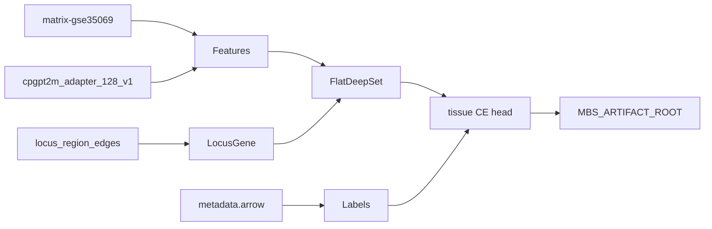

# Milestone 5 build plan: Flat DeepRVAT-style baseline

Historical implementation plan for Stage 0 Milestone 5. Normative model
contract: [`ARCHITECTURE.md`](../ARCHITECTURE.md). Status:
[`TODO_PIPELINE.md`](../TODO_PIPELINE.md) §5.

## Scope (acceptance)

Ship end-to-end training for the exact CpG→gene max-pooling baseline
(`FlatDeepSet`): overfit a tiny fixture, then train on the GSE35069 pilot
matrix. Checkpoints + resolved config under `$MBS_ARTIFACT_ROOT`.

**Done when:**

- Fixture overfits (near-zero loss / accuracy ≈ 1)
- Pilot train completes on one GPU; artifacts under
  `$MBS_ARTIFACT_ROOT/runs/<run_id>/` and `checkpoints/<run_id>/`
- Unit tests cover phenotype join, locus→gene map, and fixture overfit
- [`TODO_PIPELINE.md`](../TODO_PIPELINE.md) milestone 5 → `done` with evidence

## Locked design choices

| Choice | Decision |
|--------|----------|
| Pilot phenotype | Cell-type CE (10 classes from CpGCorpus metadata) |
| Age head | Fixture only; disabled on pilot |
| Labels | Join GSM → `cpgcorpus/GSE35069/GPL13534/metadata/metadata.arrow` |
| Topology | Flat locus→gene via region edges (skip region encoder) |
| Features | beta + m_value + CpGPT static 128-d |
| Seed mask | All-ones (no seed-gene discovery yet) |
| Stack | Plain PyTorch + AMP bf16 (not Lightning) |
| Device | `CUDA_VISIBLE_DEVICES=0` → single `cuda:0` |
| Splits | Donor-grouped 4/2 train/val (not full crossfit) |



## Artifact layout

```text
$MBS_ARTIFACT_ROOT/runs/<run_id>/
  resolved_config.yaml
  environment.json
  metrics.json
  split.json
  checksums.json
$MBS_ARTIFACT_ROOT/checkpoints/<run_id>/
  last.pt
  best.pt
  checkpoint_manifest.json
```

## CLI

```bash
uv sync --extra training
CUDA_VISIBLE_DEVICES=0 uv run mbs train flat \
  --config configs/experiment/stage0_flat_pilot.yaml \
  --device cuda \
  --run-id stage0-flat-gse35069-v1

CUDA_VISIBLE_DEVICES=0 uv run mbs train flat --overfit-fixture --max-epochs 200
```

## Explicit non-goals

- Hierarchical model (Milestone 6)
- Study-grouped outer cross-fitting / OOF scores (Milestone 7)
- Lightning / W&B
- Age regression on GSE35069
- Seed-gene discovery
