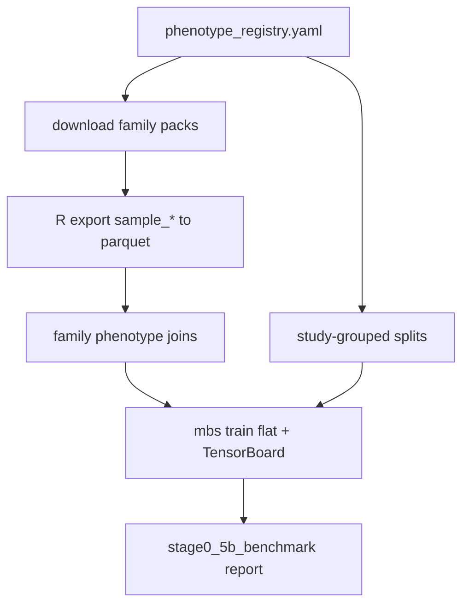

# Milestone 5b build plan: Phenotype registry and multi-pack eval

## Status

Implemented (Milestone 5b `done` in [`TODO_PIPELINE.md`](../TODO_PIPELINE.md)).

Historical implementation brief for Stage 0 Milestone 5b. Normative placement:
[ADR 0003](../adr/0003-milestone-5b-phenotype-registry.md).

## Scope (acceptance)

Ship a versioned phenotype/source registry, family-scoped EWAS Data Hub
downloads, sample-info → Parquet export, study-grouped evaluation metrics, and
TensorBoard logging on the flat baseline—then run a first multi-pack benchmark
beyond `GSE35069`.

**Done when:**

- Registry YAML + JSON Schema + loader tests exist
- Family download script covers wave-1 packs (age, tissue, disease)
- Sample-info Parquet exported for wave-1 families (or documented blocker if R
  unavailable in CI; local export path must work)
- `src/mbs/evaluation` metrics + study-grouped split writer tested
- Flat loop writes TensorBoard + JSONL when enabled
- Inspection report under `reports/inspection/stage0_5b_benchmark/`
- [`TODO_PIPELINE.md`](../TODO_PIPELINE.md) Milestone 5b → `done` with evidence

## Locked decisions

| Choice | Decision |
|--------|----------|
| Order | 5 → 5b → 6 → 7 |
| Registry | `configs/data/phenotype_registry.yaml` + schema; checksums under `$MBS_DATA_ROOT/canonical/registries/` |
| Wave 1 | age, tissue, disease (+ sample-info); GSE35069 smoke |
| Wave 2 / secondary | cancer, blood, brain; sex/ancestry/BMI |
| Sample-info | R script → Parquet (no runtime rpy2 in `src/mbs`) |
| Monitoring | TensorBoard + torchmetrics + JSONL; no Lightning/W&B |
| Public name | deepMAT in docs/artifacts; `mbs` CLI unchanged |
| Atlas | validation only |

## Artifact layout

```text
configs/data/phenotype_registry.yaml
schemas/phenotype_registry.schema.json
$MBS_DATA_ROOT/canonical/registries/download_checksums.parquet
$MBS_DATA_ROOT/canonical/phenotypes/<family>_sample_info.parquet
$MBS_ARTIFACT_ROOT/runs/<run_id>/tb/
$MBS_ARTIFACT_ROOT/runs/<run_id>/metrics.jsonl
reports/inspection/stage0_5b_benchmark/
```

## Data / artifact flow



## Explicit non-goals

- Hierarchical model (Milestone 6)
- Full OOF cross-fit score matrix (Milestone 7)
- Lightning / W&B / MLflow
- Package or CLI rename
- Training on EWAS Atlas associations
- Mandatory full cancer/disease profile convert if a documented study subset
  meets the benchmark gate

## Open questions

None blocking; disease full-matrix convert may be subsetted and must be
recorded in the registry `notes` / `split_role` fields.
