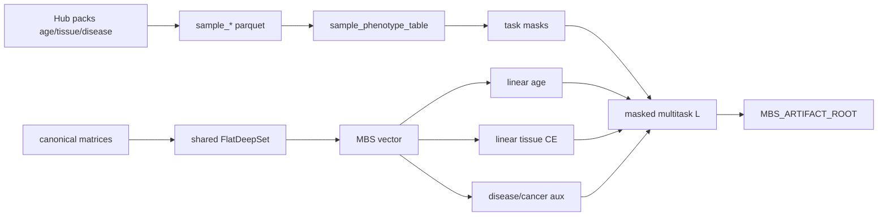

# Milestone 5c build plan: Multitask shared encoder (Hub packs)

Normative model math: [`ARCHITECTURE.md`](../ARCHITECTURE.md). Registry /
pack inventory: Milestone 5b ([ADR 0003](../adr/0003-milestone-5b-phenotype-registry.md)).
Status: [`TODO_PIPELINE.md`](../TODO_PIPELINE.md) §5c.

## Scope (acceptance)

Train **one shared** flat DeepRVAT-style burden scorer on EWAS Data Hub packs
with **task-specific linear heads** and **label masks**—not one model per ZIP.

**Done when:**

- Canonical **sample phenotype table** joins pack sample-info → stable
  `sample_id` / `study_id` / phenotype fields with per-task masks
- Age pack → MSE/Huber regression head; tissue pack → multiclass CE head
- Disease/cancer (and optional blood/brain) attach as **auxiliary** masked heads
  or stay external validation until wave-2
- Joint batches: a sample contributes only to heads for which it has labels
- Study-grouped train/val/test (no study in more than one split)
- Checkpoints + resolved multitask config under `$MBS_ARTIFACT_ROOT`
- Unit tests on synthetic multitask fixtures (no full Hub matrices in CI)
- [`TODO_PIPELINE.md`](../TODO_PIPELINE.md) §5c → `done` with evidence

## Locked decisions

| Choice | Decision | Why |
|--------|----------|-----|
| Topology for 5c | Keep **flat** `FlatDeepSet` max-pool | Isolates multitask labels before hierarchy (M6) |
| Heads | **Linear** `SeedMaskedLinearHead` (or thin linear age head) first | Interpretable MBS; DeepRVAT-style |
| Primary tasks | Age (MSE/Huber) + tissue (CE) | Pack coverage + EXPERIMENT_PROTOCOL |
| Auxiliary | Disease / cancer BCE (masked); blood/brain as domain aux after ontology | Avoid one giant unharmonized tissue set |
| Tissue labels | Coarse family + optional fine subtype; or one harmonized ontology with min-n filter | Blood/brain packs must not collide with `tissue_methylation` classes blindly |
| Loss | Fixed \(\lambda\) weighted sum + per-sample task masks | Uncertainty weighting deferred |
| Splits | Study-grouped (5b `build_study_grouped_split`) | Leakage control |
| Monitoring | TensorBoard + JSONL + torchmetrics (already on flat loop); Lightning optional later | Match 5b |
| Not yet | Hierarchical (M6), full OOF score matrix (M7), one-model-per-ZIP | Ordering |

## Formula (shared encoder)

\[
x_{s,c} \rightarrow \phi(x_{s,c}) \rightarrow MBS_{s,g} \rightarrow \text{task head}
\]

\[
\hat y^{\mathrm{age}}_s = w_{\mathrm{age}}^\top \widetilde{\mathbf{MBS}}_s + b_{\mathrm{age}} + \text{covariates}
\]

\[
\hat{\mathbf y}^{\mathrm{tissue}}_s = \mathrm{softmax}(W_{\mathrm{tissue}} \widetilde{\mathbf{MBS}}_s + \mathbf b_{\mathrm{tissue}} + \text{covariates})
\]

\[
\mathcal L =
\lambda_{\mathrm{age}}\mathcal L_{\mathrm{age}}
+ \lambda_{\mathrm{tissue}}\mathcal L_{\mathrm{tissue}}
+ \lambda_{\mathrm{disease}}\mathcal L_{\mathrm{disease}}
+ \lambda_{\mathrm{cancer}}\mathcal L_{\mathrm{cancer}}
\]

Missing labels → mask; no contribution to that term.

## Folder / module layout

```text
# Config + schemas (repo)
configs/data/phenotype_registry.yaml          # exists (5b)
configs/experiment/stage0_flat_multitask.yaml # multitask experiment
schemas/sample_phenotype_table.schema.json    # unified sample×task table

# Canonical data (under $MBS_DATA_ROOT)
canonical/phenotypes/
  age_sample_info.parquet                     # 5b export
  tissue_sample_info.parquet
  disease_sample_info.parquet
  sample_phenotype_table.parquet              # NEW: unified registry join
  tissue_ontology.yaml                        # NEW: harmonized class map
canonical/matrices/
  matrix-hub-age-…/                           # pack → matrix convert (follow-on)
  matrix-hub-tissue-…/
canonical/registries/
  download_checksums.parquet                  # 5b

# Code
src/mbs/registry/           # 5b registry loader
src/mbs/evaluation/         # 5b metrics + study splits
src/mbs/training/
  phenotypes.py             # extend: unified table loader + masks
  multitask.py              # NEW: masked multitask loss + head bundle
  loop.py                   # extend: multitask train path
src/mbs/cli.py              # mbs train flat --multitask (when implemented)

# Artifacts
$MBS_ARTIFACT_ROOT/runs/<run_id>/
  resolved_config.yaml
  environment.json
  metrics.json / metrics.jsonl
  tb/
  split.json
$MBS_ARTIFACT_ROOT/checkpoints/<run_id>/
```



## Unified sample phenotype table (contract)

One row per assay sample. Columns (normative sketch in
[`schemas/sample_phenotype_table.schema.json`](../../schemas/sample_phenotype_table.schema.json)):

| Column | Role |
|--------|------|
| `sample_id` | Stable MBS id |
| `source_sample_id` | GSM / pack id |
| `study_id` | Fold grouping key |
| `source_system` | e.g. `ewas_datahub` |
| `phenotype_family` | age / tissue / disease / … |
| `platform_id` | HM450 / EPIC / … |
| `age_years` | float or null |
| `age_mask` | bool |
| `tissue_label` / `tissue_class_id` | harmonized or null |
| `tissue_mask` | bool |
| `disease_label` / `disease_mask` | optional aux |
| `cancer_label` / `cancer_mask` | optional aux |
| `donor_id` | when known |
| `matrix_id` | which canonical matrix supplies betas |
| `row_index` | row in that matrix |

## Pack roles

| Pack | Role in 5c |
|------|------------|
| `age_methylation_v1` | Primary regression |
| `tissue_methylation_v1` | Primary multiclass (harmonized) |
| `disease_methylation_v1` | Auxiliary BCE / CE with mask |
| `cancer_methylation_v1` | Auxiliary or external test |
| `blood_methylation_v1` / `brain_methylation_v1` | Domain aux after ontology; do not dump into tissue CE blindly |
| `sex` / `BMI` / `ancestry` | Later covariates or aux (not blocking) |

## Evaluation levels

1. Within-study (debug only)
2. Cross-study holdout within family (age studies → held-out age studies)
3. Cross-family / cross-pack (optional stress test)

Always report by study and platform. Use 5b metrics helpers.

## Explicit non-goals

- One model per ZIP
- Non-linear phenotype heads as default
- Hierarchical region encoder (Milestone 6)
- Full OOF score artifact (Milestone 7)
- Training on EWAS Atlas associations
- Mandatory Lightning / W&B

## Implementation order (when coding starts)

1. Build `sample_phenotype_table.parquet` from wave-1 sample-info + matrix indices
2. Tissue ontology / class filter
3. `multitask.py` masked loss + head bundle on top of existing `FlatDeepSet`
4. CLI / config `stage0_flat_multitask.yaml`
5. Real age + tissue study-holdout runs (not synthetic fixtures)
6. Wire disease aux; document blood/brain ontology decision
7. Mark TODO §5c done; then Milestone 6

## Relation to Milestone 5b

5b delivered registry, family downloads, sample-info Parquet path, metrics,
study-grouped splits, TensorBoard, and **fixture** age/tissue holdout runs.
5c consumes those artifacts and ships **joint multitask training on real pack
labels** with a single shared encoder.
