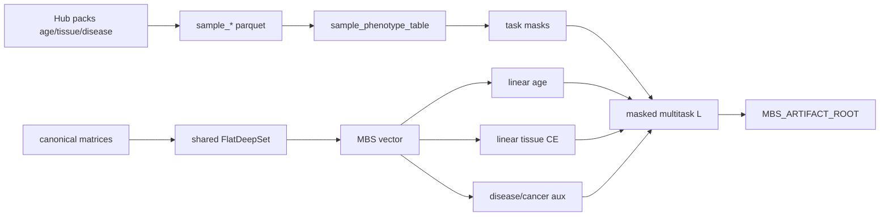

# Milestone 5c build plan: Multitask shared encoder (Hub packs)

Normative model math: [`ARCHITECTURE.md`](../ARCHITECTURE.md). Registry /
pack inventory: Milestone 5b ([ADR 0003](../adr/0003-milestone-5b-phenotype-registry.md)).
**Prerequisite (done):** Hub/Atlas metadata structure contracts
([`EWAS_METADATA.md`](../EWAS_METADATA.md),
[`ewas-metadata-structure` plan](ewas-metadata-structure.md),
`reports/inspection/ewas_metadata_structure/`) — read before inventing
phenotype columns or joins. Status: [`TODO_PIPELINE.md`](../TODO_PIPELINE.md) §5b′ / §5c.

## Scope (acceptance)

Train **one shared** flat DeepRVAT-style burden scorer on EWAS Data Hub packs
with **task-specific linear heads** and **label masks**—not one model per ZIP.

**Done when:**

- Canonical **sample phenotype table** joins pack sample-info → stable
  `sample_id` / `study_id` / phenotype fields with per-task masks
- Age pack → MSE/Huber regression head; tissue pack → multiclass CE head
- Disease/cancer (and optional blood/brain) attach as **auxiliary** masked heads
  or stay external validation until wave-2
- Joint batches: a sample contributes only to heads for which it has labels
- Study-grouped train/val/test (no study in more than one split)
- Checkpoints + resolved multitask config under `$MBS_ARTIFACT_ROOT`
- Unit tests on synthetic multitask fixtures (no full Hub matrices in CI)
- [`TODO_PIPELINE.md`](../TODO_PIPELINE.md) §5c → `done` with evidence

## Locked decisions

| Choice | Decision | Why |
|--------|----------|-----|
| Topology for 5c | Keep **flat** `FlatDeepSet` max-pool | Isolates multitask labels before hierarchy (M6) |
| Heads | **Linear** age + `SeedMaskedLinearHead` tissue | Interpretable MBS; DeepRVAT-style |
| Primary tasks | Age (Huber) + tissue (CE) | Pack coverage + EXPERIMENT_PROTOCOL |
| Auxiliary | Disease / cancer / blood / brain **off for MVP** | Incomplete disease/cancer zips; domain aux later |
| Matrix strategy | Merge `matrix-hub-age-studyholdout-v1` + `matrix-hub-tissue-studyholdout-v1` → `matrix-hub-age-tissue-multitask-v1` (identical loci; GSM dedupe) | Shortest train path; schema `matrix_id`+`row_index` |
| Tissue labels | Identity map of 5 pack classes; `min_n=10` in `tissue_ontology.yaml` | Avoid dumping blood/brain into primary CE |
| Loss | Fixed \(\lambda\) weighted sum + per-sample task masks | Uncertainty weighting deferred |
| Splits | train=`GSE51032,GSE56105,GSE58885,GSE52401,GSE97628`; val=`GSE55763`; test=`GSE78874,GSE75248` | No study in more than one role |
| Monitoring | TensorBoard + JSONL + torchmetrics (already on flat loop); Lightning optional later | Match 5b; see § Monitoring below |
| Storage | Zarr betas + Parquet phenotypes; DuckDB catalog optional/empty | ADR 0003; see § Storage recommendations |
| Not yet | Hierarchical (M6), full OOF score matrix (M7), one-model-per-ZIP | Ordering |

## Formula (shared encoder)

\[
x_{s,c} \rightarrow \phi(x_{s,c}) \rightarrow MBS_{s,g} \rightarrow \text{task head}
\]

\[
\hat y^{\mathrm{age}}_s = w_{\mathrm{age}}^\top \widetilde{\mathbf{MBS}}_s + b_{\mathrm{age}} + \text{covariates}
\]

\[
\hat{\mathbf y}^{\mathrm{tissue}}_s = \mathrm{softmax}(W_{\mathrm{tissue}} \widetilde{\mathbf{MBS}}_s + \mathbf b_{\mathrm{tissue}} + \text{covariates})
\]

\[
\mathcal L =
\lambda_{\mathrm{age}}\mathcal L_{\mathrm{age}}
+ \lambda_{\mathrm{tissue}}\mathcal L_{\mathrm{tissue}}
+ \lambda_{\mathrm{disease}}\mathcal L_{\mathrm{disease}}
+ \lambda_{\mathrm{cancer}}\mathcal L_{\mathrm{cancer}}
\]

Missing labels → mask; no contribution to that term.

## Folder / module layout

```text
# Config + schemas (repo)
configs/data/phenotype_registry.yaml          # exists (5b)
configs/experiment/stage0_flat_multitask.yaml # multitask experiment
schemas/sample_phenotype_table.schema.json    # unified sample×task table

# Canonical data (under $MBS_DATA_ROOT)
canonical/phenotypes/
  age_sample_info.parquet                     # 5b export
  tissue_sample_info.parquet
  disease_sample_info.parquet
  sample_phenotype_table.parquet              # NEW: unified registry join
  tissue_ontology.yaml                        # NEW: harmonized class map
canonical/matrices/
  matrix-hub-age-…/                           # pack → matrix convert (follow-on)
  matrix-hub-tissue-…/
canonical/registries/
  download_checksums.parquet                  # 5b

# Code
src/mbs/registry/           # 5b registry loader
src/mbs/evaluation/         # 5b metrics + study splits
src/mbs/training/
  phenotypes.py             # extend: unified table loader + masks
  multitask.py              # NEW: masked multitask loss + head bundle
  loop.py                   # extend: multitask train path
src/mbs/cli.py              # mbs train flat --multitask (when implemented)

# Artifacts
$MBS_ARTIFACT_ROOT/runs/<run_id>/
  resolved_config.yaml
  environment.json
  metrics.json / metrics.jsonl
  tb/
  split.json
$MBS_ARTIFACT_ROOT/checkpoints/<run_id>/
```



## Unified sample phenotype table (contract)

One row per assay sample. Columns (normative sketch in
[`schemas/sample_phenotype_table.schema.json`](../../schemas/sample_phenotype_table.schema.json)):

| Column | Role |
|--------|------|
| `sample_id` | Stable MBS id |
| `source_sample_id` | GSM / pack id |
| `study_id` | Fold grouping key |
| `source_system` | e.g. `ewas_datahub` |
| `phenotype_family` | age / tissue / disease / … |
| `platform_id` | HM450 / EPIC / … |
| `age_years` | float or null |
| `age_mask` | bool |
| `tissue_label` / `tissue_class_id` | harmonized or null |
| `tissue_mask` | bool |
| `disease_label` / `disease_mask` | optional aux |
| `cancer_label` / `cancer_mask` | optional aux |
| `donor_id` | when known |
| `matrix_id` | which canonical matrix supplies betas |
| `row_index` | row in that matrix |

## Pack roles

| Pack | Role in 5c |
|------|------------|
| `age_methylation_v1` | Primary regression |
| `tissue_methylation_v1` | Primary multiclass (harmonized) |
| `disease_methylation_v1` | Auxiliary BCE / CE with mask |
| `cancer_methylation_v1` | Auxiliary or external test |
| `blood_methylation_v1` / `brain_methylation_v1` | Domain aux after ontology; do not dump into tissue CE blindly |
| `sex` / `BMI` / `ancestry` | Later covariates or aux (not blocking) |

## Evaluation levels

1. Within-study (debug only)
2. Cross-study holdout within family (age studies → held-out age studies)
3. Cross-family / cross-pack (optional stress test)

Always report by study and platform. Use 5b metrics helpers.

## Explicit non-goals

- One model per ZIP
- Non-linear phenotype heads as default
- Hierarchical region encoder (Milestone 6)
- Full OOF score artifact (Milestone 7)
- Training on EWAS Atlas associations
- Mandatory Lightning / W&B

## Implementation order (when coding starts)

1. ~~Build `sample_phenotype_table.parquet` from wave-1 sample-info + matrix indices~~
2. ~~Tissue ontology / class filter~~
3. ~~`multitask.py` masked loss + head bundle on top of existing `FlatDeepSet`~~
4. ~~CLI / config `stage0_flat_multitask.yaml`~~ (`mbs phenotypes build-multitask-table`)
5. ~~Real age + tissue study-holdout runs (not synthetic fixtures)~~
6. Wire disease aux; document blood/brain ontology decision (follow-on)
7. Mark TODO §5c done; then Milestone 6

**MVP build command:**

```bash
uv run mbs phenotypes build-multitask-table
CUDA_VISIBLE_DEVICES=0 uv run mbs train flat \
  --config configs/experiment/stage0_flat_multitask.yaml \
  --run-id stage0-flat-multitask-age-tissue-v1
```

Artifacts: `$MBS_ARTIFACT_ROOT/runs/stage0-flat-multitask-age-tissue-v1/`,
`$MBS_ARTIFACT_ROOT/checkpoints/stage0-flat-multitask-age-tissue-v1/`,
`canonical/matrices/matrix-hub-age-tissue-multitask-v1/`,
`canonical/phenotypes/sample_phenotype_table.parquet`,
`canonical/phenotypes/tissue_ontology.yaml`.

## Relation to Milestone 5b

5b delivered registry, family downloads, sample-info Parquet path, metrics,
study-grouped splits, TensorBoard, and **fixture** age/tissue holdout runs.
**5b′** (metadata structure) documents Atlas small tables and Hub `sample_*.txt`
parse/join contracts — required reading before the unified phenotype table in 5c.
5c consumes those artifacts and ships **joint multitask training on real pack
labels** with a single shared encoder.

## Storage recommendations (5c)

Layer roles (do not collapse these):

| Layer | Format | Role |
|-------|--------|------|
| Betas | Zarr `float32`, chunks `(≤64, ≤4096)` | Sample×locus matrices under `canonical/matrices/` |
| Phenotypes | Parquet | `sample_phenotype_table.parquet` + family sample-info |
| Annotations / graph | Parquet | Locus registry + five-role graph |
| Static features | Zarr (CpGPT adapter) | Once per locus |
| Catalog | DuckDB (`catalog.duckdb`) | Schema-ready metadata DB; **empty is OK for 5c** |
| Raw Hub packs | ZIP | Keep compressed; stream-convert subsets only |

**Do**

1. Keep Parquet + Zarr as the training source of truth (ADR 0003). Do **not**
   put betas into DuckDB.
2. Prefer one merged multitask matrix (`matrix-hub-age-tissue-multitask-v1`)
   over duplicate dense copies of the same GSM rows.
3. Keep canonical betas `float32` + NaN missingness (no silent clip/quantize).
4. Leave full Hub profile ZIPs archived; only materialize selected studies /
   max-per-study subsets.
5. When scaling to thousands of samples, keep the sample chunk small (1–16)
   so row reads do not pull many unused samples.
6. Put disposable train caches (ragged CpG lists, gene-aggregated features)
   under `$MBS_SCRATCH_ROOT`, keyed by `(matrix_id, sample_id, graph_hash)`.

**Defer**

- Populating DuckDB `sample` / `sample_phenotype` tables — optional later for
  SQL QC via `read_parquet` views; not a 5c train gate.
- Zarr Blosc/Zstd compression — worth enabling when converting full packs;
  current studyholdout matrices are small (~100–280 MiB).
- Canonical `float16` betas — reject; scratch-only caches may use lower
  precision if needed.

Disk is not the bottleneck on this host (~9 TiB free). The costly path is
materializing full probe rows into `FlatSampleRecord`s each epoch — optimize
that with scratch caches before changing the storage stack.

Normative matrix layout: [`DATA_CONTRACT.md`](../DATA_CONTRACT.md). Workspace
roots: [`WORKSPACE.md`](../WORKSPACE.md).

## Monitoring a live 5c train run

Current MVP run id: `stage0-flat-multitask-age-tissue-v1`
(`configs/experiment/stage0_flat_multitask.yaml`, `logging.tensorboard` +
`logging.jsonl` enabled).

### Artifacts

```text
$MBS_ARTIFACT_ROOT/runs/stage0-flat-multitask-age-tissue-v1/
  metrics.jsonl          # one JSON object per epoch
  tb/                    # TensorBoard event files
  resolved_config.yaml   # written when run finishes (or mid-run if saved)
$MBS_ARTIFACT_ROOT/checkpoints/stage0-flat-multitask-age-tissue-v1/
  best.pt
  last.pt
```

### Quick CLI checks

```bash
source scripts/activate_data_environment.sh
RUN=stage0-flat-multitask-age-tissue-v1

# Is the train process alive?
ps -eo pid,etime,%cpu,%mem,cmd | rg 'mbs train flat|stage0-flat-multitask'

# Epoch metrics (JSONL)
tail -f "$MBS_ARTIFACT_ROOT/runs/$RUN/metrics.jsonl"

# GPU
nvidia-smi --query-gpu=index,name,utilization.gpu,memory.used,memory.total \
  --format=csv

# Checkpoint freshness
ls -lah "$MBS_ARTIFACT_ROOT/checkpoints/$RUN/"
```

### TensorBoard

```bash
source scripts/activate_data_environment.sh
uv run tensorboard \
  --logdir "$MBS_ARTIFACT_ROOT/runs/stage0-flat-multitask-age-tissue-v1/tb" \
  --bind_all --port 6006
```

Open `http://<host>:6006` (or SSH tunnel the port). Compare multiple runs with
`--logdir_spec name1:path1,name2:path2` or point `--logdir` at
`$MBS_ARTIFACT_ROOT/runs/`.

### Terminal dashboard (`mbs monitor`)

Lightweight Rich TUI (no TensorBoard required):

```bash
source scripts/activate_data_environment.sh
uv run mbs monitor --run-id stage0-flat-multitask-age-tissue-v1 \
  --config configs/experiment/stage0_flat_multitask.yaml

# one-shot snapshot
uv run mbs monitor --run-id stage0-flat-multitask-age-tissue-v1 --once
```

Shows epoch / train·val loss / age MAE / tissue accuracy (+ macro-F1 when
logged) / GPU memory / ETA / `best.pt`·`last.pt`. Pass `--config` or
`--max-epochs` so ETA works before `resolved_config.yaml` is written at run end.

### How to read metrics

JSONL fields (multitask): `epoch`, `train_loss`, `train_accuracy`,
`train_mae`, `val_loss`, `val_accuracy`, `val_mae`, `learning_rate`, `task`.

| Signal | Meaning for this MVP split |
|--------|----------------------------|
| `train_loss` ↓ | Joint masked age+tissue objective improving on train studies |
| `train_mae` | Age error in **train-fold standardized** units (not years) |
| `val_mae` | Val age error (standardized); study `GSE55763` |
| `val_accuracy` | Tissue CE on val — may stay **0%** if val tissue classes are absent from train (closed-set CE); treat as plumbing, not biology |
| `best.pt` mtime | Last improvement on the early-stopping metric |

External-test metrics and destandardized age MAE (years) land in the final run
`metrics.json` when training completes. Full monitoring protocol:
[`EXPERIMENT_PROTOCOL.md`](../EXPERIMENT_PROTOCOL.md) § Training monitoring.