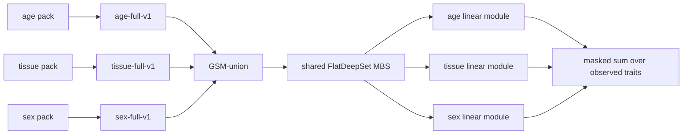

# Milestone 5d build plan: Max-N flat DeepRVAT baseline (age / tissue / sex)

Status: [`TODO_PIPELINE.md`](../TODO_PIPELINE.md) §5d.
Prerequisite: Milestone 5c shared encoder (done).
Metadata contracts: [`EWAS_METADATA.md`](../EWAS_METADATA.md).

## Scope (acceptance)

Train one **shared** flat DeepRVAT-style burden scorer on **full** Hub
age / tissue / sex packs, with **decoupled phenotype modules** and **masked
per-trait loss** (DeepRVAT phenotype-module pattern — not dynamic head
switching, not rectangular complete phenotypes). Insert **before** Milestone 6.

**Done when:**

- Full pack matrices `matrix-hub-{age,tissue,sex}-full-v1`
- GSM-union merge → `matrix-hub-age-tissue-sex-full-v1` + dedicated phenotype
  table (does not clobber 5c’s table)
- Shared `FlatDeepSet` MBS + parallel linear age / tissue / sex modules;
  sample×trait masks gate loss only
- Seeded study-grouped ~70/15/15 by sample count; `split.json`
- Background convert + train; inspection `reports/inspection/stage0_5d_max_n/`
- [`TODO_PIPELINE.md`](../TODO_PIPELINE.md) §5d → `done`

## DeepRVAT alignment (normative for 5d+)

| DeepRVAT | MBS Stage 0 |
|----------|-------------|
| Shared gene impairment module | Shared flat `FlatDeepSet` → gene MBS |
| Trait-specific linear phenotype module | One linear head per trait (age / tissue / sex) |
| Loss only on observed individual–phenotype pairs | `age_mask` / `tissue_mask` / `sex_mask` in factored loss |
| Keep samples with partial phenotypes | GSM-union cohort; missing trait → no gradient for that module |

**Not** used: switching which head is in the graph per sample; dropping rows
that lack a trait; requiring all traits present for every sample.

Future traits attach as new modules + mask columns + λ — same pattern.

## Locked decisions

| Choice | Decision | Why |
|--------|----------|-----|
| Sample ceiling | All studies; no `max_per_study` | Max available N |
| Traits | Age + tissue + sex | User lock |
| Training | Shared MBS + parallel phenotype modules + masked loss | DeepRVAT |
| Matrix merge | GSM **union** (age → tissue → sex first-seen betas) | Tiny overlaps |
| Phenotype table | `…/sample_phenotype_table_age_tissue_sex_full_v1.parquet` | Preserve 5c |
| Sex classes | Binary Male/Female (fail loud otherwise) | Hub contract |
| Splits | Auto study partition by sample count (seeded) | Full packs |
| Remote status | Skip | No powerhorse via Cursor Cloud |
| Config name | `stage0_flat_deeprvat_full.yaml` | Signal DeepRVAT pattern (not a special multitask mode) |

## Schemas / artifacts

```text
canonical/matrices/
  matrix-hub-age-full-v1/
  matrix-hub-tissue-full-v1/
  matrix-hub-sex-full-v1/
  matrix-hub-age-tissue-sex-full-v1/
canonical/phenotypes/
  {age,tissue,sex}_sample_info.parquet
  sample_phenotype_table_age_tissue_sex_full_v1.parquet
  tissue_ontology_age_tissue_sex_full_v1.yaml
  sex_ontology_v1.yaml
configs/experiment/stage0_flat_deeprvat_full.yaml
$MBS_ARTIFACT_ROOT/runs/stage0-flat-deeprvat-age-tissue-sex-full-v1/
$MBS_ARTIFACT_ROOT/checkpoints/stage0-flat-deeprvat-age-tissue-sex-full-v1/
reports/inspection/stage0_5d_max_n/
```

## Data / train flow



## Progress notes

- Studyholdout **v2** was a scale bridge only; 5d completed on uncapped packs.
- Full-pack convert: `scripts/convert_hub_full_packs.sh` (+ background wrapper).
- Train: `stage0-flat-deeprvat-age-tissue-sex-full-v1` + inspection
  `reports/inspection/stage0_5d_max_n/` (`scripts/write_stage0_5d_report.py`).
- **Status:** acceptance met → [`TODO_PIPELINE.md`](../TODO_PIPELINE.md) §5d
  `done` (2026-08-11).

## Non-goals

- Dynamic head-switching; dropping partial-phenotype samples
- Cursor remote agent / public TensorBoard
- Disease / cancer / blood / brain / BMI / ancestry modules in 5d
- Hierarchical (6), OOF (7)
- Committing zarr, checkpoints, or raw `metrics.jsonl`

## Open questions

None blocking; unexpected sex label strings fail loudly.
