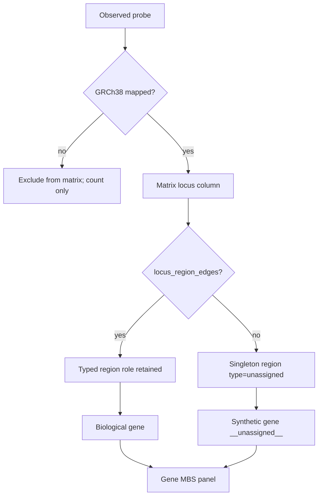
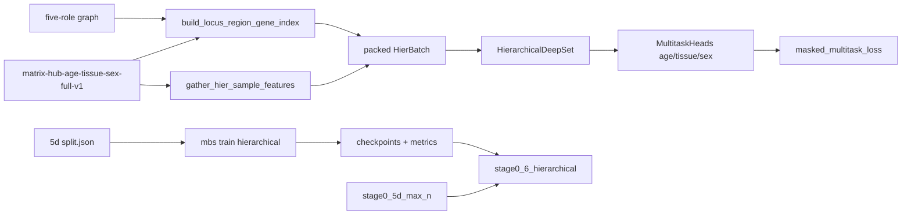

# Milestone 6 build plan: Hierarchical region model

Status: [`TODO_PIPELINE.md`](../TODO_PIPELINE.md) §6.
Prerequisite: Milestone 5d max-N flat DeepRVAT baseline (done).
Normative topology: [`ARCHITECTURE.md`](../ARCHITECTURE.md), [`ANNOTATION_GRAPH.md`](../ANNOTATION_GRAPH.md).

Historical config sketch (not the runnable 5d cohort path):
`configs/experiment/stage0_hier_max.yaml`. Runnable experiment:
`configs/experiment/stage0_hier_deeprvat_full.yaml`.

## Scope (acceptance)

Train `HierarchicalDeepSet` on the **same** 5d age/tissue/sex cohort and folds
as flat deepMAT; retain typed regulatory roles; keep gene-unassigned loci in
the model; compare to flat on the same multitask metrics.

**Done when:**

- Hierarchical train path against
  `matrix-hub-age-tissue-sex-full-v1` + masked phenotype modules
- Typed roles preserved through CpG→region→gene (not collapsed)
- Gene-unassigned loci retained as singleton `unassigned` regions under
  synthetic gene `__unassigned__`
- Illumina-coordinate-unmapped probes remain matrix-excluded (reported only)
- Inspection `reports/inspection/stage0_6_hierarchical/` vs 5d flat + role /
  unassigned ablations
- [`TODO_PIPELINE.md`](../TODO_PIPELINE.md) §6 → `done`

## Locked decisions

| Choice | Decision | Why |
|--------|----------|-----|
| Cohort | Reuse 5d full Hub age/tissue/sex + masked phenotype modules | Fair flat comparison |
| Split | Prefer 5d `split.json` when present (`reuse_flat_split`) | Same folds |
| Illumina-unmapped probes | Stay excluded from matrix (`build_probe_locus_map`) | No coords; out of M6 |
| Gene-unassigned loci | Keep via train-time singleton regions | User requirement; no nearest-gene |
| Unassigned topology | 1 locus → 1 `region_type=unassigned` → gene `__unassigned__` | Do not pool orphans at region layer |
| Graph release | No new graph ID; mint orphans at train time | Immutable five-role graph |
| Region-type vocab | Five GENCODE roles + `unassigned` (`n_region_types=6`) | Differentiate typed vs orphan |
| Train API | `mbs train hierarchical` | Flat loop hardcodes `FlatDeepSet` |
| Role comparison | Eval-time region-type / `__unassigned__` masks on frozen ckpt | Avoid N retrainings |
| Flat baseline | Do not retrain 5d; compare reports | Shortest fair compare |

## Unmapped / unassigned semantics



- Do **not** aggregate unassigned CpGs into typed regions or into each other at
  the region layer.
- Region→`__unassigned__` gene pooling is allowed for fixed-width heads;
  that path is scored separately via ablation.
- Annotated loci keep regulatory typing via `region_type` embeddings.

## Schemas / artifacts

```text
configs/experiment/stage0_hier_deeprvat_full.yaml
src/mbs/training/locus_region_gene.py
src/mbs/training/hier_dataset.py
src/mbs/training/hier_loop.py
$MBS_ARTIFACT_ROOT/runs/stage0-hier-deeprvat-age-tissue-sex-full-v1/
$MBS_ARTIFACT_ROOT/checkpoints/stage0-hier-deeprvat-age-tissue-sex-full-v1/
reports/inspection/stage0_6_hierarchical/
scripts/write_stage0_6_report.py
```

Synthetic gene id `__unassigned__` is train-time only (not written into the
immutable graph release).

## Data / train flow



## Progress notes

- Plan + train path landed 2026-08-11.
- Smoke on 5d cohort/split: `stage0-hier-smoke-maxloci` (max_loci=2000) with
  role/unassigned ablations → `reports/inspection/stage0_6_hierarchical/`.
- Uncapped full-matrix run `stage0-hier-deeprvat-age-tissue-sex-full-v1`
  launched (`scratch/logs/hier_full.log`); refresh report when it finishes,
  then mark [`TODO_PIPELINE.md`](../TODO_PIPELINE.md) §6 `done`.

## Non-goals / deferred

- Illumina-coordinate-unmapped probe columns / synthetic genomic loci
- Nearest-gene assignment; intergenic tiles / cCRE (§8)
- New immutable graph release
- Milestone 7 OOF cross-fitting
- Retraining or replacing the flat 5d baseline
- Disease/cancer heads; attention pooling; BatchNorm

## Open questions

None blocking (scope lock: gene-unassigned only).
