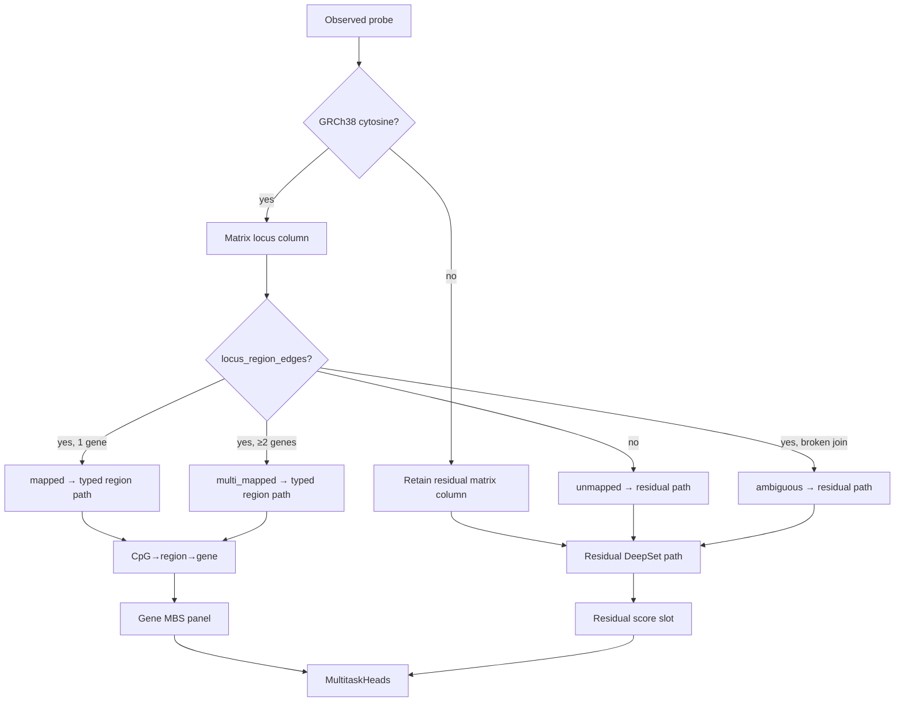
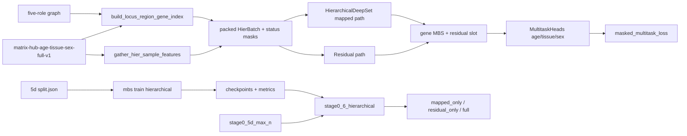

# Milestone 6 build plan: Hierarchical region model

Status: [`TODO_PIPELINE.md`](../TODO_PIPELINE.md) §6.
Prerequisite: Milestone 5d max-N flat DeepRVAT baseline (done).
Normative topology: [`ARCHITECTURE.md`](../ARCHITECTURE.md), [`ANNOTATION_GRAPH.md`](../ANNOTATION_GRAPH.md).

Historical config sketch (not the runnable 5d cohort path):
`configs/experiment/stage0_hier_max.yaml`. Runnable experiment:
`configs/experiment/stage0_hier_deeprvat_full.yaml`.

## Scope (acceptance)

Train `HierarchicalDeepSet` on the **same** 5d age/tissue/sex cohort and folds
as flat deepMAT; retain typed regulatory roles for annotated loci; **retain**
every observed probe, including loci/probes without regulatory annotation, on a
**separate residual path** (not nearest-gene, not `__unassigned__` gene pooling);
compare hierarchical vs flat on the same multitask metrics and folds; report
mapped vs unmapped slices separately.

**Done when:**

- Hierarchical train path against
  `matrix-hub-age-tissue-sex-full-v1` + masked phenotype modules
- Typed roles preserved through CpG→region→gene for regulatory-annotated loci
- Unmapped / residual loci kept out of gene pooling; residual path scored and
  evaluated separately
- Matrix conversion retains Illumina-coordinate-unmapped probes as residual
  columns (not dropped)
- Batch contract exposes annotation-status masks:
  `mapped` / `unmapped` / `ambiguous` / `multi_mapped`
- Inspection `reports/inspection/stage0_6_hierarchical/` vs 5d flat + mapped /
  residual eval slices
- [`TODO_PIPELINE.md`](../TODO_PIPELINE.md) §6 → `done`

## Locked decisions

| Choice | Decision | Why |
|--------|----------|-----|
| Cohort | Reuse 5d full Hub age/tissue/sex + masked phenotype modules | Fair flat comparison |
| Split | Prefer 5d `split.json` when present (`reuse_flat_split`) | Same folds |
| Illumina-unmapped probes | **Retain** as residual matrix columns | User policy: keep every observed probe |
| Gene-unassigned loci | Residual path only — **no** `__unassigned__` gene | No nearest-gene; no synthetic gene pooling |
| Mapped path | Typed five-role CpG→region→gene | Hierarchy where annotation exists |
| Residual path | Shared CpG encoder → max-pool per sample → residual score slot | Separate from gene panel; reportable |
| Annotation status | Per-column: mapped / unmapped / ambiguous / multi_mapped | Eval slices + batch contract |
| Region-type vocab | Five GENCODE roles only (`n_region_types=5`) | Orphans are not a region type |
| Train API | `mbs train hierarchical` | Flat loop hardcodes `FlatDeepSet` |
| Flat baseline | Do not retrain 5d; compare reports | Shortest fair compare |
| Attention pooling | Not the reference | Stage 0 invariant |

## Unmapped / residual semantics



- Do **not** assign unmapped CpGs to nearest genes.
- Do **not** mint singleton `unassigned` regions under `__unassigned__`.
- Do **not** drop unmapped probes from matrix conversion.
- Mapped / multi_mapped loci keep regulatory typing via `region_type` embeddings.
- Eval reports **full**, **mapped_only**, and **residual_only** slices.

### Annotation-status definitions

| Status | Meaning |
|--------|---------|
| `mapped` | ≥1 typed region edge; exactly one gene |
| `multi_mapped` | ≥1 typed region edge; ≥2 distinct genes |
| `ambiguous` | Region edge present but gene/type join incomplete |
| `unmapped` | No regulatory edge, or Illumina-coordinate residual column |

## Schemas / artifacts

```text
configs/experiment/stage0_hier_deeprvat_full.yaml
src/mbs/batch.py                          # annotation-status masks
src/mbs/models.py                         # hierarchical + residual path
src/mbs/matrix/locus_map.py               # retain residual probes
src/mbs/training/locus_region_gene.py     # typed edges + residual cols
src/mbs/training/hier_dataset.py          # HierBatch residual tensors
src/mbs/training/hier_loop.py
src/mbs/evaluation/annotation_slices.py   # mapped vs residual metrics
$MBS_ARTIFACT_ROOT/runs/stage0-hier-deeprvat-age-tissue-sex-full-v1/
$MBS_ARTIFACT_ROOT/checkpoints/stage0-hier-deeprvat-age-tissue-sex-full-v1/
reports/inspection/stage0_6_hierarchical/
```

Synthetic residual score id `__residual__` is a **panel slot** for the residual
path only (not a gene in the immutable graph release).

## Data / train flow



## Non-goals / deferred

- Nearest-gene assignment; intergenic tiles / cCRE (§8)
- New immutable graph release
- Milestone 7 OOF cross-fitting
- Retraining or replacing the flat 5d baseline
- Disease/cancer heads; attention pooling; BatchNorm
- Requiring a rebuilt Hub matrix before code lands (existing matrices without
  residual Illumina columns still train; residual gene-unassigned loci use the
  residual path; new conversions retain Illumina-unmapped probes)

## Open questions

None blocking.
