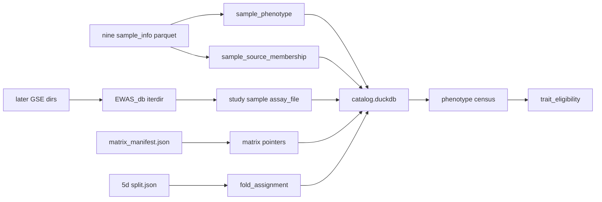

# Milestone 7A: Harmonized data release and phenotype census

Status: **done** (2026-08-24). Evidence: `$MBS_DATA_ROOT/canonical/releases/deepmat-data-v1/`, `reports/inspection/deepmat_data_v1/`.
Normative ADRs: [0005](../adr/0005-catalog-matrix-independence.md),
[0007](../adr/0007-crossfit-prerequisites.md).
Checklist: [`TODO_PIPELINE.md`](../TODO_PIPELINE.md).
Programme context: [`post-v0-scientific-programme.md`](post-v0-scientific-programme.md).

## Scope and acceptance

| Deliverable | Done when |
|-------------|-----------|
| Release tree | `$MBS_DATA_ROOT/canonical/releases/deepmat-data-v1/` with `release_manifest.json` |
| Catalog | Populated DuckDB + Parquet tables (not schema-only) |
| Census | Report answers unique GSM vs pack-row sum, overlap, conflicts, prevalence |
| Eligibility | `trait_eligibility` with programme cutoffs |
| CLI | `mbs catalog refresh-release` / `validate-release` / `phenotype-census` / `trait-eligibility` |
| Incremental EWAS_db | Re-run refresh after new `EWAS_db/{GSE}/` dirs appear; studies upsert |

EWAS_db All-Data mirror completeness is **not** required (ADR 0007).

## Locked decisions

| Choice | Decision | Why |
|--------|----------|-----|
| Phenotype SoT | Nine Hub `*_sample_info.parquet` → long-form + membership | ADR 0005; packs complete |
| EWAS_db | Shallow dir listing each refresh; upsert on change | Future downloads; no 990 GiB hash |
| GSM digest | `sha256(relpath:byte_size)` for `assay_file.sha256` | Same pattern as large Hub zips |
| Matrices | Pointers only (no Zarr copies) | Freeze / disk |
| Catalog path | Fresh DB under the release dir | Versioned release |
| Missing disease | Unknown ≠ control | Scientific invariant |
| Controls | Prefer `sample_type` matching control when present | Hub metadata |
| Splits | Ingest frozen 5d `split.json` only | No 7C splits |
| Locus load | Skip 1.08M loci into DuckDB | Census does not need them |
| Watcher | No; re-runnable CLI + Makefile | YAGNI |

## Schemas / contracts

- SQL: [`sql/001_schema.sql`](../../sql/001_schema.sql) (long-form PK + new tables),
  [`sql/011_census_views.sql`](../../sql/011_census_views.sql)
- Manifest: [`schemas/release_manifest.schema.json`](../../schemas/release_manifest.schema.json)
- Normative prose: [`DATA_CONTRACT.md`](../DATA_CONTRACT.md)

### Release layout

```text
canonical/releases/deepmat-data-v1/
├── release_manifest.json
├── catalog/catalog.duckdb
├── catalog/tables/*.parquet
├── phenotypes/
├── matrices/index.parquet
├── ontologies/
└── splits/
```

## Data / artifact flow



## Non-goals

- Waiting for 1989 EWAS_db studies; nine-pack Zarr convert (7B); graph v2 (7C);
  Level-1 norm (7D); OOF (7); Zarr copies; sample×CpG DuckDB; download watcher;
  overwriting v0.1 freezes.

## Open questions

None blocking.
