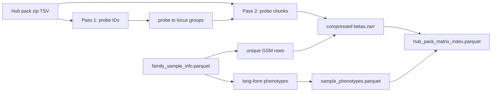

# Milestone 7B: Complete canonical Hub matrices

Status: **in_progress** (converter + unit tests landed; pack conversions +
`reports/inspection/stage0_7b_hub_matrices/` still required for Done when).
Normative ADRs: [0005](../adr/0005-catalog-matrix-independence.md),
[0007](../adr/0007-crossfit-prerequisites.md).
Checklist: [`TODO_PIPELINE.md`](../TODO_PIPELINE.md).
Programme context: [`post-v0-scientific-programme.md`](post-v0-scientific-programme.md).

## Scope and acceptance

| Deliverable | Done when |
|-------------|-----------|
| Six pack matrices | `matrix-hub-{disease,cancer,blood,brain,bmi,ancestry}-full-v1` under `$MBS_DATA_ROOT/canonical/matrices/` |
| BMI / ancestry maps | Pack converter `_PACK_ZIP_NAME` / `_PACK_TXT_NAME` include both families |
| Stream-to-Zarr | Probe chunks written directly to compressed Zarr; no full dense `[n_samples, n_probes]` RAM stack |
| Probe collapse | Mean (2 probes) / median (≥3); `contributing_probe_ids` + `collapse_method` on locus index |
| Multi-label | Unique GSM matrix rows; long-form `sample_phenotypes.parquet` (no `dict[gsm]=row`) |
| Content checksums | `source_files[].sha256` = streaming content hash of pack zip |
| Overlap | Virtual multi-store index + GSM concordance check; no silent first-pack merge |
| Evidence | Unit tests + `reports/inspection/stage0_7b_hub_matrices/` |

Age / tissue / sex full matrices stay frozen; do not reconvert.

## Locked decisions

| Choice | Decision | Why |
|--------|----------|-----|
| Layout | Per-pack Zarr `matrix-hub-{family}-full-v1` | Dense nine-pack union is YAGNI; disk + RAM |
| Cross-pack | Virtual index parquet + concordance report | 7A already has membership / long-form phenotypes |
| Protocol | No new `MethylationStore` abstraction | Existing Zarr layout; ADR 0005 allows later |
| Probe universe | HM450 edges for Hub packs | Packs are 450K-aligned |
| Manifest platform | Unique sample platform or `mixed` | Per-sample platform on sidecar; do not lie HM450 on unions |
| Collapse | `nanmean` (2) / `nanmedian` (≥3); record all probe IDs | EPICv2 / replicate probes; not lex-first drop |
| Disease / cancer | Unique GSM betas; all sample-info rows as long-form labels | Multi-label; missing ≠ control |
| Checksums | Always `sha256_file(zip)` | Drop name+size shortcut |
| 7A release | Pointers only on refresh | No Zarr copies into `deepmat-data-v1/` |

## Schemas / contracts

- Matrix layout: existing `betas.zarr` + `sample_index.parquet` + `locus_index.parquet` + `matrix_manifest.json`
- Locus index extensions: `contributing_probe_ids` (pipe-separated), `collapse_method` (`identity` \| `mean` \| `median`)
- Sidecar: long-form `sample_phenotypes.parquet` (may repeat `sample_id`)
- Virtual index: `canonical/matrices/hub_pack_matrix_index.parquet`
  (`family`, `matrix_id`, `sample_id`, `row_index`, `platform`, `betas_path`)
- Manifest: [`schemas/matrix_manifest.schema.json`](../../schemas/matrix_manifest.schema.json)
- Normative prose: [`DATA_CONTRACT.md`](../DATA_CONTRACT.md), [`DATA_CATALOG.md`](../DATA_CATALOG.md)

## Data / artifact flow

## Non-goals

- Retrain v0.1; 7C trainer / heads / splits; Level-1 MAD (7D); TileDB; ClickHouse;
  reconverting age/tissue/sex; materializing a nine-pack dense union;
  EWAS_db mirror completeness.

## Open questions

None blocking.
