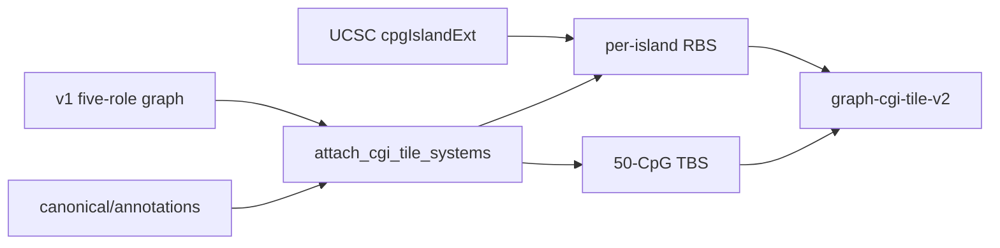

# Milestone 7C residual: graph-v2 / RBS·TBS topology

Status: **done**. Checklist: [`TODO_PIPELINE.md`](../TODO_PIPELINE.md).
Parent plan: [`milestone-7c-supervised-architecture.md`](milestone-7c-supervised-architecture.md).
ADRs: [0006](../adr/0006-multipath-noncoding-scores.md).

## Scope and acceptance

1. Full-genome `graph-grch38-gencode38-cgi-tile-v2` under `$MBS_DATA_ROOT`
   (reuse v1 annotations + five-role graph; do not clobber them).
2. Multi-system hier index (`region_systems` beyond gene-only).
3. Train-time RBS/TBS feature masks for independent arms (not eval-time masking).

**Done when:** schema-valid graph-v2 artifact + inspection report; unit tests for
per-island RBS, multi-system index, and disjoint arm panels; `rbs`/`tbs`
overfit fixtures train different panels than gene.

## Evidence

| Artifact | Path / note |
|----------|-------------|
| Graph | `$MBS_DATA_ROOT/canonical/graphs/graph-grch38-gencode38-cgi-tile-v2/` |
| Manifest | `graph_manifest.json` (`rbs_source=UCSC_cgi_per_island_shore`) |
| Inspection | `reports/inspection/annotation_graph_cgi_tile_v2/` |
| Counts | loci 1 082 522; genes 19 937; regions 346 133; RBS 18 356; TBS 5 446 |
| Tests | `tests/unit/test_stage0_7c.py`, `tests/unit/test_locus_region_gene.py` |
| Annotations | v1 `canonical/annotations/` not rewritten by v2 build |

## Locked decisions

| Choice | Decision |
|--------|----------|
| RBS | Per UCSC island; shores keyed to nearest island |
| Fixture without CGI | Chrom×context fallback |
| TBS | Greedy 50-CpG tiles on leftover mapped loci |
| Artifact write | Graph-v2 dir + `annotation_graph_cgi_tile_v2` only |
| Hier default | `region_systems=("gene",)` |
| Arms | Filter at index build via `model.arm` |

## Schemas / contracts

- [`schemas/graph_manifest.schema.json`](../../schemas/graph_manifest.schema.json)
  `region_policy.region_systems`: `gene`, `rbs`, `tbs`
- Graph id: `graph-grch38-gencode38-cgi-tile-v2`

## Data / artifact flow



## Non-goals

SCREEN cCRE; overwriting v0.1 annotations; Level-2/3 normalizers; reopening
7C fixture Done when. Hub-scale 7E CV and 7E′ multitask are downstream.

## Ops

```bash
uv run mbs graph build --graph-id graph-grch38-gencode38-cgi-tile-v2
```

Unblocks independently trained RBS/TBS arms in **7E**. Remaining Hub-wide
disease heads + catalog hygiene: **7E′**.
