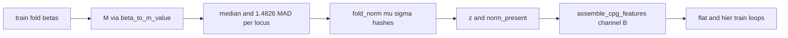

# Milestone 7D: Fold-fitted Level-1 normalization

Status: **done** (fixtures + Hub DeepRVAT ATS A/B smoke; inspection report landed).
Checklist: [`TODO_PIPELINE.md`](../TODO_PIPELINE.md).
Programme context: [`post-v0-scientific-programme.md`](post-v0-scientific-programme.md).
Normative: [ADR 0007](../adr/0007-crossfit-prerequisites.md),
[`ARCHITECTURE.md`](../ARCHITECTURE.md) § Input representation.

Hub evidence: `reports/inspection/stage0_7d_level1/` (runs `stage0-7d-level1-a/b`,
512 loci, 2 epochs). Comprehensive RBS/TBS + graph-v2 remain **7E prerequisites**.

## Scope and acceptance

| Deliverable | Done when |
|-------------|-----------|
| Level-1 fit | Train-fold median + `1.4826×MAD` on M-values |
| Persist | `μ`, `σ`, locus ids + content hashes under run `fold_norm/` |
| Novel loci | `z=0` + `norm_present=False` (keep CpG; do not discard) |
| Channel A vs B | Identical folds (fixtures **and** Hub DeepRVAT ATS); B = A + z + `norm_present` |
| Hub evidence | Fit on `matrix-hub-age-tissue-sex-full-v1` train fold; report under `reports/inspection/stage0_7d_level1/` |
| Hub GMQN | Canonical betas never rewritten |
| Levels 2–3 | Documented stubs only; config keys raise `NotImplementedError` |

This milestone is `done`. Gene-only **7E** may start. Comprehensive RBS/TBS
(graph-v2 + train-time masks) is a **full 7E bake-off prerequisite**, not 7D
Done when.

## Locked decisions

| Choice | Decision | Why |
|--------|----------|-----|
| Formula | `μ=median(M_train)`, `σ=1.4826×MAD`, `z=(M−μ)/max(σ,σ_min)` | post-v0 / STRATEGIC_PLAN |
| Study-balanced | Fit **only** on study-grouped train fold | No val/test leakage; not median-of-study-medians |
| `σ_min` | `1e-6` default | Floor for zero-MAD loci |
| Channel B gate | `features.methylation.robust_deviation: true` requires `m_value: true` | z defined on M |
| Feature layout | `beta, [M], [z], static…, static_present, [norm_present]` | Orientation still reads M at col 1 |
| Artifact root | `$MBS_ARTIFACT_ROOT/runs/<id>/fold_norm/` only | Never touch Hub Zarr |
| Hub cohort | DeepRVAT ATS: `matrix-hub-age-tissue-sex-full-v1`, `deeprvat_hub` | Same family as v0.1 / 5d |
| Efficiency | Chunked fit on all train loci; short A/B smoke with `max_loci` + few epochs | Prove path, not phenotype SOTA |
| Direct CpG | Consumes Level-1 z when B on | Replaces centered-M placeholder from 7C |
| Level 2 / 3 | Docs + config stubs; no train | AE not default |

## Schemas / contracts

- [`schemas/fold_norm_manifest.schema.json`](../../schemas/fold_norm_manifest.schema.json)
- Module: `src/mbs/training/level1_norm.py`
- Config keys under `features.methylation`: `robust_deviation`, `sigma_min`,
  `epsilon`; forbidden until implemented: `level2_probe_adapter`,
  `level3_masked_ae`
- Hub smoke configs: `configs/experiment/stage0_flat_deeprvat_level1_{a,b}.yaml`

### Fold-norm layout

```text
$MBS_ARTIFACT_ROOT/runs/<run_id>/fold_norm/
├── mu.npy
├── sigma.npy
├── locus_ids.npy   # optional / synthetic integer cols when no locus_id map
└── manifest.json
```

## Data / artifact flow



## Channel A vs B

| Channel | Config | CpG input |
|---------|--------|-----------|
| A (default) | `robust_deviation: false` | beta + M + static + `static_present` |
| B | `robust_deviation: true` | A + fold-fitted z + `norm_present` |

Compare on identical study-holdout fixture folds **and** identical DeepRVAT
Hub auto-split IDs (same seed / `split_id`).

## Levels 2 and 3 (documented ablations; not implemented)

- **Level 2 — ProbeNormalizer:** `corrected = input + bounded_shared_MLP(input, static)`
  with LayerNorm/RMSNorm (not BatchNorm). Fold-fitted adapter; does not overwrite
  canonical betas. Select on phenotype / stability, not reconstruction.
- **Level 3 — masked set AE:** only if trained **inside every training fold**;
  explicit missing/platform-downsample masks; no val/test studies in recon;
  select on held-out phenotype, replicate concordance, cross-platform stability.
  Vanilla AE reconstructs study/platform artifacts well — not the first normalizer.

If experiment YAML sets `level2_probe_adapter` or `level3_masked_ae`, the trainer
raises `NotImplementedError`.

## Non-goals

- Hub pack convert / content checksums (7B — already done)
- Full 7E 3×2 development CV
- Retraining frozen v0.1 runs
- Rewriting GMQN betas
- Median-of-study-medians
- Full-genome graph-v2 build / multi-system RBS·TBS train masks (7E prep)

## Immediate next after 7D (7E prerequisites)

1. ~~Build genome `graph-grch38-gencode38-cgi-tile-v2` under `$MBS_*`.~~ **done**
2. ~~Multi-system hier index (stop filtering `region_system==gene` only).~~ **done**
3. ~~Train-time RBS/TBS feature masks for independent arms.~~ **done**

Plan: [`milestone-7c-graph-v2-topology.md`](milestone-7c-graph-v2-topology.md).
Next: Milestone **7E** development CV.

## Open questions

None blocking.
