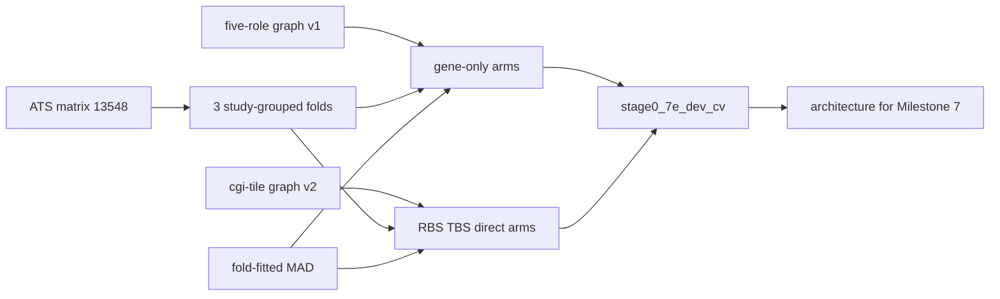

# Milestone 7E: Development CV (architecture selection)

Status: **pending** (current coding gate). Graph-v2 + train-time RBS/TBS masks
are on disk; full 3×2 bake-off may include multi-path arms. Gene-only arms
remain valid on the five-role graph and Level-1 channel A/B.
Checklist: [`TODO_PIPELINE.md`](../TODO_PIPELINE.md).
Programme: [`post-v0-scientific-programme.md`](post-v0-scientific-programme.md).
ADRs: [0006](../adr/0006-multipath-noncoding-scores.md),
[0007](../adr/0007-crossfit-prerequisites.md),
[0008](../adr/0008-score-identifiability.md).

## Scope and acceptance

| Deliverable | Done when |
|-------------|-----------|
| Folds | 3 outer study-grouped folds × 2 restarts; identical folds across arms |
| Transparent | Gene/region mean and elastic-net baselines |
| Neural gene | Parameter-matched flat gene-only and hierarchical gene-only |
| Direct | Gene + sparse direct CpG (elastic-net / group sparsity on fold-normalized z) |
| Multi-path | Gene + RBS + TBS + direct, independently trained (not eval-time mask) |
| Ablations | Each neural arm ± Level-1 z; CpGPT as a **separate** ablation |
| Report | Selects architecture for Milestone 7; stratified metrics, not accuracy/MAE alone |

**Done when** the report exists under `reports/inspection/stage0_7e_dev_cv/`
and names a winner. A 3-fold × 1-restart smoke of existing machinery is plumbing
only ([ADR 0007](../adr/0007-crossfit-prerequisites.md)).

## Readiness (inspected 2026-08-25)

Live catalog `$MBS_DATA_ROOT/canonical/releases/deepmat-data-v1/catalog/catalog.duckdb`
(`created_at` 2026-08-25T11:15:35Z): **121 931** samples, **1 325** studies,
**216 476** phenotype rows, **47 843** pack memberships, **92 971** EWAS_db
assay files, **20** matrix artifacts including all nine Hub full packs.
Overlap view: **34 234** unique Hub GSMs. Frozen 5d split ingested
(`fold_assignment` n=13 548). Hub zips complete; EWAS_db **not** complete
(`mirror_complete: false`, **924**/1989) and **must not** block 7E.

Authoritative human census snapshot:
`reports/inspection/deepmat_data_v1/` (underscore; generated with this refresh).
CLI default `reports/inspection/deepmat-data-v1/` (hyphen) currently holds a
**5-GSM fixture leak** — ignore it.

**7E prep (closed)** — see [`milestone-7c-graph-v2-topology.md`](milestone-7c-graph-v2-topology.md):

1. Full-genome `graph-grch38-gencode38-cgi-tile-v2` on disk.
2. Multi-system hier index (`region_systems`).
3. Train-time RBS/TBS feature masks.

Full multi-path 3×2 is unblocked.

## Locked decisions

| Choice | Decision | Why |
|--------|----------|-----|
| Cohort for selection | Frozen ATS `matrix-hub-age-tissue-sex-full-v1` (13 548) | Same family as v0.1 / 7D; disease/cancer auxiliary later |
| Training | Joint DeepRVAT: shared aggregation **and** linear heads | Programme glossary |
| Independent arms | Separate trains on identical folds | ADR 0006 |
| Graph for RBS/TBS | `graph-grch38-gencode38-cgi-tile-v2` | CGI RBS + 50-CpG tiles; no SCREEN required |
| Level-1 | Compare A vs B on the same folds | 7D already proved the channel |
| Winner | Held-out phenotype + stratified metrics + controls | Not reconstruction; not ordered-prefix eval |

## Schemas / contracts

- Score polarity: [`schemas/score_manifest.schema.json`](../../schemas/score_manifest.schema.json)
- Fold-norm: [`schemas/fold_norm_manifest.schema.json`](../../schemas/fold_norm_manifest.schema.json)
- Splits: constraint-aware study-grouped (`mbs.evaluation.splits`)
- Graph id: `graph-grch38-gencode38-cgi-tile-v2`

## Data / artifact flow

## Non-goals

- Milestone 7 5×6 OOF; overwriting v0.1; waiting on EWAS_db completeness;
  Level-2/3 normalizers; dual hyper/hypo channels as default;
  treating disease/cancer as core until documented controls exist.

## Open questions

None blocking 7E arms (graph-v2 + train-time masks are on disk).
