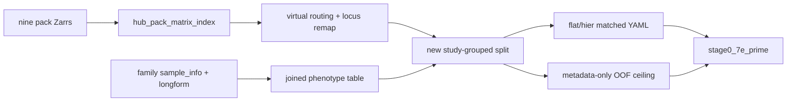

# Milestone 7E′: Hub multitask + analysis hygiene

Status: **done**.
Does not reopen 7A–7D or the frozen ATS matrix.
Checklist: [`TODO_PIPELINE.md`](../TODO_PIPELINE.md).
7E bake-off: [`milestone-7e-development-cv.md`](milestone-7e-development-cv.md).
Graph-v2 (done): [`milestone-7c-graph-v2-topology.md`](milestone-7c-graph-v2-topology.md).

Evidence:
- Virtual store `matrix-hub-nine-pack-virtual-v1` (34 234 × 482 379)
- Phenotype table + split `hub-nine-pack-full-auto-v1` (24 010 / 5 576 / 4 648)
- Metadata-only report: `reports/inspection/stage0_7e_prime/`
- Smoke: `artifacts/runs/stage0-flat-hub-multitask-smoke-v1/`
- Hub-wide run: `artifacts/runs/stage0-flat-hub-multitask-v1/` (2 epochs,
  `--max-loci 8192`; full cohort + five masked heads; uncapped production via
  `scripts/train_hub_multitask_7e_prime.sh`)

## What ATS is

**ATS** = **A**ge / **T**issue / **S**ex. It is the frozen Hub **GSM-union** of
the three baseline packs:

```text
matrix-hub-age-tissue-sex-full-v1   13 548 samples × 482 379 loci
freeze name: deepmat-data-age-tissue-sex-v1
split: hub-age-tissue-sex-full-auto-v1 (9489 / 2074 / 1985)
```

It is **not** “all downloaded methylation.” Unique Hub GSM across nine packs is
**34 234**. EWAS_db listing is **92 971** GSM files and is a different lane.

## Can ATS grow because EWAS_db downloaded more?

**No.** More `EWAS_db/{GSE}/` dirs do not enlarge the Hub age/tissue/sex zips.
Those packs are already complete. Do **not** overwrite the ATS freeze.

**Yes, a larger training cohort already exists on disk:** union (or virtual
multi-store) of the nine Hub full matrices, with masked heads for every
available trait — including disease and cancer. That is this milestone, not a
bigger ATS freeze.

EPIC/850K is also not in ATS: every Hub `*_sample_info.parquet` row is
`platform=450K`. EPIC lives in the annotation graph and in EWAS_db
`add_txt_850`, not in the nine baseline zips.

## Disease/cancer “core” vs train-on-everything

Eligibility `eligible_core_task=False` for disease/cancer means: **do not treat
missing labels as controls** and **do not claim case–control epidemiology**
until documented controls exist (ADR / DATA_CONTRACT). It does **not** mean
skip those heads.

**Locked here:** train age, tissue, sex, **and** disease (cancer too) with
**masked** loss (`unknown ≠ 0`). Pack-wide blood `cell_component` stays unused
(~1.1% populated).

## Locked decisions

| Choice | Decision | Why |
|--------|----------|-----|
| Hub cohort layout | **Virtual multi-store** (`matrix-hub-nine-pack-virtual-v1`) | No ~61 GB dense union; reuse 7B index; overlap concordant |
| Canonical pack per GSM | `age > tissue > sex > disease > cancer > blood > brain > bmi > ancestry` | Matches 5d ATS first-seen for overlapping GSMs |
| Locus alignment | Intersection of pack `locus_id`s, ordered as `matrix-hub-age-full-v1` | ATS 482 379 vs 7B 482 387; remap by id, not column index |
| Phenotype table | `sample_phenotype_table_hub_nine_pack_v1.parquet` | Labels independent of which pack supplies betas |
| Split | `hub-nine-pack-full-auto-v1` (new run_id only) | Do not overwrite ATS freeze split |
| Disease/cancer | Masked BCE; unlabeled = unknown ≠ control | ADR / DATA_CONTRACT |
| Blood | Do **not** use `cell_component` as a pack-wide head | ~1.1% populated |
| Flat vs hier | Shared `model.encoder` (GELU / dropout 0.1 / LN / width 64) | Same as 7E Done when |
| Metadata-only | Sidecar OOF on train-fit → val/test; not a training replacement | Confounding ceiling for 7E and 7E′ |

### Artifact ids

```text
canonical/matrices/matrix-hub-nine-pack-virtual-v1/
  sample_index.parquet
  locus_index.parquet
  route.parquet
  matrix_manifest.json   # kind: virtual_multi_store

canonical/phenotypes/
  sample_phenotype_table_hub_nine_pack_v1.parquet
  tissue_ontology_hub_nine_pack_v1.yaml
  sex_ontology_hub_nine_pack_v1.yaml

split_id: hub-nine-pack-full-auto-v1
configs/experiment/stage0_flat_hub_multitask_v1.yaml
configs/experiment/stage0_hier_hub_multitask_v1.yaml
reports/inspection/stage0_7e_prime/
```

CLI: `mbs matrix build-hub-virtual`, `mbs phenotypes build-hub-union-table`.

## Scope and acceptance

| Deliverable | Done when |
|-------------|-----------|
| Hub multitask | Age + tissue + sex + disease (+ cancer) heads on Hub packs already converted; masked unknown≠control; new split **not** overwriting ATS freeze |
| Metadata-only | Study/platform/tissue → phenotype on the **same** 7E folds; confounding ceiling in the 7E report |
| Catalog string | 7B `platform_id=450K` aliases to `HM450` on next `refresh-release` (probe map already HM450) |
| Census follow-ons | Donor/replicate IDs when present; within-study age/BMI ranges |
| Tests | Census/eligibility CLI tests write a **temp** `--report-dir` (no hyphen-path clobber) |
| Git | `*.RData` ignored; no Hub sample blobs under `reports/inspection/ewas_datahub_samples/` |
| Blood | Config/docs: do not use `cell_component` as a pack-wide head |
| Matched encoders | 7E YAML: same width/GELU/dropout/LN for flat vs hier (also 7E Done when) |

Graph-v2 independent RBS/TBS arms are **7E**, not this list (artifact is on disk).

## Data / artifact flow



## Non-goals

- Overwriting ATS / v0.1; waiting on EWAS_db completeness; converting EPIC
  `add_txt_850` into Hub-scale matrices; treating unlabeled disease rows as
  controls; dense nine-pack physical concat.

## Open questions

None. Virtual multi-store layout is locked above.
