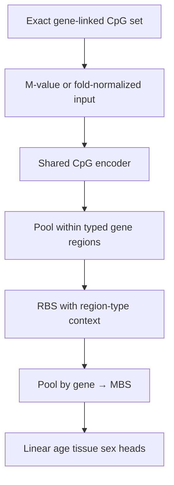
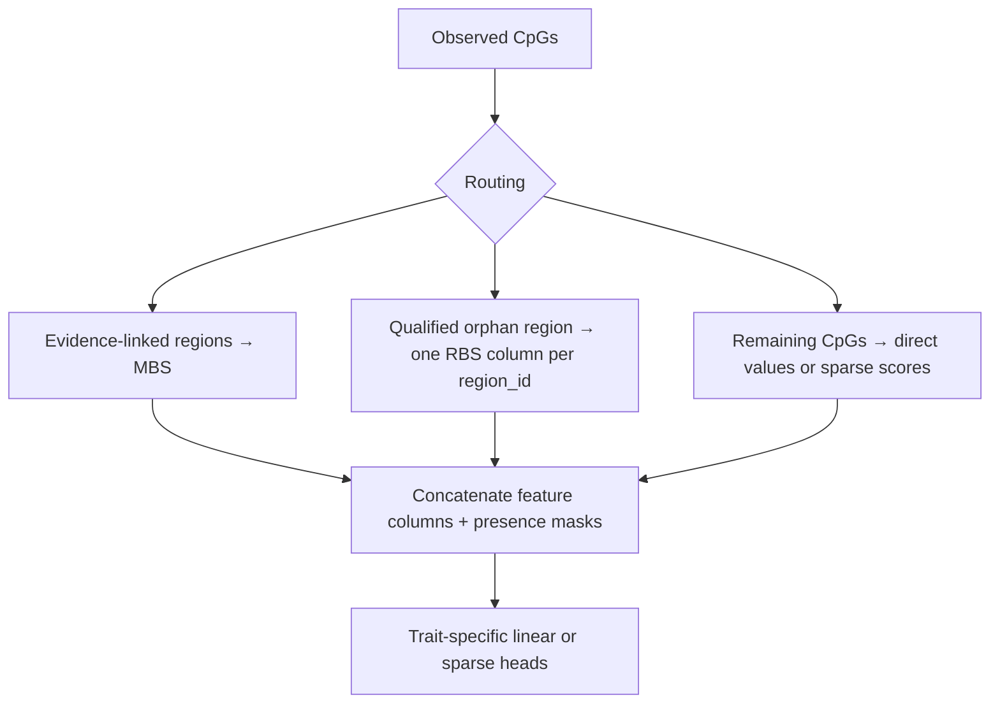

# Plan: 7G′ gene-only architecture selection + matched-panel benchmark

Status: **in progress** — required Stage A GPU arms (`P2-G` / `P4-G` /
`P5-G-max` / `C-mvalue-*-G`) **landed** with test-only `mbs_e2e` on
`explicit_only`; provisional lock `P2-G` max/max 15 epochs with
`cascade_clearly_ahead: false`. Stage A is **reopened** for the DeepRVAT-style
screening grid (mixed pooling, RBS diagnostic, vector cascade, one-hop) —
see [`milestone-7g-prime-stage-a-deeprvat-screen.md`](milestone-7g-prime-stage-a-deeprvat-screen.md).
**P5 inactive.** Stage B GPU and Milestone **7** remain blocked until the
screen selects (or rejects) a gene-aggregation architecture.

Normative encoder family: [`ARCHITECTURE.md`](../ARCHITECTURE.md) § Neural encoder family,
[`SCORING_PIPELINE.md`](../SCORING_PIPELINE.md).
Parents: [`milestone-7g-cascade-tissue-investigation.md`](milestone-7g-cascade-tissue-investigation.md),
[`milestone-7g-methylation-eval.md`](milestone-7g-methylation-eval.md).
Normative: [ADR 0007](../adr/0007-crossfit-prerequisites.md),
[ADR 0008](../adr/0008-score-identifiability.md),
[ADR 0009](../adr/0009-drop-tbs-scores.md),
[ADR 0010](../adr/0010-gene-allocation-policy.md).

Replaces the former **7H** plan
([`milestone-7h-fold-safe-probe-panel-benchmark.md`](milestone-7h-fold-safe-probe-panel-benchmark.md)).

## Status snapshot (2026-09-02)

### Landed

| Item | Evidence |
|------|----------|
| Test-only `mbs_e2e` | `cascade_loop.py`; `eval_split=test` in fold JSON |
| Lock refusal + invalid e2e banner | `write_7g_gene_only_probe_report.py`; `comparable_metrics.py` |
| `explicit_only` gene allocation | [ADR 0010](../adr/0010-gene-allocation-policy.md); Stage A YAML `*-explicit` |
| Stage B panel selector + artifact | `fold_safe_panel.py`; `run_7g_prime_stage_b.py` |
| Honest fusion arm names | `N-mbs-posthoc-full-fusion`, `N-mbs-posthoc-mbs-direct` |
| 7G″ expression plan | [`milestone-7g-double-prime-expression-auxiliary.md`](milestone-7g-double-prime-expression-auxiliary.md) |

### Best numbers (`explicit_only`, test-only — lock input)

| Rank | Arm | Panel | Eval | Tissue F1 | Notes |
|------|-----|-------|------|----------:|-------|
| 1 | `C-mvalue-enet-G` | gene 51 375 | classical | **0.388** | Tissue leader; age MAE now reported (Huber SGD) |
| 2 | `P2-G` | gene 51 375 | `mbs_enet` | 0.385 | Frozen MBS + elastic-net heads |
| 3 | `P2-G` | gene 51 375 | `mbs_e2e` | 0.373 | **Locked cascade** (max/max, 15 ep) |
| 4 | `P4-G` | gene 51 375 | `mbs_e2e` | 0.370 | mean/mean; tied with P2 within noise |
| 5 | `P5-G-max` | gene 51 375 | `mbs_e2e` | 0.356 | 30-epoch max did not help |
| ✗ | pre-fix `P*-G` `mbs_e2e` | gene | invalid | ~0.67–0.70 | **Do not cite** |

Stage A **primary metric** remains test-only **`mbs_e2e`** on **`explicit_only`**
`gene_cols`. The rows above **do** satisfy that metric; the provisional lock
chose `P2-G` but cascade is **not** clearly ahead of classical (≥0.03 tissue F1).
Age/sex deficits and the incomplete pooling/one-hop grid reopen Stage A for
screening — not because the prior e2e numbers were invalid.

Post-hoc **`mbs_enet`** (elastic-net on frozen gene MBS, no encoder retrain) is an
extra readout of encoder quality, not a lock substitute. **P5 is inactive**
(historical evidence only; do not run further 30-epoch arms).

### Pre-lock checks (required arms — done)

1. ~~GPU train `P2-G-explicit`, `P4-G-explicit`, `P5-G-max-explicit`~~ (**done**).
2. ~~`C-mvalue-classical-G` on the same `gene_panel_manifest.json`~~ (**done**).
3. ~~Every cascade fold JSON: `evaluations.mbs_e2e.eval_split == "test"`~~ (**done**).
4. ~~Regenerate report; `lock_recommendation.json` issued~~ (**done**; `cascade_clearly_ahead: false`).

### Next (ordered)

1. **Stage A DeepRVAT screen** ([plan](milestone-7g-prime-stage-a-deeprvat-screen.md)):
   - **Orientation contract v2 fix** applied (2026-09-03, commit `fc8cd6f`):
     `evaluate_flat_mbs_e2e` now passes raw encoder MBS to heads; L1/L5 training
     configs added; `early_stopping_start_epoch` supported; annotation ablation
     configs cleaned up (no `head_lr_multiplier`).
   - GPU sequence: **L1 baseline first** → inspect representation diagnostics →
     L5 if justified → annotation ablation grid (A0–A7, N0–N3, fold 0).
   - Mixed scalar pooling, RBS diagnostic, vector cascade follow after one-hop
     numbers are in. Tier 1 (5 ep) then Tier 2 (15 ep) for promoted arms.
2. **Stage B GPU run** after screen selects (or rejects) gene aggregation
   (`stage0_7g_prime_stage_b.yaml`); seed-gene transfer is a **separate** design.
3. Optional **7G″** expression pilot (not a gate).
4. Milestone **7** 5×6 OOF with locked topology + `direct_cpg.zarr` export.

## Executive decision

Architecture selection must compare **gene aggregation on the same gene-linked
CpGs** that can actually reach MBS through the computational graph. The classical
comparator receives **exactly those unique CpG columns**. Only after locking
pooling and training policy should the model be extended with non-gene CpGs and
qualified orphan-region scores.

Phenotype prediction and MBS export are **two uses of the same
phenotype-trained model**, not separate topologies. No ADR is required to
separate them.

## Why P0–P3 / uncorrected P2 do not settle the question

| Reported arm | Tissue F1 | What it actually measures |
|--------------|-----------|---------------------------|
| P0 | ~0.09 | Late-fused `[orphan \| MBS \| direct_contrib]` after equal-weight training |
| P2 | ~0.38 | MBS-only **training**, but **late-fusion test** on full blocks |
| P3 | ~0.39 | Transparent region means (no cascade train) |
| `C-mvalue-enet` | 0.334 | All 65 536 prefix columns, including CpGs that never affect MBS gradients |

**P2 does not prove MBS-only CascadeDeepSet beats `C-mvalue-enet`.** It shows
task reweighting improves the encoder; reported metrics still mix direct and
orphan information at evaluation time.

Current code facts (must stay documented until fixed):

- End-to-end loss uses **MBS heads only** (`cascade_loop.py`).
- Test metrics always late-fuse `[orphan_rbs | mbs | direct_contrib]`.
- Neural branch uses raw M-values; direct branch uses Level-1 robust z.
- `direct_contrib.zarr` holds **one task prediction per sample**, not
  sample×direct-CpG association features.
- P4/P5 on `main` may be incomplete; treat committed Phase-2 numbers as
  provisional until **gene-only** arms re-run.

## Stage A — Gene-only MBS architecture selection (corrected P4/P5)

### Gene-linked CpG definition (Stage A)

Use **`gene_allocation: explicit_only`** ([ADR 0010](../adr/0010-gene-allocation-policy.md)):
annotation-backed `gene_id` only; null-gene typed regions stay orphan. Persist
matched columns in `gene_panel_manifest.json`. Sensitivity: `legacy_nearest`,
`bounded_nearest`.

```python
gene_edge = assignment.region_to_gene[assignment.edge_region_index] >= 0
gene_cols = np.unique(assignment.edge_col_index[gene_edge])
```

Both CascadeDeepSet and **`C-mvalue-*-G`** use **exactly `gene_cols`**.

### Primary metric: test-only `mbs_e2e`

End-to-end MBS heads are evaluated on **outer test only** (`eval_split=test`).
Reports refuse architecture lock when historical metrics lack this field.

### MBS-only architecture



### Matched comparator: `C-mvalue-enet-G`

Same unique CpG columns as neural arms:

- age: elastic-net **regression**;
- sex: binary logistic elastic-net;
- tissue: multinomial or one-vs-rest logistic elastic-net (not regression on
  float class indices);
- train-fold imputation + scaling only.

### Revised arms

| Arm | Pooling | Epoch policy | Primary metric |
|-----|---------|--------------|----------------|
| `P2-G` | max/max | 15 | End-to-end MBS heads **and** optional MBS linear probe |
| `P4-G` | mean/mean | 15 | same |
| `P5-G-max` | max/max | 30 ceiling + early stop | same |
| `P5-G-mean` | mean/mean | Run if P4-G within ~0.03 F1 of P2-G | same |
| `C-mvalue-enet-G` | — | fold-fitted enet | same CpG panel |
| `C-mvalue-ridge-G` | — | fold-fitted ridge | same CpG panel |
| `C-mvalue-hgb-G` | — | fold-fitted HGB | same CpG panel |
| `C-mvalue-sva-G` | — | PCA-SVA + ridge | same CpG panel |

Report **two neural metrics** separately:

1. checkpoint end-to-end phenotype heads (MBS-only input path);
2. CPU linear probe on saved MBS only (representation check — not “fusion”).

Early-stop patience: simulate patience 5 on stored P2 validation histories
before locking; if it would stop before observed best epochs (9/12/15), keep
patience 8 or report both as ablations.

**Done when:** report under
`reports/inspection/stage0_7g_gene_only_probe/` with per-fold tables and locked
pooling/loss/epoch policy.

## Stage B — Fold-selected panel + full model extension

After Stage A locks gene-level aggregation:

### Fold-safe `C-mvalue-enetS`

1. Outer-train only: repeated study-grouped inner CV stability selection.
2. Rank probes by selection frequency, then |coefficient| per trait.
3. Union ≤ ~10 000 seed CpGs (equal trait quotas initially).
4. Expand: gene siblings for gene-linked seeds; same `region_id` for qualified
   non-gene seeds; never unrestricted nearest-gene.
5. Refit enet on expanded panel; evaluate once on outer test.

Sensitivity arm `S-assoc`: univariate meta-analysis within studies only — not
the primary selector.

### Seed-gene transfer (separate experiment — design only)

Not the same as fold-selected-panel Stage B. Full DeepRVAT analogy: train a
shared impairment function on trait-associated **seed genes**, apply to all
genes, evaluate non-seed transfer / replication. Protocol, trait bar, study
overlap controls, and robustness checks:
[`milestone-7g-prime-stage-a-deeprvat-screen.md`](milestone-7g-prime-stage-a-deeprvat-screen.md)
§ Stage B seed-gene transfer. **Do not implement training until Stage A screen
selects (or rejects) gene aggregation and a real trait passes the coverage bar.**

### Comparison arms (identical panel per fold)

| Arm | Role |
|-----|------|
| `C-mvalue-enetS` | sparse linear on selected panel |
| `N-cascade-S` | locked Stage-A cascade on same loci |
| `N-light-type` | `[M, multi-hot regulatory annotation, observed]` → gene pool |
| `N-mbs-posthoc-mbs-direct` | MBS + direct post-hoc fusion (encoder once) |
| `N-mbs-posthoc-full-fusion` | MBS + orphan RBS + direct post-hoc fusion |

Legacy names `N-full` / `N-mbs-direct-only` are deprecated aliases.

### Full model after gene-architecture selection



Staged training: load winning gene encoder → add blocks frozen → train new
heads → joint fine-tune → compare vs scratch.

**Orphan RBS rules**

- During Stage A: orphan CpGs belong to the **excluded non-gene set**.
- Final model: one column per **qualified** multi-CpG `region_id`; never pool
  globally or by `region_type`.
- Unqualified singletons → direct.
- Remove unrestricted same-chromosome nearest-gene allocation for **Stage A**
  (`explicit_only`; ADR 0010). Product OOF may use `bounded_nearest` when documented.

**Stage B panel artifact** (`fold_panels/fold_*_panel.json`):

- Multitask study-grouped stability selection on M-values (age, sex, tissue union)
- Shared `panel_cols` for `C-mvalue-enetS`, `N-cascade-S`, `N-light-type`, post-hoc fusion arms
- Selection frequency, graph/hash metadata, train-only normalizer hashes

**Association product (Milestone 7 export)**

```text
mbs.zarr
gene_present.zarr
orphan_rbs.zarr          # possibly zero columns
direct_cpg.zarr          # sample × retained locus (7G′ deliverable)
direct_locus_index.parquet
```

`direct_contrib.zarr` remains a **phenotype diagnostic only**.

**Done when:** report under
`reports/inspection/stage0_7g_prime_matched_probe/` recommends one OOF config.

## Non-goals

- Milestone **7** 5×6 OOF before Stage A + B complete.
- Retraining v0.1.
- Claiming P0–P3 or uncorrected P2 as MBS-only architecture winners.

## Sequencing

1. ~~Test-only `mbs_e2e` + report invalidation~~ (**done**, `4f5e022`).
2. ~~`explicit_only` allocation + `gene_panel_manifest.json`~~ (**done**).
3. ~~Fold-safe panel selector + Stage B runner plumbing~~ (**done**; GPU run pending).
4. **Re-run Stage A** (`P2-G` … `C-mvalue-enet-G` on `*-explicit` run IDs) ← **current gate**.
5. Run Stage B on GPU.
6. Optional **7G″** expression pilot ([plan](milestone-7g-double-prime-expression-auxiliary.md)).
7. Start Milestone **7** OOF with locked config + full product export.
