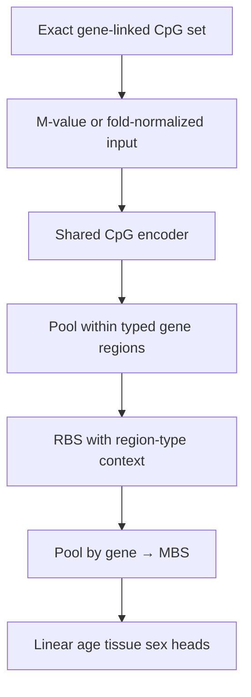
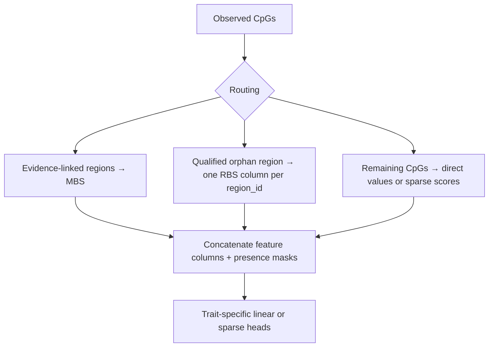

# Plan: 7G′ gene-only architecture selection + matched-panel benchmark

Status: **pending** (blocks Milestone **7** final OOF).
Parents: [`milestone-7g-cascade-tissue-investigation.md`](milestone-7g-cascade-tissue-investigation.md),
[`milestone-7g-methylation-eval.md`](milestone-7g-methylation-eval.md).
Normative: [ADR 0007](../adr/0007-crossfit-prerequisites.md),
[ADR 0008](../adr/0008-score-identifiability.md),
[ADR 0009](../adr/0009-drop-tbs-scores.md).

Replaces the former **7H** plan
([`milestone-7h-fold-safe-probe-panel-benchmark.md`](milestone-7h-fold-safe-probe-panel-benchmark.md)).

## Executive decision

Architecture selection must compare **gene aggregation on the same gene-linked
CpGs** that can actually reach MBS through the computational graph. The classical
comparator receives **exactly those unique CpG columns**. Only after locking
pooling and training policy should the model be extended with non-gene CpGs and
qualified orphan-region scores.

Phenotype prediction and MBS export are **two uses of the same
phenotype-trained model**, not separate topologies. No ADR is required to
separate them.

## Why P0–P3 / uncorrected P2 do not settle the question

| Reported arm | Tissue F1 | What it actually measures |
|--------------|-----------|---------------------------|
| P0 | ~0.09 | Late-fused `[orphan \| MBS \| direct_contrib]` after equal-weight training |
| P2 | ~0.38 | MBS-only **training**, but **late-fusion test** on full blocks |
| P3 | ~0.39 | Transparent region means (no cascade train) |
| `C-mvalue-enet` | 0.334 | All 65 536 prefix columns, including CpGs that never affect MBS gradients |

**P2 does not prove MBS-only CascadeDeepSet beats `C-mvalue-enet`.** It shows
task reweighting improves the encoder; reported metrics still mix direct and
orphan information at evaluation time.

Current code facts (must stay documented until fixed):

- End-to-end loss uses **MBS heads only** (`cascade_loop.py`).
- Test metrics always late-fuse `[orphan_rbs | mbs | direct_contrib]`.
- Neural branch uses raw M-values; direct branch uses Level-1 robust z.
- `direct_contrib.zarr` holds **one task prediction per sample**, not
  sample×direct-CpG association features.
- P4/P5 on `main` may be incomplete; treat committed Phase-2 numbers as
  provisional until **gene-only** arms re-run.

## Stage A — Gene-only MBS architecture selection (corrected P4/P5)

### Gene-linked CpG definition

From the assignment graph (after removing unrestricted nearest-gene allocation
for architecture selection):

```python
gene_edge = (
    assignment.region_to_gene[assignment.edge_region_index] >= 0
)
gene_cols = np.unique(
    assignment.edge_col_index[gene_edge]
)
```

Both CascadeDeepSet and the comparator use **exactly `gene_cols`**. Non-gene
typed regions, orphan-region CpGs, and untyped CpGs are **excluded** from this
phase (compute savings + fair loss path).

### MBS-only architecture



### Matched comparator: `C-mvalue-enet-G`

Same unique CpG columns as neural arms:

- age: elastic-net **regression**;
- sex: binary logistic elastic-net;
- tissue: multinomial or one-vs-rest logistic elastic-net (not regression on
  float class indices);
- train-fold imputation + scaling only.

### Revised arms

| Arm | Pooling | Epoch policy | Primary metric |
|-----|---------|--------------|----------------|
| `P2-G` | max/max | 15 | End-to-end MBS heads **and** optional MBS linear probe |
| `P4-G` | mean/mean | 15 | same |
| `P5-G-max` | max/max | 30 ceiling + early stop | same |
| `P5-G-mean` | mean/mean | Run if P4-G within ~0.03 F1 of P2-G | same |
| `C-mvalue-enet-G` | — | fold-fitted enet | same CpG panel |

Report **two neural metrics** separately:

1. checkpoint end-to-end phenotype heads (MBS-only input path);
2. CPU linear probe on saved MBS only (representation check — not “fusion”).

Early-stop patience: simulate patience 5 on stored P2 validation histories
before locking; if it would stop before observed best epochs (9/12/15), keep
patience 8 or report both as ablations.

**Done when:** report under
`reports/inspection/stage0_7g_gene_only_probe/` with per-fold tables and locked
pooling/loss/epoch policy.

## Stage B — Fold-selected panel + full model extension

After Stage A locks gene-level aggregation:

### Fold-safe `C-mvalue-enetS`

1. Outer-train only: repeated study-grouped inner CV stability selection.
2. Rank probes by selection frequency, then |coefficient| per trait.
3. Union ≤ ~10 000 seed CpGs (equal trait quotas initially).
4. Expand: gene siblings for gene-linked seeds; same `region_id` for qualified
   non-gene seeds; never unrestricted nearest-gene.
5. Refit enet on expanded panel; evaluate once on outer test.

Sensitivity arm `S-assoc`: univariate meta-analysis within studies only — not
the primary selector.

### Comparison arms (identical panel per fold)

| Arm | Role |
|-----|------|
| `C-mvalue-enetS` | sparse linear on selected panel |
| `N-cascade-S` | locked Stage-A cascade on same loci |
| `N-light-type` | `[M, multi-hot regulatory annotation, observed]` → gene pool |
| `N-mbs-direct-only` | MBS + direct; omit orphan block |
| `N-full` | MBS + qualified orphan RBS + direct CpG features |

### Full model after gene-architecture selection



Staged training: load winning gene encoder → add blocks frozen → train new
heads → joint fine-tune → compare vs scratch.

**Orphan RBS rules**

- During Stage A: orphan CpGs belong to the **excluded non-gene set**.
- Final model: one column per **qualified** multi-CpG `region_id`; never pool
  globally or by `region_type`.
- Unqualified singletons → direct.
- Remove unrestricted same-chromosome nearest-gene allocation for final OOF
  (current `cascade_assign.py` violates this).

**Association product (Milestone 7 export)**

```text
mbs.zarr
gene_present.zarr
orphan_rbs.zarr          # possibly zero columns
direct_cpg.zarr          # sample × retained locus (7G′ deliverable)
direct_locus_index.parquet
```

`direct_contrib.zarr` remains a **phenotype diagnostic only**.

**Done when:** report under
`reports/inspection/stage0_7g_prime_matched_probe/` recommends one OOF config.

## Non-goals

- Milestone **7** 5×6 OOF before Stage A + B complete.
- Retraining v0.1.
- Claiming P0–P3 or uncorrected P2 as MBS-only architecture winners.

## Sequencing

1. Implement gene-col filter + MBS-only evaluation mode in cascade trainer.
2. Re-run Stage A (`P2-G` … `C-mvalue-enet-G`).
3. Implement fold-safe panel selector + `direct_cpg.zarr` contract.
4. Run Stage B.
5. Start Milestone **7** OOF with locked config + full product export.
