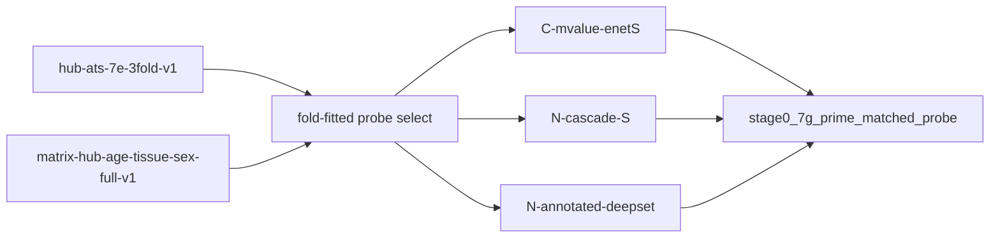

# Plan: 7G′ matched-probe bake-off + lightweight annotated-CpG aggregator

Status: **pending** (after Phase-2 tissue probe P4–P5).
Parent: [`milestone-7g-methylation-eval.md`](milestone-7g-methylation-eval.md),
[`milestone-7g-cascade-tissue-investigation.md`](milestone-7g-cascade-tissue-investigation.md).
Normative: [ADR 0007](../adr/0007-crossfit-prerequisites.md),
[ADR 0008](../adr/0008-score-identifiability.md),
[ADR 0009](../adr/0009-drop-tbs-scores.md).

## Problem statement

7G compared **CascadeDeepSet** (graph aggregation → MBS / orphan RBS / direct)
to **C-mvalue-enet** on the **same arbitrary 65 536 locus-index prefix**. That
prefix is not biology-selected: enet uses 65k independent columns while the
cascade compresses to genes. A fair bake-off requires both methods on the
**same fold-fitted informative probe set**.

## Scope and acceptance

**Done when:**

- Per train fold, a persisted probe list (≤ ~10 000 loci) from C-mvalue-enet
  importance + gene-sibling enrichment (no test-fold leakage).
- **Matched arms** on frozen `hub-ats-7e-3fold-v1`:
  - **C-mvalue-enetS** — SGD elastic-net on the selected loci only.
  - **N-cascade-S** — cascade with Phase-2 locked hparams on the same loci.
  - **N-annotated-deepset** — lightweight: `[M or B, one-hot region_type]` per
    CpG → pool by gene → MBS; untyped → direct (no orphan-RBS block).
  - **Orphan-skip ablation** — fusion `[MBS | direct]` vs full
    `[orphan | MBS | direct]` on the same encoder.
- Report under `reports/inspection/stage0_7g_prime_matched_probe/` with tissue
  macro-F1, sex AUROC, age MAE/R² per fold; recommendation for Milestone **7**
  OOF config.

**Out of scope:** Milestone **7** 5×6 OOF; changing Hub GMQN; metadata-only arms.

## Locked decisions

| Choice | Decision | Why |
|--------|----------|-----|
| Splits | Frozen `hub-ats-7e-3fold-v1` | Match 7G / probe |
| Probe selection | Train-fold only; union top-\|coef\| across age/sex/tissue; cap ~10k | No leakage |
| Enrichment | Add all matrix loci sharing a gene with any selected probe | Gene-level fairness |
| Comparator | C-mvalue-enetS on **exact same** locus list | Apples-to-apples |
| Lightweight arm | One-hot regulatory type + M/B per CpG → gene pool | DeepRVAT-like |
| Orphan RBS | One column per region when kept; skip fusion block if not repeatable | User invariant |
| Product export | Still MBS + optional orphan + direct after OOF | ADR 0009 |

## Probe selection algorithm (sketch)

```text
For each outer fold:
  1. Fit C-mvalue-enet on train samples (M-values, median impute, StandardScaler).
  2. Per task (age regressor, sex classifier, tissue classifier), take top-K
     probes by |coefficient| (K chosen so union ≤ 10_000).
  3. Enrich: for each selected probe, add other probes in matrix assigned to
     the same gene (via locus→gene or graph assignment).
  4. Persist locus_id list + content hash under fold artifact dir.
  5. Subset betas to selected columns for both enetS and cascadeS.
```

## Lightweight annotated-CpG aggregator

DeepRVAT analog: variant-level features + context → gene score.

```text
x_{s,c} = [M_{s,c} or β_{s,c}, one_hot(region_type(c))]
h_{s,c} = φ(x_{s,c})
MBS_{s,g} = pool_{c ∈ gene(g)} h_{s,c}   # max or mean (match Phase-2 lock)
```

Untyped CpGs: fold-fitted direct elastic-net (same as 7F). No two-hop RBS→gene;
no orphan-RBS export block in this arm (ablation vs full cascade).

## Data / artifact flow



## Non-goals

- Full 482 379 loci in one pass (unless explicitly budgeted later).
- Retraining v0.1 or rewriting 7G bake-off tables.
- ADR separating training from product use (same model serves both).

## Sequencing

1. Complete Phase-2 probe (P4–P5 + fusion grid); lock OOF hparams in probe report.
2. Implement probe selector + enetS runner + annotated-deepset module.
3. Run 7G′ on GPU; write inspection report.
4. Start Milestone **7** 5×6 OOF with locked cascade config + product score export.
