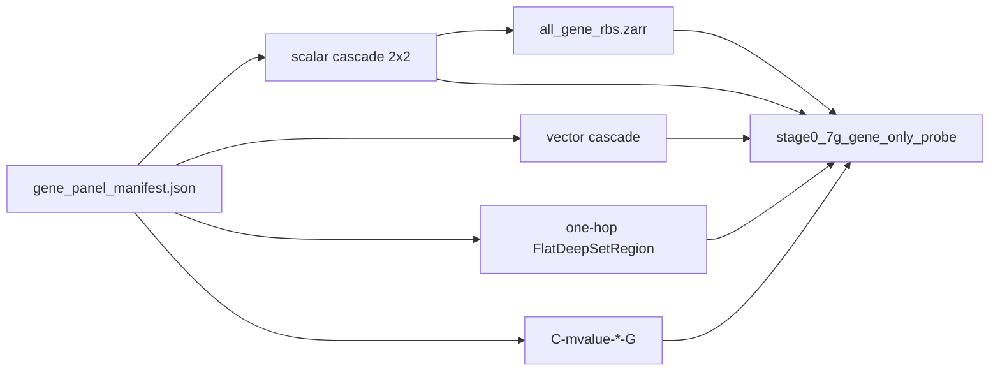

# Plan: 7G′ Stage A DeepRVAT-style architecture screen

Status: **in progress** — Stage A reopened for compute-efficient screening
(mixed pooling, RBS diagnostic, vector cascade, one-hop). Required P2/P4/P5-max
/`C-mvalue-*-G` GPU runs already landed; cascade is **not** ≥0.03 ahead of
classical. **P5 inactive.** Stage B GPU and Milestone **7** remain blocked.

Parent: [`milestone-7g-prime-matched-probe-lightweight.md`](milestone-7g-prime-matched-probe-lightweight.md).
Normative: [ADR 0010](../adr/0010-gene-allocation-policy.md),
[`ARCHITECTURE.md`](../ARCHITECTURE.md), [`SCORING_PIPELINE.md`](../SCORING_PIPELINE.md).

## Scope and acceptance

Expand Stage A into a small architecture-screening benchmark on the existing
`explicit_only` gene-linked panel (51 375 CpGs) and frozen
`hub-ats-7e-3fold-v1` folds. Always report tissue, age, and sex. Select by
per-task rankings + Pareto, not tissue F1 alone.

**Done when:** promoted arms have three valid held-out folds; the report
identifies where age/sex information is lost; one gene-aggregation architecture
is selected **or** the report concludes no neural aggregation is yet adequate.

## Locked decisions

| Choice | Decision | Why |
|--------|----------|-----|
| Panel | Reuse `explicit_only` + `gene_panel_manifest.json` | Fair vs classical `-G` |
| P5 | Inactive; keep historical artifacts | 30 epochs hurt; no more epoch grid |
| Scalar pooling | Independent `cpg_pool` / `region_pool` | P4 changed both levels at once |
| Vector cascade | Pool region **embeddings**, then `rho_G` | Scalar RBS before gene pool discards promoter/body |
| One-hop | Annotated CpG → gene pool (batched flat train) | Closest DeepRVAT literal copy |
| RBS diagnostic | `all_gene_rbs.zarr` (not orphan `rbs.zarr`) | Locate age/sex loss before vs after gene pool |
| Screening | Tier 1: 5 ep; Tier 2: 15 ep if Pareto/near-best | Compute-efficient |
| Execution | **Model-by-model**; refresh `analysis.md` after each arm | Start with one-hop (`N-light-gene-*`), then cascade screen |
| Regulatory cCRE | Slots reserved; zeros until graph release | SCREEN deferred (7C non-goal) |
| Stage B seed-gene | Design only; separate from fold-panel Stage B | Do not delay Stage A |

## Arm naming

| Arm | Role |
|-----|------|
| `N-cascade-scalar-max-max` | Alias of landed `P2-G` |
| `N-cascade-scalar-mean-mean` | Alias of landed `P4-G` |
| `N-cascade-scalar-mean-max` | New mixed train |
| `N-cascade-scalar-max-mean` | New mixed train |
| `N-cascade-vector-mean-max` | Preferred vector hypothesis |
| `N-cascade-vector-max-max` | Vector max/max |
| `N-light-gene-max` / `N-light-gene-mean` | One-hop annotated DeepSet |
| `rbs_linear_probe` / `rbs_enet` | Frozen gene-linked RBS readouts |

## Data / artifact flow

## Non-goals

- Milestone **7** 5×6 OOF.
- Additional P5 / 30-epoch arms.
- SCREEN/cCRE graph rebuild.
- Joint end-to-end orphan/direct fusion in Stage A.
- Implementing Stage B seed-gene transfer training (design only).

## Stage B seed-gene transfer (design only — do not implement training now)

DeepRVAT discovers trait-associated **seed genes**, trains a **shared** impairment
function through phenotype heads on those genes, cross-fits **across samples**,
then applies the shared function to seed **and** non-seed genes, and evaluates
association discovery/replication. It is **not** ordinary train-gene / test-gene CV.

Keep the existing fold-selected-panel Stage B (`stage0_7g_prime_stage_b.yaml`,
`C-mvalue-enetS` / `N-cascade-S`) as a **separate** question. Probe selection and
gene-transfer validation must not be conflated.

### Protocol sketch

1. **Inspect coverage** — Hub phenotype labels + EWAS Atlas CpG→trait tables;
   record sample counts, study IDs, and gene mappings under
   `reports/inspection/` (do not invent a trait).
2. **Trait bar** — propose **one** trait with: adequate labeled samples on the
   Hub matrix; a substantial Atlas CpG set; enough distinct genes after
   `explicit_only` mapping; ≥2 independent studies for replication. If none
   meet the bar, stop and document.
3. **Seeds** — significant Atlas CpGs with defensible gene edges (same ADR 0010
   policy as Stage A). Persist seed gene IDs + provenance.
4. **Study overlap control** — exclude or flag seed evidence from studies in the
   evaluation fold; prefer independent seed vs validation study sets.
5. **Train** — shared encoder on **seed genes only**; sample-level cross-fitting
   unchanged (gene transfer does **not** replace held-out samples).
6. **Apply** — score all eligible genes with the shared function.
7. **Evaluate non-seed transfer** — enrichment for held-out Atlas associations;
   replication in independent studies; permutation calibration; vs regional
   means and classical CpG burdens.
8. **Robustness** — drop 10% of seeds; add 20% non-associated genes; vary seed
   count.

### Atlas / Hub coverage note (inspect only; no trait invented)

From `reports/inspection/deepmat_data_v1/trait_eligibility.md` (2026-09-03):

- Hub ATS core phenotypes (age / tissue / sex) are already Stage A targets — **not**
  seed-gene transfer traits.
- Pack-level `disease` / `cancer` binary labels still fail the project bar
  (need ≥200 cases, ≥200 controls, ≥3 studies with unknown≠control).
- Candidate **continuous** packs with multi-study support include BMI
  (`bmi` pack: n≈2070, 25 studies) and blood/brain tissue packs — but seed-gene
  transfer needs an **EWAS Atlas CpG set** for that trait, not just Hub labels.
- **Next inspect before proposing a trait:** join Atlas association tables to Hub
  sample study IDs; count distinct genes after `explicit_only`; check independent
  discovery vs replication studies. If no trait clears that join, document stop.

### Non-goals for this design note

- Starting Milestone **7** OOF.
- Replacing Stage B fold-selected panel GPU work.
- Fetching SCREEN/cCRE for regulatory features (still reserved zeros).

## Open questions (resolved by this screen)

1. Mean vs max at each cascade level.
2. Whether scalar RBS discards information.
3. Whether gene pooling discards information relative to RBS.
4. Whether one-hop matches or beats the cascade.
5. Whether one scalar MBS per gene is enough for age/sex/tissue.
