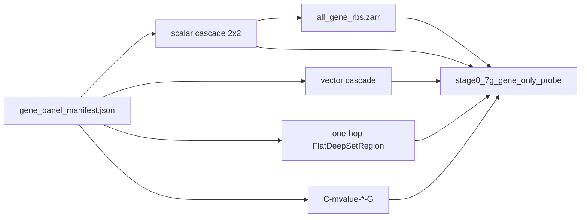

# Plan: 7G′ Stage A DeepRVAT-style architecture screen

Status: **in progress** — Stage A reopened for compute-efficient screening
(mixed pooling, RBS diagnostic, vector cascade, one-hop). Required P2/P4/P5-max
/`C-mvalue-*-G` GPU runs already landed; cascade is **not** ≥0.03 ahead of
classical. **P5 inactive.** Stage B GPU and Milestone **7** remain blocked.

Last updated: **2026-09-03** (scalar mixed-pooling + vector cascade arms
nearly complete; `mbs_enet` / `rbs_enet` moved to post-hoc for screen speed;
`N-light-gene-max` f0 complete with v2 contract; light-max f1/f2 and all
light-mean folds need retrain after orientation v2 + checkpoint-selection bug;
`N-cascade-scalar-max-mean` tentative screen leader at ~0.36 mean e2e F1;
`N-cascade-vector-max-max` fold 2 running).

Parent: [`milestone-7g-prime-matched-probe-lightweight.md`](milestone-7g-prime-matched-probe-lightweight.md).
Normative: [ADR 0010](../adr/0010-gene-allocation-policy.md),
[`ARCHITECTURE.md`](../ARCHITECTURE.md), [`SCORING_PIPELINE.md`](../SCORING_PIPELINE.md).

## Scope and acceptance

Expand Stage A into a small architecture-screening benchmark on the existing
`explicit_only` gene-linked panel (51 375 CpGs) and frozen
`hub-ats-7e-3fold-v1` folds. Always report tissue, age, and sex. Select by
per-task rankings + Pareto, not tissue F1 alone.

**Done when:** promoted arms have three valid held-out folds; the report
identifies where age/sex information is lost; one gene-aggregation architecture
is selected **or** the report concludes no neural aggregation is yet adequate.

## Locked decisions

| Choice | Decision | Why |
|--------|----------|-----|
| Panel | Reuse `explicit_only` + `gene_panel_manifest.json` | Fair vs classical `-G` |
| P5 | Inactive; keep historical artifacts | 30 epochs hurt; no more epoch grid |
| Scalar pooling | Independent `cpg_pool` / `region_pool` | P4 changed both levels at once |
| Vector cascade | Pool region **embeddings**, then `rho_G` | Scalar RBS before gene pool discards promoter/body |
| One-hop | Annotated CpG → gene pool (batched flat train) | Closest DeepRVAT literal copy |
| RBS diagnostic | `all_gene_rbs.zarr` (not orphan `rbs.zarr`) | Locate age/sex loss before vs after gene pool |
| Screening | Tier 1: 5 ep; Tier 2: 15 ep if Pareto/near-best | Compute-efficient |
| Execution | **Model-by-model**; refresh `analysis.md` after each arm | Start with one-hop (`N-light-gene-*`), then cascade screen |
| Regulatory cCRE | Slots reserved; zeros until graph release | SCREEN deferred (7C non-goal) |
| Stage B seed-gene | Design only; separate from fold-panel Stage B | Do not delay Stage A |
| Orientation contract | **v2** (2026-09-03): `evaluate_flat_mbs_e2e` passes **raw** encoder MBS to heads; `orient_mbs_array` affects only the exported association artifact. Legacy checkpoints with negated head weights use the repair path (`legacy_negated_heads=True`). | Passing `1-MBS` through unchanged head weights gives wrong logits (ADR 0008). |
| Training LR baseline | **L1**: single `1e-3` LR for all parameters (no `head_lr_multiplier`) — DeepRVAT-like. **L5**: head LR 5× diagnostic, only if L1 representation diagnostics justify it. | Avoids premature optimisation decisions before representation quality is understood. |
| Early stopping | `early_stopping_start_epoch: 5`; patience 3–5 | Short warmup prevents premature convergence signal on first epochs. |
| Annotation channels | `cpg_context` wired (UCSC CGI from `loci.parquet`). Gene-role one-hot populated. Regulatory (cCRE/DHS/ChromHMM) reserved zero slots — sources not on disk. | Stage A non-goal for regulatory; ablation grid tests what is available. |

## Arm naming

| Arm | Role |
|-----|------|
| `N-cascade-scalar-max-max` | Alias of landed `P2-G` |
| `N-cascade-scalar-mean-mean` | Alias of landed `P4-G` |
| `N-cascade-scalar-mean-max` | New mixed train |
| `N-cascade-scalar-max-mean` | New mixed train |
| `N-cascade-vector-mean-max` | Preferred vector hypothesis |
| `N-cascade-vector-max-max` | Vector max/max |
| `N-light-gene-max` / `N-light-gene-mean` | One-hop annotated DeepSet |
| `rbs_linear_probe` / `rbs_enet` | Frozen gene-linked RBS readouts |

## Data / artifact flow



## Non-goals

- Milestone **7** 5×6 OOF.
- Additional P5 / 30-epoch arms.
- SCREEN/cCRE graph rebuild.
- Joint end-to-end orphan/direct fusion in Stage A.
- Implementing Stage B seed-gene transfer training (design only).

## Stage B seed-gene transfer (design only — do not implement training now)

DeepRVAT discovers trait-associated **seed genes**, trains a **shared** impairment
function through phenotype heads on those genes, cross-fits **across samples**,
then applies the shared function to seed **and** non-seed genes, and evaluates
association discovery/replication. It is **not** ordinary train-gene / test-gene CV.

Keep the existing fold-selected-panel Stage B (`stage0_7g_prime_stage_b.yaml`,
`C-mvalue-enetS` / `N-cascade-S`) as a **separate** question. Probe selection and
gene-transfer validation must not be conflated.

### Protocol sketch

1. **Inspect coverage** — Hub phenotype labels + EWAS Atlas CpG→trait tables;
   record sample counts, study IDs, and gene mappings under
   `reports/inspection/` (do not invent a trait).
2. **Trait bar** — propose **one** trait with: adequate labeled samples on the
   Hub matrix; a substantial Atlas CpG set; enough distinct genes after
   `explicit_only` mapping; ≥2 independent studies for replication. If none
   meet the bar, stop and document.
3. **Seeds** — significant Atlas CpGs with defensible gene edges (same ADR 0010
   policy as Stage A). Persist seed gene IDs + provenance.
4. **Study overlap control** — exclude or flag seed evidence from studies in the
   evaluation fold; prefer independent seed vs validation study sets.
5. **Train** — shared encoder on **seed genes only**; sample-level cross-fitting
   unchanged (gene transfer does **not** replace held-out samples).
6. **Apply** — score all eligible genes with the shared function.
7. **Evaluate non-seed transfer** — enrichment for held-out Atlas associations;
   replication in independent studies; permutation calibration; vs regional
   means and classical CpG burdens.
8. **Robustness** — drop 10% of seeds; add 20% non-associated genes; vary seed
   count.

### Atlas / Hub coverage note (inspect only; no trait invented)

From `reports/inspection/deepmat_data_v1/trait_eligibility.md` (2026-09-03):

- Hub ATS core phenotypes (age / tissue / sex) are already Stage A targets — **not**
  seed-gene transfer traits.
- Pack-level `disease` / `cancer` binary labels still fail the project bar
  (need ≥200 cases, ≥200 controls, ≥3 studies with unknown≠control).
- Candidate **continuous** packs with multi-study support include BMI
  (`bmi` pack: n≈2070, 25 studies) and blood/brain tissue packs — but seed-gene
  transfer needs an **EWAS Atlas CpG set** for that trait, not just Hub labels.
- **Next inspect before proposing a trait:** join Atlas association tables to Hub
  sample study IDs; count distinct genes after `explicit_only`; check independent
  discovery vs replication studies. If no trait clears that join, document stop.

### Non-goals for this design note

- Starting Milestone **7** OOF.
- Replacing Stage B fold-selected panel GPU work.
- Fetching SCREEN/cCRE for regulatory features (still reserved zeros).

## N-light one-hop status and repair (2026-09-03)

### What was wrong

Pre-fix `N-light-gene-*` `mbs_e2e` numbers (~0.000–0.001 tissue F1) were
invalid due to two compounding bugs:

1. **Orientation anchor**: `orient_mbs_array` was called **before** the
   phenotype heads, passing `1 − MBS` through head weights that expected raw
   scores → wrong logits at evaluation.
2. **Head/score mismatch**: `_orient_and_write_score_manifest()` was also
   mutating head weights at checkpoint time, creating inconsistent state.

Both are fixed in commit `fc8cd6f` (2026-09-03). Frozen MBS probes (linear /
elastic-net on raw MBS) showed valid representation signal throughout — one-hop
is **not** rejected on the basis of the broken `mbs_e2e` numbers.

### Corrected evaluation contract (v2)

```
evaluate_flat_mbs_e2e:
  heads receive: raw encoder MBS (always)
  exported association artifact: orient_mbs_array(mbs, score_polarity)
  legacy repair: legacy_negated_heads=True → 1-MBS (logit-preserving for that ckpt)
```

Unit tests: `tests/unit/test_orientation_eval.py` —
`test_v2_contract_heads_see_raw_mbs_when_flipped`,
`test_legacy_path_heads_see_one_minus_mbs_when_flipped`,
`test_hyper_aligned_heads_always_see_raw`.

### Third compounding bug: checkpoint selection silently no-op

Independently of the orientation bug above, `checkpoint_selection:
validation_tissue_macro_f1_then_age_mae` (set in `light_mean.yaml`/
`light_max.yaml`) was **also** broken: ranking checkpoints by validation
tissue-F1 requires that metric to be computed every epoch, which is gated by
a separate `stage_a_per_epoch_eval` flag that neither config set. Without it,
`validation_rank()` always compared missing values, so epoch 1 (near-random
weights) satisfied `best_rank is None` once and no later epoch could ever
`> ` it — the saved `best.pt` was permanently the first-epoch checkpoint
regardless of `max_epochs`. Confirmed via `checkpoint_selection.best_epoch: 1`
on every affected fold.

Fixed in `loop.py`: `stage_a_per_epoch_eval` is now implied by
`use_tissue_rank` (`... or use_tissue_rank`), so this class of bug can't
recur regardless of config. Also added the flag explicitly to
`light_mean.yaml`/`light_max.yaml` for clarity. Old checkpoints moved aside
as `artifacts/runs/*.stale-epoch1-bug` (not deleted).

**Sequencing note:** this fix and the orientation-v2 fix (`fc8cd6f`) landed
within ~25 minutes of each other in the same shared checkout. A retrain
launched between the two only gets the fix that existed when its Python
process started (module imports are cached in-process; edits on disk after
that don't take effect until the next fresh process). One retrain pass was
discarded for exactly this reason — moved aside as
`artifacts/runs/*.stale-preorientation-fix` — and redone from a fresh process
after both fixes were on disk. When rerunning any `N-light-gene-*` arm, check
`git log -1 --format=%cI -- src/mbs/training/loop.py` against the launching
process's start time before trusting the result.

### GPU run sequence for one-hop (fold 0)

Run in this order; do not start annotation ablations before L1 numbers are in.

1. **L1 baseline** (`light_mean_l1.yaml`) — M-only features, mean pooling,
   single LR `1e-3`, `early_stopping_start_epoch: 5`, patience 3, max 10 ep.
   Establishes the DeepRVAT-like single-LR control.
2. **Inspect representation diagnostics** — gene MBS variance, head weight
   norms, validation curves. If encoder variance is reasonable, proceed to
   ablations. If heads are flat despite encoder signal, run L5.
3. **L5 head-LR diagnostic** (`light_mean_l5.yaml`) — identical to L1 but
   `head_lr_multiplier: 5.0`. Run only if L1 diagnostics justify it.
4. **Annotation ablation grid** (all 18 arms, `run_7g_gene_only_probe.py
   --fold 0 --device cuda`):

| Arm | Config suffix | Feature mode | Notes |
|-----|--------------|-------------|-------|
| A0 | `ablation_m_only` | `m_only` | M + observed; no annotation |
| A1 | `ablation_m_role` | `m_role` | M + gene-role one-hot |
| A2 | `ablation_m_context` | `m_context` | M + CpG-context one-hot |
| A3 | `ablation_m_role_context` | `m_role_context` | M + role + context |
| A4/A7 | `ablation_full` | `full` | All channels (reg stays zero) |
| N0 | `ablation_n0_obs_only` | `obs_only` | Observed flag only; no M |
| N1 | `ablation_n1_anno_only` | `anno_only` | Role + context; no M |
| N2 | `ablation_n2_reg_permuted` | `full` + permuted reg | Regulatory permutation sanity |
| N3 | `ablation_n3_reg_zero` | `full` + zero reg | Explicit zero-reg control |

Each arm has two seeds (`_s2` suffix). Report bootstrap CIs and representation
diagnostics via `write_7g_gene_only_probe_report.py`.

5. **Post-hoc direct/orphan fusion** — deferred until ablation grid is scored.

## Handoff — 2026-09-03 (all background jobs stopped; GPU free)

No training is running. GPU 0 is free (~39.7 GB / 49.1 GB free at handoff time).
This section is the complete state for whoever (or whichever fresh agent)
picks this up next.

### Done and trustworthy — cascade arm sweep is complete

All four previously-missing cascade arms landed this session, gene-linked
panel (`explicit_only`, 51 375 CpGs), `mbs_e2e` (`eval_split=test`), Tier 1
(5 epochs), 3/3 folds each:

| Arm | `mbs_e2e` tissue F1 | Notes |
|---|---:|---|
| `N-cascade-scalar-mean-max` | 0.359 (±0.075) | |
| `N-cascade-vector-max-max` | 0.343 (±0.063) | |
| `N-cascade-vector-mean-max` | 0.337 (±0.036) | plan's "preferred" hypothesis — did **not** clearly beat scalar |
| `N-cascade-scalar-max-mean` | 0.331 (±0.020) | |

Combined with the already-landed `P2-G` (0.373), `P4-G` (0.370), `P5-G-max`
(0.356, inactive) and `C-mvalue-enet-G` (0.388, classical), all six neural
scalar/vector cascade variants now cluster in **0.33–0.37**, all still below
classical elastic-net (0.388) but within noise of each other and of it. No
pooling combination or scalar-vs-vector choice produced a decisive winner.
This is real signal, not an artifact — these runs are unaffected by either
bug below (they don't use `train_flat_baseline`/`checkpoint_selection`).

`analysis.md` is current for these arms (regenerated automatically when the
sweep's own process finished, 17:42).

### NOT done — `N-light-gene-mean` / `N-light-gene-max` need a full clean redo

Both per_arm files in the current `analysis.md` are **stale** and must not be
used for the model-selection report:

- `N-light-gene-mean.json` (mtime 15:03): predates **both** fixes below — the
  original fully-broken run (no `mbs_e2e` row at all in the report).
- `N-light-gene-max.json` (mtime 17:31): predates **only** the orientation fix
  — checkpoint selection now works (`best_epoch` 4–5, not stuck at 1), but
  heads may still have seen `1-MBS` instead of raw MBS during training
  (see "Third compounding bug" above and the orientation section before it).
  Reported `mbs_e2e` F1 = 0.122 is **not trustworthy**.

Two retrain attempts were made and both discarded (moved to
`artifacts/runs/*.stale-epoch1-bug` and `*.stale-preorientation-fix`
respectively) — not because the fixes are wrong, but because of process
timing: a long-running Python process keeps its imports from when it started,
so a retrain launched between the two fixes landing only picks up whichever
fix existed at that moment. **Before launching, confirm both fixes are on
disk and start a fresh process after that:**

```bash
# sanity check both fixes are present
grep -n "stage_a_per_epoch_eval = bool.*or use_tissue_rank" src/mbs/training/loop.py
git log -1 --format='%H %cI' -- src/mbs/training/loop.py   # should be >= fc8cd6f

# then, fresh process, both arms, full 3 folds each (~20-30 min on a free GPU 0)
cd /data/projects/methyl-burden-score
source scripts/activate_data_environment.sh
CUDA_VISIBLE_DEVICES=0 MBS_CASCADE_GPU_SHARE=1 PYTHONUNBUFFERED=1 \
  uv run python scripts/run_7g_gene_only_probe.py \
  --config configs/experiment/stage0_7g_gene_only_probe.yaml \
  --arm N-light-gene-mean --arm N-light-gene-max --device cuda

# then refresh the report
uv run python scripts/write_7g_gene_only_probe_report.py
```

The stale run directories were intentionally left in place (not deleted) in
case anyone wants to diff old-vs-new numbers; the new run will not reuse them
(different arm ids reuse the same `run_id`s and will overwrite in place once
started — the `.stale-*` copies are the only preserved snapshots).

### Blocked on the above: the full model-selection report

You (Dima) asked for a comprehensive report update to `analysis.md` — current
valid baselines, four scalar pooling combos, RBS-only readouts, vector
cascade, one-hop, parameter counts, epoch/runtime/GPU-memory estimates, all
three task metrics, per-fold tables, Pareto table, architecture diagrams, and
explicit answers to the 7 questions at the bottom of this plan (mean vs max at
each level, does scalar RBS discard information, does gene pooling discard
information relative to RBS, does one-hop match/beat the cascade, is one
scalar per gene sufficient, best performance/compute trade-off — not decided
on tissue F1 alone). That report is **not written yet** — six of the ten
arms it needs (all cascade + classical) are ready now; the one-hop numbers
above are exactly the piece the clean redo produces. Write it after the redo
lands, not before, or the one-hop conclusions will be wrong a third time.

## Current screen status (2026-09-03 evening)

> **Update (post-handoff):** `N-cascade-vector-max-max` finished all 3/3 folds
> and its own process wrote `per_arm/N-cascade-vector-max-max.json` +
> regenerated `analysis.md` at 17:42 — mean `e2e` tissue F1 **0.343 (±0.063)**.
> The runner PID below (885721) has since exited normally; the "fold 2
> training now" row is stale. See the "Handoff" section above for the fuller
> post-completion picture (all four screen arms landed, none decisive vs
> classical or each other).

### Arms complete / near-complete (Tier-1 scalar + vector)

| Arm | Folds done | Mean e2e tissue F1 | Mean linear F1 | Notes |
|-----|-----------|-------------------|---------------|-------|
| `N-cascade-scalar-mean-max` | 3/3 ✓ | 0.332 | 0.375 | per_arm JSON ready |
| `N-cascade-scalar-max-mean` | 3/3 ✓ | 0.359 | 0.370 | tentative screen leader; per_arm JSON ready |
| `N-cascade-vector-mean-max` | 3/3 ✓ | 0.337 | 0.360 | per_arm JSON ready |
| `N-cascade-vector-max-max` | 3/3 ✓ | 0.343 | 0.367 | **done** (see update note above) |
| `N-light-gene-max` | 1/3 🔄 | — | — | f0 rerun post-fix (e2e 0.116); f1/f2 need retrain |
| `N-light-gene-mean` | 0/3 ✗ | — | — | all folds stale (pre-orientation fix + checkpoint-bug) |

> **Reference baselines:** `P2-G` (max/max 15ep): 0.373 e2e / 0.385 enet;
> `C-mvalue-enet-G`: 0.388 classical. Screen arms are ~0.03–0.04 behind P2-G e2e.

### What is done (code + policy)

- `mbs_enet` / `rbs_enet` deferred to post-hoc for all screen arms
  (`stage_a_include_mbs_enet: false` in all arm YAML configs).
- Post-hoc script: `scripts/eval_mbs_enet_from_scores.py` supports
  `--run-prefix` for flat `-f{i}` runs **and** `--run-id` for cascade folds.
- Orientation contract v2 (`fc8cd6f`): `evaluate_flat_mbs_e2e` passes raw MBS
  to heads; `orient_mbs_array` only affects exported association artifact.
- Checkpoint-selection bug fixed: `stage_a_per_epoch_eval` now implied by
  `use_tissue_rank` in `loop.py`; configs updated explicitly.
- `ThreadPoolExecutor` for deferred CPU probes (avoids stale-import issues with
  `ProcessPoolExecutor` after mid-queue hotfixes).
- `mbs_linear_probe` uses default `lbfgs LogisticRegression` (`fusion=None`)
  matching P2/P4 baseline.
- `SGDClassifier` alpha scaled by `n_samples` for wide tissue classification
  (speeds up `mbs_enet` when eventually run post-hoc).

### What remains to be done / redone

#### Immediate (in-flight GPU queue)

1. ~~**`N-cascade-vector-max-max` fold 2**~~ — **done**, no longer in the
   queue. All 3 folds finished, `per_arm/N-cascade-vector-max-max.json`
   written and `analysis.md` already regenerated (17:42). See the "Handoff"
   section above.

#### Short-term (next GPU slots)

2. **`N-light-gene-max` folds 1 and 2 retrain** — the existing f1/f2 checkpoints
   were saved at 17:18/17:28 UTC+2, before the orientation-v2 fix commit
   at 17:30. Per-arm JSON uses their stale numbers (e2e ~0.12). Retrain from
   fresh process after both fixes are confirmed on disk. Runner:
   ```bash
   uv run python scripts/run_7g_gene_only_probe.py \
     --config configs/experiment/stage0_7g_gene_only_probe.yaml \
     --device cuda --arm N-light-gene-max --fold 1 --fold 2
   ```
3. **`N-light-gene-mean` all 3 folds retrain** — all existing checkpoints are
   stale (pre-fix or pre-checkpoint-bug-fix). The mean-pooling variant is needed
   to answer whether mean vs max matters for the one-hop architecture. Runner:
   ```bash
   uv run python scripts/run_7g_gene_only_probe.py \
     --config configs/experiment/stage0_7g_gene_only_probe.yaml \
     --device cuda --arm N-light-gene-mean --fold 0 --fold 1 --fold 2
   ```
4. **Post-hoc `mbs_enet`** on all screen arms that have saved `mbs.npy` scores:
   ```bash
   # For flat (light) arms:
   uv run python scripts/eval_mbs_enet_from_scores.py \
     --run-prefix stage0-7g-gene-probe-light-max --n-folds 3
   uv run python scripts/eval_mbs_enet_from_scores.py \
     --run-prefix stage0-7g-gene-probe-light-mean --n-folds 3
   # For cascade arms (after per-arm JSONs ready):
   uv run python scripts/eval_mbs_enet_from_scores.py \
     --run-id stage0-7g-gene-probe-scalar-max-mean
   uv run python scripts/eval_mbs_enet_from_scores.py \
     --run-id stage0-7g-gene-probe-scalar-mean-max
   uv run python scripts/eval_mbs_enet_from_scores.py \
     --run-id stage0-7g-gene-probe-vector-mean-max
   uv run python scripts/eval_mbs_enet_from_scores.py \
     --run-id stage0-7g-gene-probe-vector-max-max
   ```
5. **Regenerate `analysis.md`** once vector-max-max and light retrains land:
   ```bash
   uv run python scripts/write_7g_gene_only_probe_report.py
   ```

#### Deferred (after screen arms stabilize)

6. **Annotation ablation grid** (fold 0 only; A0–A7, N0–N3, two seeds each) —
   runs the one-hop `FlatDeepSetRegion` with different feature modes to test
   whether `cpg_context` / gene-role annotations add measurable signal over
   M-only. Use `run_7g_gene_only_probe.py --fold 0 --device cuda` with the
   `ablation_*` config suffixes. Start **after** L1 baseline (item 3 above)
   numbers are in and representation diagnostics reviewed.
7. **Post-hoc direct/orphan fusion** — deferred until ablation grid scored.
8. **Stage B GPU run** — after screen selects (or rejects) a gene-aggregation
   architecture. Requires `direct_cpg.zarr` and fold panel artifacts. Runner:
   `scripts/run_7g_prime_stage_b.py`.

## Open questions (resolved by this screen)

1. Mean vs max at each cascade level.
2. Whether scalar RBS discards information.
3. Whether gene pooling discards information relative to RBS.
4. Whether one-hop matches or beats the cascade.
5. Whether one scalar MBS per gene is enough for age/sex/tissue.
6. Whether `cpg_context` annotation adds measurable signal over M-only baseline (A0 vs A2/A3). ← *new, added 2026-09-03*
