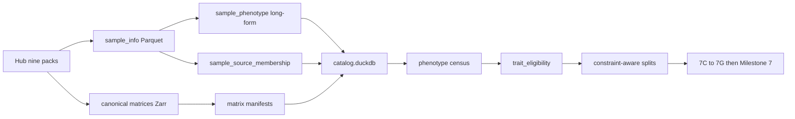

# Plan: Post-v0 scientific programme (Milestones 7A–7G → 7)

Status: implementation brief for Stage 0 after Milestone 6.
Normative ADRs: [0005](../adr/0005-catalog-matrix-independence.md),
[0006](../adr/0006-multipath-noncoding-scores.md),
[0007](../adr/0007-crossfit-prerequisites.md),
[0008](../adr/0008-score-identifiability.md).
Checklist: [`TODO_PIPELINE.md`](../TODO_PIPELINE.md).

**Do not retrain v0.1.** Freeze those runs. **7A**, **7B**, **7C** (fixture
acceptance), **7D**, **7E** (development CV), and **7E′** (Hub multitask +
hygiene) are closed. **7F** (RBS→gene + direct leftover, no TBS scores) is
**done**. **7G** (methylation-only full eval) is **done**. **Milestone 7**
(final OOF) is the **current coding gate**. Cascade tissue gap: see
[`milestone-7g-cascade-tissue-investigation.md`](milestone-7g-cascade-tissue-investigation.md).
The incomplete `EWAS_db` mirror must not block Milestone 7.

This document is the coding brief for **7A–7G**. The expensive Milestone **7**
OOF cross-fit is unblocked now that **7F and 7G** passed.

## Glossary and training model

| Term | Meaning |
|------|---------|
| **ADR** | Architecture Decision Record under `docs/adr/`. Binding design choice (e.g. [0006](../adr/0006-multipath-noncoding-scores.md) multi-path scores; [0007](../adr/0007-crossfit-prerequisites.md) 7A–7E before final OOF; [0008](../adr/0008-score-identifiability.md) score orientation). ADRs win when docs disagree. **7F** drops tile **scores**; leftover CpGs are **direct**. Nearest-gene is allowed only to allocate already-typed **RBS** onto a gene (MBS), not to swallow unmapped CpGs ([ADR 0004](../adr/0004-unmapped-probe-retention.md)). |
| **ATS** | Age/Tissue/Sex. Frozen Hub GSM-union `matrix-hub-age-tissue-sex-full-v1` (13 548 samples). Freeze: `deepmat-data-age-tissue-sex-v1`. Not all Hub GSM (34 234) and not EWAS_db. |
| **MBS** | Gene methylation burden. In **7F** this is **gene-aggregated RBS**, not a separate gene Deep Set plus tiles. |
| **RBS** | Regulatory Burden Score: CpG → typed region (cCRE / enhancer / CGI / DMR / ChromHMM / similar / gene roles) → region score. Orphan RBS = region with no gene allocation. |
| **TBS** | Tile Burden Score (graph-v2 50-CpG tiles). **Not used after 7E** — bins randomly aggregate leftover loci. Leftover CpGs go **direct**. |
| **Direct** | Per-locus contribution for CpGs **not assigned to a typed region**. No tile compression. Unmapped CpGs are not collapsed into a nearest-gene proxy. |
| **Metadata-only** | Predicts age/tissue/sex from **study ID + platform ID** (optionally tissue one-hots). **No methylation.** GEO series are often one tissue and one age band, so this looks strong. It is a **leakage alarm**, not a method to beat. Architecture tables in 7G exclude it. |
| **Level-1 MAD** | Fold-fitted robust z on train-fold M-values: \(\mu=\mathrm{median}\), \(\sigma=1.4826\times\mathrm{MAD}\); Hub GMQN betas stay canonical. Novel loci: `z=0` + `norm_present=False`. |
| **3×2 independently trained arms** | Milestone **7E** (done): 3 outer study-grouped folds × 2 random restarts; each architecture arm trained from scratch on the same folds (not eval-time branch masking). **7F/7G reuse those frozen folds.** |
| **5×6 OOF** | Milestone **7**: 5 outer folds × ≤6 restarts; every sample scored only by models that never saw its study/donor/replicate group; orientation-aligned average → score matrix. |

### When training runs

| Step | Training? |
|------|-----------|
| 7A–7B | No (catalog + matrices) |
| 7C | Trainer/model code + fixture/smoke; not the architecture bake-off |
| 7D | Norm fit + A/B smoke; not full CV |
| **7E** | **Done** — development CV on frozen ATS (2-epoch / 8 192-locus budget; linear region-mean fusion) |
| **7E′** | **Done** — Hub multitask + hygiene |
| **7F** | **Done.** RBS→gene cascade + direct leftover; saved neural scores fused |
| **7G** | **Done.** Methylation-only re-eval; winner `C-mvalue-enet`; cascade weak on tissue — probe planned |
| **7** | **Yes — current gate.** Final OOF after 7F and 7G |

Do not retrain frozen **v0.1** flat/hier runs.

### DeepRVAT-style: aggregation **and** heads

Same pattern as DeepRVAT: a **shared** set scorer produces gene-level (and later
RBS/TBS) scores; **linear phenotype heads** (age, tissue, sex, …) consume those
scores. Training is **end-to-end**: phenotype loss updates heads **and** the
shared aggregation network jointly. Heads are trained, not post-hoc only.

Exported product is the score matrix (gene-aggregated RBS ± genome-wide RBS ±
direct); heads train the encoder but are not part of the exported scoring
function
([`SCORING_PIPELINE.md`](../SCORING_PIPELINE.md),
[`ARCHITECTURE.md`](../ARCHITECTURE.md)). Transparent 7E/7G baselines
(gene/region mean, elastic-net, M-value ridge / trees) may fit a linear or
boosted layer on fixed methylation features only; neural arms are joint
DeepRVAT-style (shared φ/pool/ρ + linear heads). **TBS is not exported.**

## Readiness vs live catalog (2026-08-25)

Inspected `$MBS_DATA_ROOT/canonical/releases/deepmat-data-v1/` (manifest
`created_at` 2026-08-25T11:15:35Z). **Hub packs and 7B matrices are in the
catalog.** EWAS_db incompleteness is expected and not a 7E gate. Underscore
census/eligibility reports were re-exported in the same refresh.

| Check | Live catalog / disk | Notes |
|-------|---------------------|-------|
| Samples / studies / phenotype rows | 121 931 / 1 325 / 216 476 | Unique GSM includes EWAS_db-only files |
| Pack memberships / unique Hub GSM | 47 843 / 34 234 | Memberships ≠ people |
| EWAS_db assay files / studies | 92 971 / 924 of 1989 | `mirror_complete: false` |
| Matrix artifacts | 20, including all `matrix-hub-*-full-v1` | 7B disease 12 218 × 482 387; cancer 10 101 |
| Overlap betas | 0 discordant (7B report) | Concordant |
| Frozen 5d split | `fold_assignment` n=13 548 | Do not overwrite |
| Graph-v2 on disk | **yes** | `graph-grch38-gencode38-cgi-tile-v2` + `annotation_graph_cgi_tile_v2/` |
| Donor / replicate groups | `v_replicate_groups` = 0 | Census follow-on |
| Hyphen inspection dir | **5 GSM fixture leak** | Ignore; use `deepmat_data_v1/` (underscore) |
| 7B `platform_id` | `450K` on six full packs; `HM450` on 5d ATS | Same 450K universe; string not normalized |

**Proceed to 7F?** **Yes.** 7E report:
[`../reports/inspection/stage0_7e_dev_cv/analysis.md`](../reports/inspection/stage0_7e_dev_cv/analysis.md).
Topology residual closed for graph-v2:
[`milestone-7c-graph-v2-topology.md`](milestone-7c-graph-v2-topology.md).
7E winner `N-multipath-l1a` is **not** the 7F topology (TBS dropped; fusion
must be neural scores).

### Improve the analysis (7E′ — beside 7E; required before Milestone 7)

Plan: [`milestone-7e-prime-analysis-hygiene.md`](milestone-7e-prime-analysis-hygiene.md).

1. **Hub multitask:** train age + tissue + sex + **disease** (and cancer) with
   masked unknown≠control on packs already converted (~34 234 unique Hub GSM).
   Do not overwrite the ATS freeze. More EWAS_db downloads do not enlarge ATS.
2. Metadata-only control (study/platform/tissue → phenotype) on the same 7E
   folds (code exists: `fit_metadata_only`). It is a **leakage alarm**, not a
   methylation competitor. 7G ranking tables omit it.
3. Census follow-ons: donor/replicate IDs; within-study age/BMI ranges.
4. Alias Hub `platform=450K` → catalog `HM450` on next refresh (probe map is
   already HM450). These nine zips contain **no EPIC rows**.
5. Parameter-matched width/GELU/dropout/LN for flat vs hier (also 7E Done when).
6. Do not use blood `cell_component` pack-wide (~1.1% populated).
7. Census tests: temp `--report-dir` so they cannot clobber
   `reports/inspection/deepmat-data-v1/`.
8. `*.RData` gitignored; do not commit Hub sample blobs.

Graph-v2 + independent RBS/TBS train-time masks are **done**
([`milestone-7c-graph-v2-topology.md`](milestone-7c-graph-v2-topology.md)).

## Scope and acceptance

| Milestone | Done when (summary) |
|-----------|---------------------|
| Freeze v0 | Named freeze tags in docs; artifacts not overwritten |
| **7A** | Versioned `deepmat-data-v1/` release; populated DuckDB; phenotype census + trait eligibility reports |
| **7B** | All nine Hub packs as canonical matrices; chunked Zarr; multi-label long-form; probe-collapse policy (**done**; six full packs + index + overlap report) |
| **7C** | Trainer P0/P1 fixes; centered heads; score-orientation anchor; graph v2 (RBS/TBS); direct CpG; constraint-aware splits; metrics wired (**fixture done**; orientation + long-form join + Hub smoke + AUROC emission landed; topology residuals closed — see [`milestone-7c-graph-v2-topology.md`](milestone-7c-graph-v2-topology.md)) |
| **7D** | Fold-fitted Level-1 MAD robust-z; persist hashes; novel loci `z=0` + `norm_present=False`; Hub DeepRVAT A/B smoke; AE not default (**done**; `reports/inspection/stage0_7d_level1/`) |
| **7E** | 3×2 independently trained arms; report at `stage0_7e_dev_cv/` (**done**; budget-limited) |
| **7E′** | Hub multitask (age/tissue/sex/disease/cancer, masked) + catalog/census hygiene (**done**) |
| **7F** | RBS genome-wide → gene-associated RBS aggregation; leftover CpGs **direct**; no TBS scores; fuse **saved neural** scores (**done**) |
| **7G** | Methylation-only re-eval on frozen 7E folds: longer train, ROC, M-value ridge/enet/trees/optional PCA-SVA; no metadata-only ranking (**current gate**) |
| **7** | 5×6 OOF gene-RBS + RBS + direct (no TBS) with leakage controls |

## Locked decisions

| Choice | Decision | Why |
|--------|----------|-----|
| Storage | DuckDB + Parquet + Zarr; catalog ⊥ matrix | ADR 0005 |
| ClickHouse / TileDB now | No | No current bottleneck; TileDB only at first WGBS |
| Phenotype SoT | Long-form + `sample_source_membership` | Multi-pack / multi-label GSMs |
| Missing disease labels | Unknown, not automatic control | Pack semantics |
| Noncoding | Typed region → RBS; leftover CpGs **direct** (no tiles). Nearest-gene allocates RBS→MBS only | 7F drops ADR 0006 tile scores; ADR 0004 still forbids collapsing unmapped CpGs |
| Residual one-scalar | Frozen v0.1 only | Bottleneck, not biology test |
| Normalization | Level-1 fold-fitted robust z required before 7E; AE later | GMQN already on Hub |
| Final 5×6 | After 7F and 7G (7A–7E′ already done) | ADR 0007 spirit + 7E evaluation gaps |
| Architecture ranking | Methylation-input methods only | Metadata-only is a leakage alarm, not a competitor |
| Flat vs hier compare | Parameter-matched topology in 7E | Width/activation/dropout differed in v0 |
| Pack “prevalence” | Availability in Hub packs, not epidemiology | Heterogeneous contributed studies |
| Score orientation | Anchor before OOF average | ADR 0008 |
| Constraint vs MBS | Predictive representation ≠ LOEUF-like constraint | ADR 0008 |
| Direct CpG v1 | Sparse elastic-net / group sparsity on fold-normalized z for **non-RBS** loci | Transparent leftover path |
| Late fusion | Concatenate saved orphan RBS + MBS (gene-aggregated RBS) + direct; then linear/boosted head | 7E region-mean linear fusion is not sufficient |
| Level-1 z | Study-balanced median / 1.4826×MAD on train M | GMQN betas stay canonical |

## Schemas / contracts

Normative sketches: [`DATA_CONTRACT.md`](../DATA_CONTRACT.md). SQL/JSON schemas
are implemented in **7A/7B**, not in the docs-only landing of this plan.

### Release layout

```text
data/canonical/releases/deepmat-data-v1/
├── release_manifest.json
├── catalog/
│   ├── catalog.duckdb
│   └── tables/
├── matrices/
├── phenotypes/
├── ontologies/
├── annotations/
├── graphs/
└── splits/
```

### Tables to populate (7A minimum)

```text
source_release, study, platform, sample, sample_alias (if needed),
sample_source_membership, assay_file, phenotype, sample_phenotype,
matrix_artifact, matrix_sample, matrix_locus, fold_assignment,
artifact, experiment
```

### Census / eligibility views (7A)

```text
v_sample_pack_overlap
v_sample_label_conflicts
v_phenotype_prevalence
v_phenotype_study_support
v_phenotype_platform_support
v_tissue_class_distribution
v_disease_case_control_distribution
v_age_distribution_by_study
v_trait_missingness
v_trait_training_eligibility
v_split_trait_balance
```

### Initial eligibility cutoffs (starting criteria)

| Task | Inclusion |
|------|-----------|
| Continuous age/BMI | ≥1,000 labeled samples, ≥5 studies, meaningful range in >1 study |
| Binary disease | ≥200 cases and ≥200 valid controls, ≥3 studies |
| Multiclass tissue | ≥100 samples/class; prefer ≥2 studies/class |
| Cancer subtype | ≥100 cases/subtype; tissue-matched controls where possible |
| Multi-label disease | ≥100–200 cases/label; unknown ≠ control |
| Brain / blood fine class | Outside single-study or evaluation-only |
| Ancestry | Fairness / domain eval; not default burden-training target |

### Implemented CLI (7A)

```text
mbs catalog refresh-release
mbs catalog validate-release
mbs catalog phenotype-census
mbs catalog trait-eligibility
```

Default `--report-dir` is `reports/inspection/deepmat-data-v1` (hyphen = release
id). Keep the committed snapshot at `reports/inspection/deepmat_data_v1/`
(underscore). After tests, the hyphen dir can contain a tiny fixture census —
re-export from the live catalog before citing numbers.

## Data / artifact flow




## Pack roles (availability ≠ epidemiology)

Nine unique-GSM counts sum to **memberships**, not independent people (47,843
pack memberships; age+tissue+sex 16,675 → 13,548 unique). Inventory spans ~470
Hub projects. “Prevalence” here is **availability in these contributed packs**,
not UK-Biobank-style epidemiological prevalence. Tissue, study, platform, and
disease confounding are expected.

| Family | Unique GSM / studies | Role | Reason |
|--------|---------------------:|------|--------|
| Age | 8,374 / 143 | Core regression | Strongest broadly supported continuous task |
| Tissue | 5,323 / 258 | Core after ontology | 72 raw labels too fragmented; coarse + conditional fine heads |
| BMI | 2,070 / 25 | Secondary core | If age/tissue-adjusted ranges exist in several studies |
| Sex | 2,978 / 161 | Downweighted aux/QC | Easy; may over-use sex chromosomes vs general burden |
| Disease | 12,218 / 209 | Later multi-label | ~36.6% of rows labeled; missing is unknown, not control |
| Cancer | 10,101 / 225 | Within-tissue case/control | Pan-cancer largely learns tissue/study |
| Brain | 1,997 / 40 | Conditional fine-tissue | Only among brain samples |
| Blood | 3,402 / 161 | Do **not** use `cell_component` pack-wide | ~1.1% populated; often compositions |
| Ancestry | 1,380 / 21 | Fairness / domain eval | Not a default biological burden objective |

### Census fields (7A refresh follow-on)

For every harmonized phenotype:

- unique GSMs, rows, studies, platforms, tissues;
- label missingness and conflicts;
- cases and documented controls;
- label support by study and platform;
- age/BMI ranges within each study;
- cross-pack memberships;
- donor/replicate information;
- predictability from study/platform/tissue metadata alone;
- eligibility as core, auxiliary, or evaluation-only.

## Defects: landed vs remaining (do not retrain v0.1)

Many P0/P1 items from the original review are **closed in 7B–7D** (chunked
Zarr, long-form labels, content zip hashes, epoch shuffle, token-budget
sampler, constraint-aware splits, centered heads, Level-1 MAD, AUROC emission,
orientation train-path). Remaining before a **full** 7E:

| Pri | Remaining | Consequence |
|-----|-----------|-------------|
| P0 | (closed) graph-v2 + RBS/TBS masks | See milestone-7c-graph-v2-topology.md |
| P0 | Hier still gene-system only | RBS/TBS not in hierarchical path |
| P0 | Branch `rbs`/`tbs` still gene FlatDeepSet features | Eval-time mask ≠ independent arm |
| P1 | Census follow-ons (donor/replicate, metadata-only predictability, within-study age/BMI) | Confounding / eligibility incomplete |
| P1 | Hyphen vs underscore census paths | Fixture reports can overwrite CLI default |
| P1 | 7B `platform_id=450K` vs 5d `HM450` | Catalog provenance inconsistency, not a convert bug |

v0.1 residual-only: ~108k loci → one scalar; eval-time mask of jointly trained
branch; **first 512 ordered** holdout samples. Near-chance is not evidence
noncoding CpGs lack signal. Flat vs hier (tissue 0.666 vs 0.598; age MAE 22.0 vs
27.8 y) only shows hierarchical-v0.1 is currently weaker.

## Milestone briefs

### 7A — Harmonized release + census

Shipped (`deepmat-data-v1/`). Live catalog (2026-08-25T11:15Z) is the SoT;
underscore census matches it. Follow-on fields (metadata-only predictability,
within-study age/BMI, donor/replicate) still open. Do not wait on EWAS_db
completeness. Do not cite the hyphen inspection dir if N≈5.

### 7B — Complete matrices (**done**)

Implementation brief:
[`milestone-7b-complete-hub-matrices.md`](milestone-7b-complete-hub-matrices.md).
Evidence: `reports/inspection/stage0_7b_hub_matrices/`.

- Convert disease, cancer, blood, brain, BMI, ancestry; add BMI/ancestry maps.
- Stream probe chunks **directly** to compressed Zarr (no full dense RAM).
- Per-sample platform provenance (not one HM450 map for merged unions).
- Probe collapse: mean/robust mean; record all contributing probe IDs.
- True **content** checksums (not filename/size).
- Multi-label long-form (no `dict[gsm]=row`).
- Overlapping GSM betas: verify concordance; do not silently take the first pack.
- Deduplicated union or virtual multi-store index.

### 7C — Trainer then graph/model v2

Fix the trainer **before** expanding topology:

- deterministic epoch shuffle; token-budget batch sampler; task/study-balanced
  sampling;
- centered age/tissue/sex heads;
- constraint-aware grouped splits; real donor/replicate identifiers;
- emit macro-F1, balanced accuracy, RMSE, R², correlations, AUROC/AUPRC,
  calibration; study/platform/tissue-stratified reports;
- static-only, coverage-only, **metadata-only**, and label-permutation controls;
- keep mapped loci missing CpGPT with `static_present=False` (do not drop);
- residual zeros must carry a missingness flag;
- **score identifiability** ([ADR 0008](../adr/0008-score-identifiability.md)):
  orientation anchor (hyper/hypo channels or magnitude vs |robust z|) before
  any OOF average;
- graph v2: MBS, RBS, TBS; first direct branch
  \(D_k(s)=\sum_{c \in \mathrm{obs}(s)} w_{k,c} z_{s,c}\) with elastic-net /
  group sparsity, minimum cross-study coverage, centered fold-normalized
  values; later \(w_{k,c}\) from static embeddings;
- independently trained branch ablations on identical folds;
- parameter-matched flat vs hierarchical.

deepMAT remains a **sample×gene predictive representation**, not a methylation
constraint / LOEUF analogue (ADR 0008).

**Residual vs 7B:** orientation train-path and long-form multi-label join are
implemented; Hub smoke + holdout AUROC/AUPRC/ECE emission landed
(`reports/inspection/stage0_7c_hub_disease_smoke/`). Topology leftovers
(full-genome graph-v2, multi-system hier, true RBS/TBS arm masks) are closed in
[`milestone-7c-graph-v2-topology.md`](milestone-7c-graph-v2-topology.md).

### 7D — Normalization (do not overwrite Hub GMQN betas)

Implementation brief:
[`milestone-7d-fold-fitted-normalization.md`](milestone-7d-fold-fitted-normalization.md).

Hub profiles are already GMQN-normalized. Canonical betas stay GMQN.

**Required Level 1** — study-balanced robust reference **inside each training
fold**:

```math
\mu_c=\operatorname{median}_{s \in \mathrm{train}}(M_{s,c}),\qquad
\sigma_c=1.4826\,\operatorname{MAD}_{s \in \mathrm{train}}(M_{s,c})
```

```math
z_{s,c}=\frac{M_{s,c}-\mu_c}{\max(\sigma_c,\sigma_{\min})}
```

CpG input:

```text
beta
M-value
robust fold-fitted z
static CpGPT features
static_present
observed / value_valid
norm_present
probe design and regulatory annotations
```

Persist per-fold \(\mu,\sigma\) and hashes. Novel loci: `z=0` and
`norm_present=False` — **do not discard**.

**Optional Level 2:** `corrected = input + bounded_shared_MLP(input, static)`;
LayerNorm or RMSNorm, not BatchNorm; adapter, not canonical overwrite.

**Optional Level 3:** masked set AE only if trained per training fold; explicit
missing/platform-downsample masks; no val/test studies in reconstruction;
select on held-out phenotype, replicate concordance, and cross-platform
stability — **not** reconstruction loss. Vanilla AE reconstructs
study/platform artifacts well; it is not the first normalizer.

Compare A (beta+M) vs B (A + robust z) on identical folds (fixtures and
DeepRVAT Hub ATS: `matrix-hub-age-tissue-sex-full-v1`). Evidence:
`reports/inspection/stage0_7d_level1/` when closed.

Comprehensive RBS/TBS (graph-v2 + train-time masks) is closed as 7E prep
([`milestone-7c-graph-v2-topology.md`](milestone-7c-graph-v2-topology.md)).

### 7E — Development CV (**done**)

Implementation brief:
[`milestone-7e-development-cv.md`](milestone-7e-development-cv.md).
Report: [`../reports/inspection/stage0_7e_dev_cv/analysis.md`](../reports/inspection/stage0_7e_dev_cv/analysis.md).

90 cells finished (3 folds × arms). Winner under the 7E rule: `N-multipath-l1a`
(tissue macro-F1 0.329, age MAE 11.49 y). **Do not ship that arm as-is.**

**What 7E actually measured**

- Neural Deep Sets: **2 epochs**, first **8 192** of **482 379** CpG columns.
- Reported multipath numbers: **linear heads on presence-aware region means**
  (+ direct elastic-net preds), not saved neural MBS/RBS/TBS matrices.
- Metadata-only (study + platform) F1 0.659 / age MAE 9.76 y is a
  **confounding ceiling**: many GEO series are single-tissue, single-age-band.
  It uses **no methylation**. 7G ranking tables omit it.
- M-value ridge age MAE 10.77 y; HGB age MAE 11.13 y (tissue F1 0.103,
  under-trained for 47 classes). SGD elastic-net age diverged.

**Honest gaps (evaluation quality, not a crash)**

1. Under-trained neural nets — do not conclude trees beat Deep Sets.
2. Late fusion was not neural score fusion.
3. T-mean-region was not a separate named cell.
4. No LightGBM package; HGB is the same family.
5. Not every CpG column (memory); classical matched the neural prefix.
6. Neural AUROC was a binary helper, not 47-class tissue ROC.
7. SVA was 10 train PCs, not Bioconductor `sva`.
8. Sex incomplete in the merged neural dump.

Hub-wide disease/cancer heads: **7E′** (**done**).

### 7F — RBS→gene + direct leftover (**done**)

Impl brief: [`milestone-7f-rbs-gene-direct.md`](milestone-7f-rbs-gene-direct.md);
[ADR 0009](../adr/0009-drop-tbs-scores.md);
report [`stage0_7f_rbs_gene_direct/`](../../reports/inspection/stage0_7f_rbs_gene_direct/).

Drop **TBS** (random CpG-count bins). Assignment: typed region first
(cCRE / enhancer / CGI / DMR / ChromHMM / similar / gene roles) → **RBS**.
Unassigned CpGs are **direct**, not tiles. **Nearest-gene allocates RBS to
genes** (MBS); it does not reassign leftover CpGs.

```text
CpG → cCRE / enhancer / CGI / DMR / ChromHMM / similar / typed gene region
      → RBS
        ├─ allocated to a gene (typed role and/or nearest-gene) → MBS
        └─ no gene allocation → orphan RBS
CpG with no region assignment → direct
late fusion: [orphan RBS | MBS | direct] → heads
```

Fusion must write per-sample score matrices and train the head on **those**,
not on region-mean tables. Same frozen split `hub-ats-7e-3fold-v1`. Fixture
tests required. Report: `reports/inspection/stage0_7f_rbs_gene_direct/`.

### 7G — Methylation-only full evaluation (**done**)

Impl brief: [`milestone-7g-methylation-eval.md`](milestone-7g-methylation-eval.md).
Report: [`reports/inspection/stage0_7g_methylation_eval/`](../../reports/inspection/stage0_7g_methylation_eval/analysis.md).

Closed at **65 536 loci / 15 epochs / 3×1** on frozen `hub-ats-7e-3fold-v1`.
Ranking winner (methylation-input only): **`C-mvalue-enet`** (tissue macro-F1
0.334). **7F cascade** (`N-cascade-l1`) remains the product topology but reached
only **~0.09** tissue macro-F1 vs **~0.33** for region means / M-value enet.
Tissue-head investigation:
[`milestone-7g-cascade-tissue-investigation.md`](milestone-7g-cascade-tissue-investigation.md).

### Milestone 7 — Final OOF (**current gate**)

After **7F and 7G** (both done): 5 outer folds, up to 6 restarts; fold-specific
normalization and seed selection; **orientation-aligned** ensemble (ADR 0008).
Persist sample×gene (gene-aggregated RBS) OOF, genome-wide RBS, direct,
phenotype preds, fold assignments, presence/coverage/norm masks, complete
model lineage. **No TBS.**

## Non-goals / deferred (§8)

- ClickHouse; full TileDB migration; PROTRIDER AE as default; ComBat-met for
  Hub GMQN; episignatures; dynamic foundation-model tokens;
  **methylation constraint / LOEUF-like scores**.
- GWAS-style REGENIE / BGEN pseudodosage export (not applicable to methylation).
- Overwriting frozen flat/hier v0.1 runs or `deepmat-data-age-tissue-sex-v1`.
- Advertising unimplemented CLI as shipped.
- Retraining v0.1 or launching Milestone **7** before **7F and 7G**.
- Treating metadata-only (study + platform) as a methylation method.
- TBS scores. Nearest-gene collapse of leftover **CpGs** (RBS→gene
  allocation remains allowed).
- Claiming 7E’s 2-epoch / region-mean fusion as the shipped architecture.

## Open questions

None blocking **7F** (graph-v2 and frozen 7E folds are on disk).
[ADR 0009](../adr/0009-drop-tbs-scores.md) drops product TBS scores.
