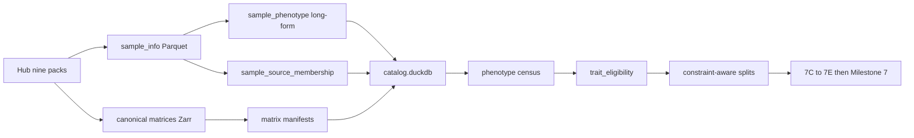

# Plan: Post-v0 scientific programme (Milestones 7A–7E → 7)

Status: implementation brief for Stage 0 after Milestone 6.
Normative ADRs: [0005](../adr/0005-catalog-matrix-independence.md),
[0006](../adr/0006-multipath-noncoding-scores.md),
[0007](../adr/0007-crossfit-prerequisites.md).
Checklist: [`TODO_PIPELINE.md`](../TODO_PIPELINE.md).

This document is the coding brief for **7A–7E**. The expensive Milestone **7**
OOF cross-fit stays blocked until those gates pass.

## Scope and acceptance

| Milestone | Done when (summary) |
|-----------|---------------------|
| Freeze v0 | Named freeze tags in docs; artifacts not overwritten |
| **7A** | Versioned `deepmat-data-v1/` release; populated DuckDB; phenotype census + trait eligibility reports |
| **7B** | All nine Hub packs as canonical matrices; chunked Zarr; multi-label long-form; probe-collapse policy |
| **7C** | Centered heads; graph v2 (RBS/TBS); direct CpG path; constraint-aware splits; task balance; seed masks; report metrics wired |
| **7D** | Fold-fitted Level-1 robust M-channels; A/B(/C/D) protocol documented; AE not default |
| **7E** | 3×2 independently trained architecture selection on identical folds |
| **7** | 5×6 OOF MBS (+ RBS/TBS/direct as applicable) with leakage controls |

## Locked decisions

| Choice | Decision | Why |
|--------|----------|-----|
| Storage | DuckDB + Parquet + Zarr; catalog ⊥ matrix | ADR 0005 |
| ClickHouse / TileDB now | No | No current bottleneck; TileDB only at first WGBS |
| Phenotype SoT | Long-form + `sample_source_membership` | Multi-pack / multi-label GSMs |
| Missing disease labels | Unknown, not automatic control | Pack semantics |
| Noncoding | MBS + RBS + TBS + optional direct CpG | ADR 0006; ~30% unassigned is signal |
| Residual one-scalar | Frozen v0.1 only | Bottleneck, not biology test |
| Normalization | Level-1 fold-fitted robust z required before 7E; AE later | GMQN already on Hub |
| Final 5×6 | After 7A–7E | ADR 0007 |
| Flat vs hier compare | Parameter-matched topology in 7E | Width/activation/dropout differed in v0 |

## Schemas / contracts

Normative sketches: [`DATA_CONTRACT.md`](../DATA_CONTRACT.md). SQL/JSON schemas
are implemented in **7A/7B**, not in the docs-only landing of this plan.

### Release layout

```text
data/canonical/releases/deepmat-data-v1/
├── release_manifest.json
├── catalog/
│   ├── catalog.duckdb
│   └── tables/
├── matrices/
├── phenotypes/
├── ontologies/
├── annotations/
├── graphs/
└── splits/
```

### Tables to populate (7A minimum)

```text
source_release, study, platform, sample, sample_alias (if needed),
sample_source_membership, assay_file, phenotype, sample_phenotype,
matrix_artifact, matrix_sample, matrix_locus, fold_assignment,
artifact, experiment
```

### Census / eligibility views (7A)

```text
v_sample_pack_overlap
v_sample_label_conflicts
v_phenotype_prevalence
v_phenotype_study_support
v_phenotype_platform_support
v_tissue_class_distribution
v_disease_case_control_distribution
v_age_distribution_by_study
v_trait_missingness
v_trait_training_eligibility
v_split_trait_balance
```

### Initial eligibility cutoffs (starting criteria)

| Task | Inclusion |
|------|-----------|
| Continuous age/BMI | ≥1,000 labeled samples, ≥5 studies, meaningful range in >1 study |
| Binary disease | ≥200 cases and ≥200 valid controls, ≥3 studies |
| Multiclass tissue | ≥100 samples/class; prefer ≥2 studies/class |
| Cancer subtype | ≥100 cases/subtype; tissue-matched controls where possible |
| Multi-label disease | ≥100–200 cases/label; unknown ≠ control |
| Brain / blood fine class | Outside single-study or evaluation-only |
| Ancestry | Fairness / domain eval; not default burden-training target |

### Planned CLI (7A — do not advertise as implemented until coded)

```text
mbs catalog refresh-release
mbs catalog validate-release
mbs catalog phenotype-census
mbs catalog trait-eligibility
```

## Data / artifact flow




## Pack roles

| Family | Role |
|--------|------|
| Age | Core regression |
| Tissue | Core coarse multiclass |
| Sex | Auxiliary biological / QC |
| BMI | Core or secondary regression |
| Brain | Fine-grained head given brain |
| Blood | Fine-grained after label QC |
| Cancer | Multi-label or within-tissue case/control |
| Disease | Multi-label binary heads; unknown ≠ control |
| Ancestry | Fairness / domain; optional nuisance |

## Milestone briefs

### 7A — Harmonized release + census

- Populate DuckDB from existing Parquet / manifests / registry.
- Cross-pack unique GSM (nine-pack row sum ≠ unique N).
- Conflict and overlap reports under `reports/inspection/`.
- Deliver `deepmat-data-v1/` + `release_manifest.json`.

### 7B — Complete matrices

- Convert disease, cancer, blood, brain, BMI, ancestry.
- Add BMI/ancestry to `_PACK_ZIP_NAME` / `_PACK_TXT_NAME`.
- Chunked probe-chunk write to Zarr (avoid 18–22 GB dense stack).
- Probe collapse: mean or robust mean; record contributing probe IDs (replace
  lexicographic-first policy for EPICv2 duplicates).
- Multi-label disease/cancer via long-form observations (no `dict[gsm]=row`
  overwrite).

### 7C — Architecture

- Center all phenotype-head inputs consistently (contract already in
  `ARCHITECTURE.md`; age/sex currently diverge).
- Graph v2: non-gene regulatory regions + adaptive CpG-count tiles.
- Model paths: gene MBS; RBS; TBS; direct CpG (sparse linear baseline).
- `static_present` and observation flags in features.
- Constraint-aware grouped splitter (no study/donor/replicate leakage; class
  coverage; age-quantile / platform / task-mask balance).
- Task-balanced sampling and loss weighting; trait-specific fold-safe seed
  masks; token-budget sampler; wire macro-F1, balanced accuracy, correlations,
  calibration into run reports.
- Parameter-matched flat vs hierarchical when comparing topology.

### 7D — Normalization

Required:

```text
A. beta + M only
B. beta + M + robust train-fold per-CpG deviation
```

Document (train later / §8 until architecture selected):

```text
C. B + learned ProbeNormalizer
D. C + masked autoencoder pretraining
```

All fold statistics fitted on training studies only. Select by held-out
phenotype performance and stability—not reconstruction loss alone.

### 7E — Development CV

```text
3 outer study-grouped folds
2 random restarts
```

Independently trained arms:

```text
flat gene-only
hierarchical gene-only
gene + direct noncoding
gene + RBS + TBS + direct
each with / without robust Level-1 channels
```

Winner feeds Milestone 7 (5×6).

### Milestone 7 — Final OOF

After architecture selection: 5 outer folds, up to 6 restarts; fold-specific
normalization and seed selection; ensemble held-out predictions. Persist
sample×gene OOF MBS, optional RBS/TBS/direct contributions, phenotype preds,
fold assignments, presence/coverage masks.

## Non-goals / deferred (§8)

- ClickHouse; full TileDB migration; PROTRIDER AE as default; ComBat-met for
  Hub GMQN; REGENIE; episignatures; dynamic foundation-model tokens.
- Overwriting frozen flat/hier v0.1 runs or `deepmat-data-age-tissue-sex-v1`.
- Advertising planned catalog CLI before implementation.

## Open questions

None blocking. Optional git annotated tags for the freeze names may be added
later; docs already bind the run/matrix IDs.
