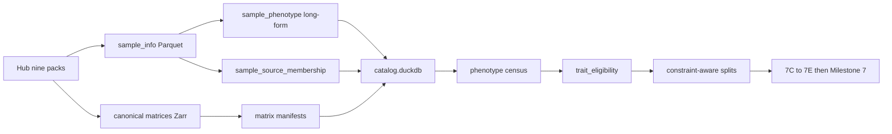

# Plan: Post-v0 scientific programme (Milestones 7A–7E → 7)

Status: implementation brief for Stage 0 after Milestone 6.
Normative ADRs: [0005](../adr/0005-catalog-matrix-independence.md),
[0006](../adr/0006-multipath-noncoding-scores.md),
[0007](../adr/0007-crossfit-prerequisites.md),
[0008](../adr/0008-score-identifiability.md).
Checklist: [`TODO_PIPELINE.md`](../TODO_PIPELINE.md).

**Do not retrain v0.1.** Freeze those runs. **7A** and **7C** (fixture
acceptance) are closed. Finish **7B** matrices, then **7D**, before
development training (**7E**). The incomplete `EWAS_db` mirror must not block
7B–7E.

This document is the coding brief for **7A–7E**. The expensive Milestone **7**
OOF cross-fit stays blocked until those gates pass.

## Scope and acceptance

| Milestone | Done when (summary) |
|-----------|---------------------|
| Freeze v0 | Named freeze tags in docs; artifacts not overwritten |
| **7A** | Versioned `deepmat-data-v1/` release; populated DuckDB; phenotype census + trait eligibility reports |
| **7B** | All nine Hub packs as canonical matrices; chunked Zarr; multi-label long-form; probe-collapse policy (**current gate**; converter code landed) |
| **7C** | Trainer P0/P1 fixes; centered heads; score-orientation anchor; graph v2 (RBS/TBS); direct CpG; constraint-aware splits; metrics wired (**fixture done**; orientation + long-form join code landed; **Hub disease/cancer smoke waits on 7B convert**) |
| **7D** | Fold-fitted Level-1 MAD robust-z; persist hashes; novel loci `z=0` + `norm_present=False`; AE not default |
| **7E** | 3×2 independently trained arms including transparent baselines and CpGPT ablation |
| **7** | 5×6 OOF MBS (+ RBS/TBS/direct as applicable) with leakage controls |

## Locked decisions

| Choice | Decision | Why |
|--------|----------|-----|
| Storage | DuckDB + Parquet + Zarr; catalog ⊥ matrix | ADR 0005 |
| ClickHouse / TileDB now | No | No current bottleneck; TileDB only at first WGBS |
| Phenotype SoT | Long-form + `sample_source_membership` | Multi-pack / multi-label GSMs |
| Missing disease labels | Unknown, not automatic control | Pack semantics |
| Noncoding | MBS + RBS + TBS + optional direct CpG | ADR 0006; ~30% unassigned is signal |
| Residual one-scalar | Frozen v0.1 only | Bottleneck, not biology test |
| Normalization | Level-1 fold-fitted robust z required before 7E; AE later | GMQN already on Hub |
| Final 5×6 | After 7A–7E | ADR 0007 |
| Flat vs hier compare | Parameter-matched topology in 7E | Width/activation/dropout differed in v0 |
| Pack “prevalence” | Availability in Hub packs, not epidemiology | Heterogeneous contributed studies |
| Score orientation | Anchor before OOF average | ADR 0008 |
| Constraint vs MBS | Predictive representation ≠ LOEUF-like constraint | ADR 0008 |
| Direct CpG v1 | Sparse elastic-net / group sparsity on fold-normalized z | Transparent baseline |
| Level-1 z | Study-balanced median / 1.4826×MAD on train M | GMQN betas stay canonical |

## Schemas / contracts

Normative sketches: [`DATA_CONTRACT.md`](../DATA_CONTRACT.md). SQL/JSON schemas
are implemented in **7A/7B**, not in the docs-only landing of this plan.

### Release layout

```text
data/canonical/releases/deepmat-data-v1/
├── release_manifest.json
├── catalog/
│   ├── catalog.duckdb
│   └── tables/
├── matrices/
├── phenotypes/
├── ontologies/
├── annotations/
├── graphs/
└── splits/
```

### Tables to populate (7A minimum)

```text
source_release, study, platform, sample, sample_alias (if needed),
sample_source_membership, assay_file, phenotype, sample_phenotype,
matrix_artifact, matrix_sample, matrix_locus, fold_assignment,
artifact, experiment
```

### Census / eligibility views (7A)

```text
v_sample_pack_overlap
v_sample_label_conflicts
v_phenotype_prevalence
v_phenotype_study_support
v_phenotype_platform_support
v_tissue_class_distribution
v_disease_case_control_distribution
v_age_distribution_by_study
v_trait_missingness
v_trait_training_eligibility
v_split_trait_balance
```

### Initial eligibility cutoffs (starting criteria)

| Task | Inclusion |
|------|-----------|
| Continuous age/BMI | ≥1,000 labeled samples, ≥5 studies, meaningful range in >1 study |
| Binary disease | ≥200 cases and ≥200 valid controls, ≥3 studies |
| Multiclass tissue | ≥100 samples/class; prefer ≥2 studies/class |
| Cancer subtype | ≥100 cases/subtype; tissue-matched controls where possible |
| Multi-label disease | ≥100–200 cases/label; unknown ≠ control |
| Brain / blood fine class | Outside single-study or evaluation-only |
| Ancestry | Fairness / domain eval; not default burden-training target |

### Planned CLI (7A — do not advertise as implemented until coded)

```text
mbs catalog refresh-release
mbs catalog validate-release
mbs catalog phenotype-census
mbs catalog trait-eligibility
```

## Data / artifact flow




## Pack roles (availability ≠ epidemiology)

Nine unique-GSM counts sum to **memberships**, not independent people (47,843
pack memberships; age+tissue+sex 16,675 → 13,548 unique). Inventory spans ~470
Hub projects. “Prevalence” here is **availability in these contributed packs**,
not UK-Biobank-style epidemiological prevalence. Tissue, study, platform, and
disease confounding are expected.

| Family | Unique GSM / studies | Role | Reason |
|--------|---------------------:|------|--------|
| Age | 8,374 / 143 | Core regression | Strongest broadly supported continuous task |
| Tissue | 5,323 / 258 | Core after ontology | 72 raw labels too fragmented; coarse + conditional fine heads |
| BMI | 2,070 / 25 | Secondary core | If age/tissue-adjusted ranges exist in several studies |
| Sex | 2,978 / 161 | Downweighted aux/QC | Easy; may over-use sex chromosomes vs general burden |
| Disease | 12,218 / 209 | Later multi-label | ~36.6% of rows labeled; missing is unknown, not control |
| Cancer | 10,101 / 225 | Within-tissue case/control | Pan-cancer largely learns tissue/study |
| Brain | 1,997 / 40 | Conditional fine-tissue | Only among brain samples |
| Blood | 3,402 / 161 | Do **not** use `cell_component` pack-wide | ~1.1% populated; often compositions |
| Ancestry | 1,380 / 21 | Fairness / domain eval | Not a default biological burden objective |

### Census fields (7A refresh follow-on)

For every harmonized phenotype:

- unique GSMs, rows, studies, platforms, tissues;
- label missingness and conflicts;
- cases and documented controls;
- label support by study and platform;
- age/BMI ranges within each study;
- cross-pack memberships;
- donor/replicate information;
- predictability from study/platform/tissue metadata alone;
- eligibility as core, auxiliary, or evaluation-only.

## Defects still in code (7B/7C — do not retrain v0.1)

| Pri | Problem | Consequence |
|-----|---------|-------------|
| P0 | Disease/cancer keyed by GSM; SQL one sample–phenotype row | Silent multi-label overwrite |
| P0 | One platform map; merged manifests hard-coded HM450 | EPIC/EPICv2 provenance wrong |
| P0 | Dense RAM then Zarr | Disease/cancer peak memory |
| P0 | Lexicographic first probe per locus | EPICv2 replicates discarded |
| P0 | Pack “checksums” = filename/size | Not content hashes (`hub_pack.py`) |
| P0 | No epoch shuffle; pack/study order | Homogeneous task/study batches |
| P0 | `batch_token_budget` unused | Ragged CpG counts ignored |
| P0 | Split balances sample count only | No class/task/age/platform/donor constraints |
| P1 | Age/sex `MBS × present`; tissue centers 0.5 | Inconsistent missing-gene leakage |
| P1 | Mapped loci without CpGPT dropped; residual zeros, no flag | Static-feature availability selects |
| P1 | Configured macro-F1 / balanced acc / correlations not emitted | Accuracy/MAE insufficient for selection |
| P1 | Flat vs hier different width/GELU/dropout/LN | Not a topology-only comparison |
| P1 | No CpG normalization channel | Only age-target standardization is fold-fitted |

v0.1 residual-only: ~108k loci → one scalar; eval-time mask of jointly trained
branch; **first 512 ordered** holdout samples. Near-chance is not evidence
noncoding CpGs lack signal. Flat vs hier (tissue 0.666 vs 0.598; age MAE 22.0 vs
27.8 y) only shows hierarchical-v0.1 is currently weaker.

## Milestone briefs

### 7A — Harmonized release + census

Shipped (`deepmat-data-v1/`). Refresh follow-on: remaining census fields above
(metadata-only predictability, within-study age/BMI ranges, donor/replicate).
Do not wait on EWAS_db completeness.

### 7B — Complete matrices (current coding gate)

Implementation brief:
[`milestone-7b-complete-hub-matrices.md`](milestone-7b-complete-hub-matrices.md).

- Convert disease, cancer, blood, brain, BMI, ancestry; add BMI/ancestry maps.
- Stream probe chunks **directly** to compressed Zarr (no full dense RAM).
- Per-sample platform provenance (not one HM450 map for merged unions).
- Probe collapse: mean/robust mean; record all contributing probe IDs.
- True **content** checksums (not filename/size).
- Multi-label long-form (no `dict[gsm]=row`).
- Overlapping GSM betas: verify concordance; do not silently take the first pack.
- Deduplicated union or virtual multi-store index.

### 7C — Trainer then graph/model v2

Fix the trainer **before** expanding topology:

- deterministic epoch shuffle; token-budget batch sampler; task/study-balanced
  sampling;
- centered age/tissue/sex heads;
- constraint-aware grouped splits; real donor/replicate identifiers;
- emit macro-F1, balanced accuracy, RMSE, R², correlations, AUROC/AUPRC,
  calibration; study/platform/tissue-stratified reports;
- static-only, coverage-only, **metadata-only**, and label-permutation controls;
- keep mapped loci missing CpGPT with `static_present=False` (do not drop);
- residual zeros must carry a missingness flag;
- **score identifiability** ([ADR 0008](../adr/0008-score-identifiability.md)):
  orientation anchor (hyper/hypo channels or magnitude vs |robust z|) before
  any OOF average;
- graph v2: MBS, RBS, TBS; first direct branch
  \(D_k(s)=\sum_{c \in \mathrm{obs}(s)} w_{k,c} z_{s,c}\) with elastic-net /
  group sparsity, minimum cross-study coverage, centered fold-normalized
  values; later \(w_{k,c}\) from static embeddings;
- independently trained branch ablations on identical folds;
- parameter-matched flat vs hierarchical.

deepMAT remains a **sample×gene predictive representation**, not a methylation
constraint / LOEUF analogue (ADR 0008).

**Residual vs 7B:** orientation train-path and long-form multi-label join are
implemented on fixtures. Hub smoke (`matrix-hub-disease-full-v1` /
`matrix-hub-cancer-full-v1` + `stage0_flat_hub_disease_multilabel.yaml`) waits
until 7B pack convert finishes. Independent leftovers (full-genome graph-v2,
multi-system hier, true RBS/TBS arm masks) are listed in
[`milestone-7c-supervised-architecture.md`](milestone-7c-supervised-architecture.md).

### 7D — Normalization (do not overwrite Hub GMQN betas)

Hub profiles are already GMQN-normalized. Canonical betas stay GMQN.

**Required Level 1** — study-balanced robust reference **inside each training
fold**:

```math
\mu_c=\operatorname{median}_{s \in \mathrm{train}}(M_{s,c}),\qquad
\sigma_c=1.4826\,\operatorname{MAD}_{s \in \mathrm{train}}(M_{s,c})
```

```math
z_{s,c}=\frac{M_{s,c}-\mu_c}{\max(\sigma_c,\sigma_{\min})}
```

CpG input:

```text
beta
M-value
robust fold-fitted z
static CpGPT features
static_present
observed / value_valid
norm_present
probe design and regulatory annotations
```

Persist per-fold \(\mu,\sigma\) and hashes. Novel loci: `z=0` and
`norm_present=False` — **do not discard**.

**Optional Level 2:** `corrected = input + bounded_shared_MLP(input, static)`;
LayerNorm or RMSNorm, not BatchNorm; adapter, not canonical overwrite.

**Optional Level 3:** masked set AE only if trained per training fold; explicit
missing/platform-downsample masks; no val/test studies in reconstruction;
select on held-out phenotype, replicate concordance, and cross-platform
stability — **not** reconstruction loss. Vanilla AE reconstructs
study/platform artifacts well; it is not the first normalizer.

Compare A (beta+M) vs B (A + robust z) on identical folds.

### 7E — Development CV

```text
3 outer study-grouped folds
2 random restarts
```

Independently trained (minimum):

```text
gene/region mean and elastic-net baselines
parameter-matched flat gene-only
parameter-matched hierarchical gene-only
gene + direct CpG
gene + RBS + TBS + direct
each neural arm with / without Level-1 robust z
CpGPT inclusion as a separate ablation
```

Winner feeds Milestone 7 (5×6). Eval-time branch masking is not sufficient.

### Milestone 7 — Final OOF

After architecture selection: 5 outer folds, up to 6 restarts; fold-specific
normalization and seed selection; **orientation-aligned** ensemble (ADR 0008).
Persist sample×gene OOF MBS, optional RBS/TBS/direct, phenotype preds, fold
assignments, presence/coverage/norm masks, complete model lineage.

## Non-goals / deferred (§8)

- ClickHouse; full TileDB migration; PROTRIDER AE as default; ComBat-met for
  Hub GMQN; episignatures; dynamic foundation-model tokens;
  **methylation constraint / LOEUF-like scores**.
- GWAS-style REGENIE / BGEN pseudodosage export (not applicable to methylation).
- Overwriting frozen flat/hier v0.1 runs or `deepmat-data-age-tissue-sex-v1`.
- Advertising planned catalog CLI before implementation.
- Retraining v0.1 or launching 7E/7 before 7B–7D.

## Open questions

None blocking. Optional git annotated tags for the freeze names may be added
later; docs already bind the run/matrix IDs.
